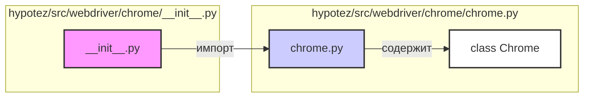

## Анализ кода `hypotez/src/webdriver/chrome/__init__.py`

### <алгоритм>

1. **Импорт модуля `chrome`:**
   - Начинается с импорта `Chrome` из `hypotez.src.webdriver.chrome.chrome`.
   - Это действие делает класс `Chrome` доступным для использования в других частях проекта, где импортируется пакет `hypotez.src.webdriver.chrome`.
   - Пример: После этого импорта можно создать экземпляр класса `Chrome` как `webdriver_instance = Chrome()`.

### <mermaid>

**Объяснение зависимостей `mermaid`:**

- `init_py` (представляющий `__init__.py`): Инициирует импорт модуля `chrome.py`.
- `chrome_py` (представляющий `chrome.py`): Содержит определение класса `Chrome`.
- `ChromeClass` (представляющий `class Chrome`): Представляет класс, который импортируется из `chrome.py`.

### <объяснение>

**Импорты:**

-   `from .chrome import Chrome`: 
    -   Это строка импортирует класс `Chrome` из модуля `chrome.py`, который находится в той же директории (`.`) что и файл `__init__.py`.
    -   Назначение: сделать класс `Chrome` доступным для использования при импорте пакета `hypotez.src.webdriver.chrome`.  
    -   Взаимосвязь: Этот импорт связывает `__init__.py` с модулем `chrome.py` в пакете `hypotez.src.webdriver`.

**Классы:**

-   В данном коде явно не определяются классы, но импортируется класс `Chrome`.
   -   Предполагается, что класс `Chrome` определен в `chrome.py`.
   -   Роль: Этот класс, вероятно, отвечает за управление экземпляром Chrome-браузера для целей автоматизации.
   -   Взаимодействие: Класс `Chrome` вероятно имеет методы для запуска, управления и закрытия браузера, а так же для взаимодействия с веб-страницами (методы навигации, поиск элементов, ввод данных и т.д.)

**Функции:**
- В этом конкретном файле нет функций, но, подразумевается наличие функций в импортируемом классе `Chrome`.

**Переменные:**

-   В данном файле нет переменных.

**Потенциальные ошибки или области для улучшения:**
- Код выглядит нормально и выполняет роль инициализатора пакета. 
- Проверка `__version__` (если необходимо): Если это часть проекта, использующего семантическое версионирование, было бы полезно добавить атрибут `__version__` в `__init__.py` для отслеживания версии пакета.

**Цепочка взаимосвязей с другими частями проекта:**

1.  `hypotez.src.webdriver.chrome.__init__.py` является точкой входа для модуля `chrome`.
2.  Он импортирует `hypotez.src.webdriver.chrome.chrome.Chrome`, таким образом, предоставляя интерфейс для управления Chrome-браузером из других частей проекта.
3.  Другие части проекта, такие как тесты или пользовательский код, могут импортировать `Chrome` через `from hypotez.src.webdriver.chrome import Chrome` и использовать его для автоматизации.

**В итоге**, данный файл `__init__.py` действует как связующее звено, делая класс `Chrome` доступным для использования, что упрощает структуру проекта, и является стандартной практикой для модулей Python.