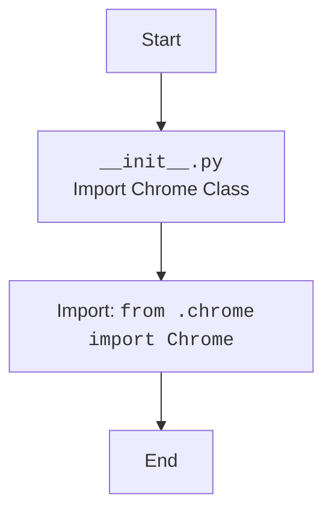

## АНАЛИЗ КОДА: `hypotez/src/webdriver/chrome/__init__.py`

### 1. <алгоритм>

**Назначение:** Файл `__init__.py` в пакете `src.webdriver.chrome` делает модуль `chrome` доступным для импорта из пакета `src.webdriver.chrome`.  Он выполняет роль точки входа в пакет и позволяет импортировать `Chrome` класс напрямую.

**Блок-схема:**

1.  **Начало:** Запуск интерпретатора Python.
2.  **Импорт:** Выполняется `from .chrome import Chrome`.  
    *   Пример: `from src.webdriver.chrome import Chrome` (где `src` - корень проекта)
3.  **Конец:** Пакет `src.webdriver.chrome` теперь имеет доступ к классу `Chrome`, определенному в модуле `chrome.py`.

### 2. <mermaid>

**Описание диаграммы:**

*   **Start:** Начало выполнения файла `__init__.py`.
*   **ImportChrome:**  Обозначает действие импорта класса `Chrome`.
*   **ChromeModule:**  Представляет импорт класса `Chrome` из файла `chrome.py`, находящегося в том же каталоге. 
*   **End:** Завершение выполнения файла `__init__.py`.

### 3. <объяснение>

**Импорты:**

*   `from .chrome import Chrome`:
    *   `.chrome`  указывает на модуль `chrome.py`, находящийся в том же каталоге что и `__init__.py`.
    *   `Chrome`  - это класс, который импортируется из модуля `chrome.py` и становится доступным для использования через `src.webdriver.chrome`.
    *   **Взаимосвязь:** Это  позволяет пользователям  импортировать класс  `Chrome`  как  `from src.webdriver.chrome import Chrome`. Без этого импорта, класс `Chrome` был бы недоступен напрямую из пакета `src.webdriver.chrome`.

**Классы:**
*    `Chrome`: в текущем файле класс не определен, он импортируется, и предположительно будет определен в `src/webdriver/chrome/chrome.py`. 

**Функции:**
*   В данном коде функции не определены.

**Переменные:**
*   Переменные в данном коде отсутствуют.

**Цепочка взаимосвязей:**

1.  `src/webdriver/chrome/__init__.py` -> `src/webdriver/chrome/chrome.py`:  Импортирует класс `Chrome`.
2.  `src/webdriver` -> `src/webdriver/chrome`: Может импортировать `Chrome` как `from src.webdriver.chrome import Chrome`.
3.  `src/tests` -> `src/webdriver/chrome` -> `src/webdriver/chrome/chrome.py` может использовать импортированный класс для написания тестов.
4.   `src/core` -> `src/webdriver/chrome` -> `src/webdriver/chrome/chrome.py` может использовать импортированный класс в ядре для работы с браузером chrome.

**Потенциальные ошибки или области для улучшения:**

*   **Отсутствие документации:** Для улучшения читаемости и понимания кода, можно добавить docstring к файлу и к `Chrome` классу.
*   **Уточнение путей:** Можно явным образом указать пути к файлам.
*   **Зависимости:** Не указаны требования для установки webdriver chrome, что может привести к проблемам при запуске.