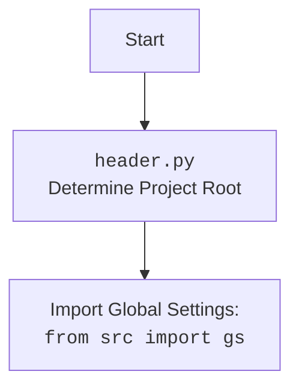

## Анализ кода `chrome.py`

### 1. <алгоритм>

1. **Инициализация `Chrome`:**
    - При создании экземпляра класса `Chrome` вызывается метод `__init__`.
    - Устанавливается случайный `user-agent` (если не предоставлен) с помощью `fake_useragent`.
    - Загружаются настройки из `chrome.json` (используется `j_loads` из `src.utils.jjson`).
    - Определяется путь к профилю пользователя Chrome (переменная `profile_directory`).
    - Определяется путь к `chromedriver.exe` и бинарному файлу `chrome.exe` из настроек в `chrome.json`. Заменяется `"chrome"` на `gs.default_webdriver` в путях.
    - Устанавливаются опции Chrome с помощью метода `set_options`.
    - Добавляется аргумент с путем к профилю пользователя Chrome.
    - Создается `ChromeService` с путем к бинарному файлу `chrome.exe`.
    - Ищется свободный порт для Chrome (метод `find_free_port`).
    - Если порт найден, он передается в опции браузера.
    - Если порт не найден, возвращается ошибка.
2. **Запуск WebDriver:**
    - Вызывается конструктор родительского класса `webdriver.Chrome` с установленными опциями и сервисом.
    - Обработка исключений `WebDriverException` (ошибка инициализации) и общих исключений `Exception` (ошибка запуска).
    - В случае ошибки выводятся сообщения в логгер.
    - *Пример:*
    ```
    chrome_instance = Chrome() # Создание экземпляра класса `Chrome`
    chrome_instance.get("https://www.google.com") # открытие сайта в браузере.
    ```
3. **Метод `find_free_port`:**
    - Проходит по диапазону портов, начиная со `start_port` до `end_port`.
    - Проверяет доступность порта, пытаясь привязаться к нему с помощью `socket.socket`.
    - Если порт доступен, возвращает его. Если порт занят, в лог пишется отладочное сообщение и цикл продолжается.
    - Если свободный порт не найден, возвращает `None`.
    - *Пример:*
    ```
    free_port = Chrome().find_free_port(9500, 9599) # Поиск свободного порта
    print(free_port) # Вывод свободного порта (если найден) или None
    ```
4. **Метод `set_options`:**
    - Принимает настройки из `chrome.json` (`settings`) в виде словаря `dict`.
    - Проверяет наличие ключей `options` и `headers` в словаре настроек.
    - Создает экземпляр `ChromeOptions`.
    - Если ключ `options` присутствует:
      - Парсит список параметров опций (в виде `key=value`) в словарь `options_dict`.
      - Добавляет каждую пару ключ-значение в `ChromeOptions` с помощью `add_argument`.
    - Если ключ `headers` присутствует:
      - Добавляет каждую пару ключ-значение из словаря `headers` в `ChromeOptions`.
    - Возвращает объект `ChromeOptions` с установленными настройками.
    - *Пример:*
    ```
        settings = {"options": ["headless=true", "disable-gpu=true"], "headers": {"User-Agent": "Custom"}}
        options = Chrome().set_options(settings)  # Получение объекта ChromeOptions
        print(options.arguments)
    ```

### 2. <mermaid>

```mermaid
flowchart TD
    Start --> InitializeChrome[Initialize Chrome Class<br><code>__init__</code>];
    InitializeChrome --> LoadSettings[Load Settings from <br><code>chrome.json</code>];
    LoadSettings -- Error --> CriticalErrorLog[Log Critical Error and Return];
    LoadSettings -- Success --> DeterminePaths[Determine ChromeDriver & Chrome Binary Paths<br> Replace <code>"chrome"</code> with <br> <code>gs.default_webdriver</code>];
    DeterminePaths --> SetChromeOptions[Set Chrome Options <br> using <code>set_options()</code>];
    SetChromeOptions --> AddProfileDir[Add User Data Directory to Options];
    AddProfileDir --> CreateChromeService[Create Chrome Service];
    CreateChromeService --> FindFreePort[Find Free Port <br> using <code>find_free_port()</code>];
    FindFreePort -- No Port --> CriticalErrorPort[Log Critical Error: No Free Port];
    FindFreePort -- Port Found --> AddPortToOptions[Add port to Chrome options];
    AddPortToOptions --> StartWebDriver[Start Chrome WebDriver<br>Call Parent Class Constructor];
    StartWebDriver -- WebDriverException --> CriticalErrorWebDriver[Log Critical Error: WebDriver Initialization];
    StartWebDriver -- GeneralException --> CriticalErrorCrash[Log Critical Error: WebDriver Crash];
    StartWebDriver -- Success --> End[End Initialization];
    
    subgraph "find_free_port(start_port, end_port)"
        F_Start[Start] --> F_LoopStart[Loop Ports (start_port to end_port)];
        F_LoopStart --> F_CheckPort[Check if port is free];
        F_CheckPort -- Free --> F_ReturnPort[Return Port];
        F_CheckPort -- Occupied --> F_LogDebug[Log Debug: Port Occupied];
        F_LogDebug --> F_LoopStart;
        F_LoopStart -- All ports checked --> F_ReturnNone[Return None];
        F_ReturnPort --> F_End[End];
        F_ReturnNone --> F_End;
    end
    
    subgraph "set_options(settings)"
         SO_Start[Start] --> SO_CheckSettings[Check if settings are valid]
         SO_CheckSettings -- Not valid --> SO_ReturnNone[Return None]
         SO_CheckSettings -- Valid --> SO_CreateOptions[Create <code>ChromeOptions</code> instance]
         SO_CreateOptions --> SO_ProcessOptions[Process 'options' settings];
         SO_ProcessOptions --> SO_ProcessHeaders[Process 'headers' settings];
         SO_ProcessHeaders --> SO_ReturnOptions[Return <code>ChromeOptions</code>]
         SO_ReturnNone --> SO_End[End]
         SO_ReturnOptions --> SO_End
    end
```

#### Объяснение `mermaid` диаграммы:

*   `Start`: Начало процесса инициализации класса `Chrome`.
*   `InitializeChrome`: Вызов метода `__init__` для инициализации класса `Chrome`.
*   `LoadSettings`: Загрузка настроек из файла `chrome.json` с помощью `j_loads_ns`.
*   `CriticalErrorLog`: Логирование критической ошибки, если `chrome.json` не загружен, и завершение работы.
*   `DeterminePaths`: Определение путей к `chromedriver.exe` и исполняемому файлу Chrome, замена `"chrome"` на путь к `gs.default_webdriver`.
*   `SetChromeOptions`: Установка параметров Chrome с помощью метода `set_options`.
*   `AddProfileDir`: Добавление аргумента с путем к профилю пользователя Chrome.
*   `CreateChromeService`: Создание экземпляра `ChromeService` с путем к исполняемому файлу Chrome.
*   `FindFreePort`: Вызов метода `find_free_port` для поиска свободного порта.
*   `CriticalErrorPort`: Логирование критической ошибки, если свободный порт не найден, и завершение работы.
*   `AddPortToOptions`: Добавление найденного порта в параметры Chrome.
*   `StartWebDriver`: Запуск Chrome WebDriver с использованием родительского класса `webdriver.Chrome`.
*   `CriticalErrorWebDriver`: Логирование критической ошибки, если `WebDriverException` возникла при запуске драйвера.
*   `CriticalErrorCrash`: Логирование критической ошибки, если возникла общая ошибка при запуске драйвера.
*   `End`: Завершение процесса инициализации.
*   `subgraph find_free_port(start_port, end_port)`: Диаграмма, описывающая логику метода `find_free_port`, включая цикл по портам, проверку занятости и возвращение порта или `None`.
*   `subgraph set_options(settings)`: Диаграмма, описывающая логику метода `set_options`, включая проверку настроек, создание `ChromeOptions`, обработку `options` и `headers` параметров.

#### Дополнительный блок `mermaid` для `header.py`:



### 3. <объяснение>

#### Импорты:
*   `os`: Стандартная библиотека Python для работы с операционной системой, используется для работы с путями к файлам и переменными окружения.
*   `socket`: Стандартная библиотека Python для сетевого программирования, используется для проверки доступности порта.
*   `pathlib.Path`: Модуль для представления путей к файлам и директориям, обеспечивает более удобную работу с путями.
*   `typing.List`, `typing.Dict`: Модули для объявления типов, используются для статической проверки типов.
*   `selenium.webdriver`: Библиотека Selenium для управления веб-браузерами, включает классы `webdriver.Chrome`, `ChromeService` и `ChromeOptions`.
*   `fake_useragent`: Библиотека для генерации случайных `user-agent` строк, используется для имитации различных браузеров.
*  `selenium.common.exceptions.WebDriverException`: Класс исключения, которое может возникнуть при инициализации или работе `webdriver`.
*   `src.gs`: Глобальные настройки проекта, используется для получения пути к ресурсам и текущего порта.
*   `src.utils.jjson`: Модуль для работы с JSON, используется для загрузки конфигураций из `chrome.json`.
*   `src.logger.logger`: Модуль для логирования, используется для записи сообщений об ошибках и процессах.

#### Классы:

*   `Chrome(webdriver.Chrome)`:
    *   **Роль**: Расширение класса `webdriver.Chrome` для настройки и инициализации браузера Chrome.
    *   **Атрибуты**:
        *   `driver_name` (str): Имя драйвера (`'chrome'`).
        *   `d` (webdriver.Chrome): Экземпляр драйвера Chrome (изначально `None`).
        *   `options` (ChromeOptions): Экземпляр класса `ChromeOptions` для настройки браузера.
        *   `user_agent` (dict): Заголовки `user-agent`.
    *   **Методы**:
        *   `__init__(self, user_agent: dict = None, *args, **kwargs) -> None`:
            *   **Назначение**: Инициализация экземпляра `Chrome`.
            *   **Аргументы**: `user_agent` - словарь с пользовательскими настройками `user-agent`, `*args`, `**kwargs` - дополнительные аргументы.
            *   **Функциональность**:
                -   Загружает настройки из `chrome.json`, включая пути к `chromedriver` и бинарному файлу Chrome.
                -   Настраивает профиль пользователя Chrome.
                -   Ищет свободный порт и передает его в параметры браузера.
                -   Инициализирует драйвер Chrome.
                -   Ловит исключения при инициализации.
        *   `find_free_port(self, start_port: int, end_port: int) -> int | None`:
            *   **Назначение**: Поиск свободного порта в заданном диапазоне.
            *   **Аргументы**: `start_port` (int) - начальный порт, `end_port` (int) - конечный порт.
            *   **Возвращает**: Свободный порт (int) или `None`, если порт не найден.
            *   **Функциональность**:
                -   Проверяет порты в цикле, с помощью `socket.socket`.
                -   Возвращает первый свободный порт.
        *   `set_options(self, settings: list | dict | None = None) -> ChromeOptions`:
            *   **Назначение**: Установка параметров запуска Chrome на основе настроек.
            *   **Аргументы**: `settings` - настройки из `chrome.json`.
            *   **Возвращает**: Экземпляр `ChromeOptions` с установленными параметрами.
            *   **Функциональность**:
                -   Разбирает параметры из `settings['options']` и применяет их.
                -   Добавляет заголовки из `settings['headers']`.

#### Функции:

*   `__init__(self, user_agent: dict = None, *args, **kwargs) -> None`: Конструктор класса `Chrome`, описан выше в разделе "Классы".
*   `find_free_port(self, start_port: int, end_port: int) -> int | None`: Функция для поиска свободного порта, описана выше в разделе "Классы".
*   `set_options(self, settings: list | dict | None = None) -> ChromeOptions`: Функция для установки параметров Chrome, описана выше в разделе "Классы".

#### Переменные:

*   `MODE = 'debug'`:  Переменная для установки режима работы модуля (не используется в данном коде, вероятно, используется где-то еще).
*   `driver_name`:  Строковая константа, представляющая название драйвера ('chrome').
*   `d`: Экземпляр драйвера Chrome, изначально устанавливается в `None`.
*   `options`: Экземпляр `ChromeOptions`, предназначен для хранения настроек Chrome.
*   `user_agent`: Словарь для хранения пользовательских `user-agent` строк.

#### Потенциальные ошибки и области для улучшения:

*   **Отсутствие явной обработки ошибок:** Код содержит общую обработку ошибок через блок `except Exception as e:`, что может затруднить отладку и выявление конкретных проблем. Рекомендуется обрабатывать исключения более узко и предоставлять более конкретные сообщения об ошибках.
*   **Жестко заданные пути**: Пути к файлам `chromedriver.exe` и `chrome.exe` прописаны в `chrome.json`, что может привести к проблемам, если структура каталогов изменится. Можно рассмотреть возможность динамического определения путей.
*   **Неполная реализация перезапуска:** В коде есть комментарии `@todo Implement driver restart` и `@todo Implement program restart`, указывающие на необходимость реализации механизма перезапуска драйвера и программы в случае ошибок.
*   **Проверка наличия параметров:** Функция `set_options` не проверяет, является ли `settings` словарем.
*   **Обработка `profile_directory`**:  Использование `os.getenv('LOCALAPPDATA')` может не сработать в некоторых системах.
*   **Неполная логика поиска порта:**  При поиске свободного порта используется диапазон портов с шагом 1.  Возможно, необходимо добавить механизм проверки доступности порта или изменить подход к выбору порта.

#### Взаимосвязь с другими частями проекта:
*   **`src.gs`**:  Используется для получения глобальных настроек и пути к ресурсам, а также для хранения текущего порта веб-драйвера.
*   **`src.utils.jjson`**: Используется для загрузки JSON-конфигурации из файла `chrome.json`.
*   **`src.logger.logger`**: Используется для вывода сообщений об ошибках, отладочных сообщений и информации о ходе выполнения.
*   **`fake_useragent`**: Используется для генерации случайных `user-agent` строк.

Этот анализ предоставляет детальное представление о функциональности кода, его зависимостях и потенциальных областях для улучшения.