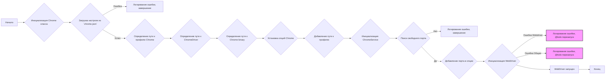
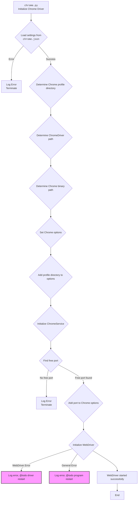
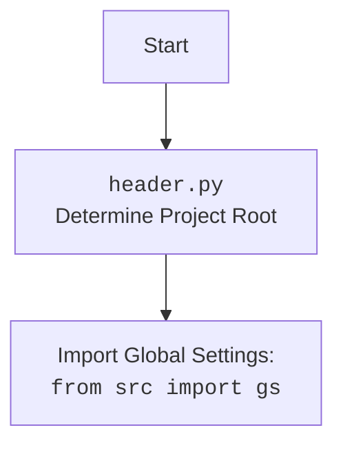

## Анализ кода `hypotez/src/webdriver/chrome/_docs/chrome.html`

### 1. <алгоритм>

**Блок-схема работы `chrome.py`**

**Примеры:**

*   **`B` (Инициализация Chrome класса):** Создаётся экземпляр класса `Chrome`.
*   **`C` (Загрузка настроек из `chrome.json`):**
    *   Файл `chrome.json` содержит пути к драйверу и бинарнику Chrome, а также настройки браузера.
    *   Например, `{"chromedriver": ["webdrivers", "chrome", "125.0.6422.14", "chromedriver.exe"]}`.
*   **`F` (Определение пути к ChromeDriver):** Извлекается путь к драйверу из `chrome.json` и подставляется корень проекта, например, `/path/to/project/bin/webdrivers/chrome/125.0.6422.14/chromedriver.exe`.
*   **`H` (Установка опций Chrome):** Устанавливаются опции, например `user-agent`, `headless` режим и т.д.
*   **`K` (Поиск свободного порта):** Циклически перебираются порты в диапазоне 9500-9599, пока не найдется свободный. Если свободный порт найден, он используется для вебдрайвера.

### 2. <mermaid>

**Зависимости:**

*   `os`: Для работы с операционной системой, например, для построения путей.
*   `socket`: Для поиска свободного порта.
*   `pathlib.Path`: Для удобной работы с путями.
*   `typing.List`, `typing.Dict`: Для аннотаций типов.
*   `selenium.webdriver`: Основной пакет для управления браузерами.
*   `selenium.webdriver.chrome.service.Service`: Для управления сервисом ChromeDriver.
*   `selenium.webdriver.chrome.options.Options`: Для настройки параметров запуска Chrome.
*    `fake_useragent`: Для генерации случайных `user-agent`.
*   `selenium.common.exceptions.WebDriverException`: Для обработки исключений WebDriver.
*   `src.gs`: Доступ к глобальным настройкам проекта, например, путь к бинарникам.
*   `src.utils.jjson.j_loads_ns`: Для загрузки JSON.
*   `src.logger.logger`: Для логирования событий.

### 3. <объяснение>

*   **Импорты:**
    *   `os`: Позволяет взаимодействовать с операционной системой, например, получать переменные среды (`os.getenv()`) или строить пути к файлам (`os.path.join()`).
    *   `socket`: Используется для работы с сетевыми соединениями, в частности, для проверки доступности портов (`socket.socket()`).
    *   `pathlib.Path`: Предоставляет более объектно-ориентированный способ работы с путями к файлам и директориям, чем стандартные строковые пути.
    *   `typing.List`, `typing.Dict`: Служат для статической проверки типов в Python, облегчают чтение и поддержку кода.
    *   `selenium.webdriver`: Основной пакет для управления веб-браузерами через WebDriver.
    *   `selenium.webdriver.chrome.service.Service`: Класс для управления службой ChromeDriver, которая необходима для взаимодействия с браузером Chrome.
    *   `selenium.webdriver.chrome.options.Options`: Класс для настройки параметров запуска Chrome, таких как расширения, user-agent и т.д.
    *   `fake_useragent`: Библиотека для генерации случайных user-agent, что полезно при веб-скрапинге.
    *   `selenium.common.exceptions.WebDriverException`: Класс исключений, которые могут возникнуть при работе с WebDriver.
    *   `src.gs`: Глобальные настройки проекта.
    *   `src.utils.jjson.j_loads_ns`: Используется для безопасной загрузки JSON из файла с возможностью обработки `namespace`.
    *   `src.logger.logger`:  Пользовательская библиотека логирования.

*   **Классы:**
    *   `Chrome(webdriver.Chrome)`:
        *   **Роль**: Класс расширяет функциональность стандартного `selenium.webdriver.Chrome` для более удобной и кастомизированной работы с Chrome.
        *   **Атрибуты**:
            *   `driver_name`: Строка, определяющая имя драйвера, в данном случае "chrome".
            *   `d`: Экземпляр `webdriver.Chrome`, создается после успешной инициализации.
            *   `options`: Экземпляр класса `ChromeOptions`, хранит настройки для Chrome.
            *    `user_agent`: Содержит информацию о user-agent.
        *   **Методы**:
            *   `__init__(self, user_agent: dict = None, *args, **kwargs)`: Инициализирует экземпляр класса, загружает настройки из `chrome.json`, настраивает пути к ChromeDriver и бинарнику Chrome, устанавливает необходимые опции и запускает WebDriver.
            *   `find_free_port(self, start_port: int, end_port: int) -> int | None`: Пытается найти свободный порт в заданном диапазоне, проверяя его доступность через сокет.
            *   `set_options(self, settings: list | dict | None = None) -> ChromeOptions`: Настраивает параметры запуска Chrome, устанавливая различные опции и заголовки (headers) из `chrome.json`.

*   **Функции:**
    *   `__init__`:
        *   **Аргументы**:
            *   `user_agent` (dict): Словарь, содержащий настройки user-agent. По умолчанию используется случайный user-agent с помощью `fake_useragent`.
            *  `*args, **kwargs`: Дополнительные аргументы и ключевые аргументы, переданные родительскому классу.
        *   **Возвращаемое значение**: `None`
        *   **Назначение**: Инициализирует WebDriver с заданными настройками, путями и профилем.
    *   `find_free_port`:
        *   **Аргументы**:
            *   `start_port` (int): Начальный порт для поиска.
            *   `end_port` (int): Конечный порт для поиска.
        *   **Возвращаемое значение**: `int` или `None`. Возвращает номер свободного порта или `None`, если свободный порт не найден.
        *   **Назначение**: Находит первый свободный порт в заданном диапазоне.
    *   `set_options`:
        *   **Аргументы**:
            *   `settings` (list | dict | None): Словарь с настройками для Chrome.
        *   **Возвращаемое значение**: `ChromeOptions`. Возвращает объект `ChromeOptions` с настроенными параметрами.
        *   **Назначение**: Устанавливает параметры запуска Chrome на основе предоставленных настроек.

*   **Переменные:**
    *   `MODE`: Устанавливает режим отладки.
    *   `settings`: Словарь, загруженный из `chrome.json`, содержит настройки драйвера, бинарника и заголовки.
    *   `profile_directory`: Путь к каталогу профиля пользователя Chrome.
    *   `chromedriver_path_parts`: Список, содержащий компоненты пути к ChromeDriver из файла `chrome.json`.
    *   `chromedriver_path`: Полный путь к ChromeDriver.
    *   `binary_location_parts`: Список, содержащий компоненты пути к исполняемому файлу Chrome.
    *   `binary_location`: Полный путь к исполняемому файлу Chrome.
    *   `options`: Экземпляр `ChromeOptions`, содержащий параметры запуска Chrome.
    *   `service`: Экземпляр `ChromeService`, используемый для запуска Chrome.
    *   `free_port`: Найденный свободный порт.

*   **Потенциальные ошибки и области для улучшения:**
    *   Обработка ошибок инициализации WebDriver (try/except блоки) требует доработки, например автоматического перезапуска драйвера или программы.
    *   В коде есть комментарии `@todo`, указывающие на необходимость доработки, например, управление профилями.
    *   Необходимо добавить проверку наличия файла `chrome.json`.
    *   Использование портов в коде ограничено диапазоном от 9500 до 9599, что может быть недостаточным в некоторых случаях, можно рассмотреть динамическое выделение портов.
    *  Используются магические строки при обращении к ключам словаря `settings`.
    *  Логика парсинга options из `settings['options']` подразумевает что все значения придут в формате `ключ=значение`, что может стать ошибкой.
    
*   **Взаимосвязи с другими частями проекта:**
    *   `src.gs`: Используется для доступа к глобальным переменным проекта.
    *   `src.utils.jjson`: Используется для загрузки JSON.
    *   `src.logger.logger`: Используется для логирования.

Таким образом, `chrome.py` предоставляет мощный инструмент для создания и настройки Chrome WebDriver с гибкими параметрами, а также содержит механизмы для поиска свободного порта и управления профилями. Он тесно интегрирован с другими компонентами проекта для обеспечения согласованной и эффективной работы.