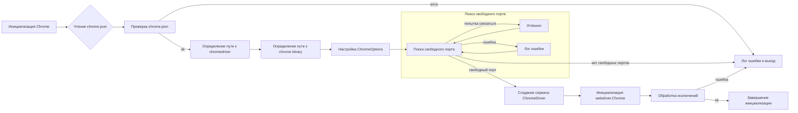

```MD
# Анализ кода файла chrome.py

## <input code>

```python
# ... (код файла chrome.py)
```

## <algorithm>

Алгоритм работы `chrome.py` можно представить следующей блок-схемой:

**1. Инициализация (метод `__init__`)**

* Вход: `user_agent` (словарь),  опциональные аргументы и ключевые аргументы для `webdriver.Chrome`.
* Чтение настроек из `chrome.json` файла с помощью `j_loads_ns` из `src.utils.jjson`.
* Проверка корректности загруженных настроек. Если нет настроек, логгируется ошибка и метод завершается.
* Определение директории профиля Chrome.
* Извлечение пути к `chromedriver.exe` из `chrome.json`. Проверяется наличие строки 'chrome' и заменяется на `gs.default_webdriver`, если необходимо.
* Извлечение пути к `chrome.exe` из `chrome.json` аналогично.
* Настройка ChromeOptions с помощью метода `set_options`.
* Добавление аргумента `user-data-dir` к `ChromeOptions`.
* Поиск свободного порта с помощью `find_free_port`.
* Создание сервиса ChromeDriver с заданным путем `executable_path`.
* Если найден свободный порт, добавляется аргумент `--port` к `ChromeOptions`.
* Инициализация экземпляра `webdriver.Chrome` с заданными `options` и `service`.
* Обработка исключений `WebDriverException` и общих исключений во время инициализации.  В случае ошибки, логгируется сообщение об ошибке и завершается.


**2. Поиск свободного порта (метод `find_free_port`)**

* Вход: `start_port`, `end_port`
* Цикл по портам от `start_port` до `end_port`.
* Попытка связать сокет с текущим портом.
* Если попытка удачна, возвращает найденный порт.
* Если ошибка (OSError), логгируется сообщение и цикл продолжается.
* Если все порты заняты, возвращает `None`.


**3. Настройка опций (метод `set_options`)**

* Вход: `settings` (словарь или список)
* Обработка пустых настроек.
* Если `settings` содержат `options`, строковый список пар `key=value` преобразуется в словарь `options_dict`.
* Добавляются аргументы из `options_dict` в `ChromeOptions`.
* Если `settings` содержат `headers`, добавляются соответствующие аргументы в `ChromeOptions`.
* Возвращает настроеный объект `ChromeOptions`.


## <mermaid>



## <explanation>

**Импорты:**

* `os`: Для работы с операционной системой (получение пути, переменных окружения).
* `socket`: Для проверки доступности портов.
* `pathlib`: Для работы с путями к файлам.
* `typing`: Для типизации.
* `selenium`: Для взаимодействия с веб-драйвером.
* `selenium.webdriver.chrome.service`, `selenium.webdriver.chrome.options`:  Для управления chrome драйвером и его опциями.
* `fake_useragent`: Для генерации случайных user-agent строк.
* `selenium.common.exceptions`:  Для обработки возможных исключений.
* `src.gs`:  Предполагает наличие модуля `gs` в папке `src`, который содержит информацию о путях к файлам и ресурсам проекта.  
* `src.utils.jjson`:  Модуль, отвечающий за загрузку json данных, что позволяет читать и обрабатывать JSON конфигурацию `chrome.json`.
* `src.logger.logger`: Модуль, предоставляющий средства для логгирования.  Связь: `src` – это корневая папка проекта, `utils`, `logger` – подпапки, содержащие соответствующие инструменты.

**Классы:**

* `Chrome`: Наследует от `selenium.webdriver.Chrome` и добавляет функциональность для конфигурации (настройка профиля, поиск свободных портов, обработка настроек из `chrome.json`).  `driver_name`, `d`, `options`, `user_agent` – атрибуты, хранящие данные о драйвере. `__init__`, `find_free_port`, `set_options` – методы для инициализации, поиска портов и настройки опций.


**Функции:**

* `find_free_port`: Ищет свободный порт в заданном диапазоне.
* `set_options`: Настраивает опции Chrome (в том числе, user-agent и другие параметры).


**Переменные:**

* `settings`: Хранит загруженные настройки из `chrome.json`.
* `profile_directory`: Директория профиля браузера Chrome.
* `chromedriver_path`: Путь к исполняемому файлу `chromedriver`.
* `binary_location`: Путь к исполняемому файлу `chrome`.
* `free_port`: Свободный порт для запуска Chrome WebDriver.


**Возможные ошибки/улучшения:**

* **Обработка ошибок:** Обработка исключений `WebDriverException` и общих исключений в методе `__init__`.
* **Управление ресурсами:** Необходимо добавить закрытие сокета и других ресурсов в `find_free_port`.
* **Проверка наличия файла `chrome.json`:** Необходимо добавить проверку существования файла `chrome.json`.
* **Локализация:**  `chromedriver` и `chrome` могут иметь различные имена на разных платформах. Можно было бы использовать более универсальные подходы для определения пути.
* **Конфигурация:**  Использование `gs` для получения путей вызывает зависимость от внешнего модуля, что не всегда хорошо.


**Взаимосвязь с другими частями проекта:**

Класс `Chrome` напрямую зависит от `gs` (для получения путей) и `src.utils.jjson` (для загрузки настроек).  Класс также использует `selenium` для запуска драйвера.  Возможно, существует и другие зависимости, например, от  `logger` для ведения журналов.


**Общий вывод:**

Код хорошо структурирован и прокомментирован.  Добавление более подробной информации о логике и использовании `gs` позволит сделать код более понятным и  уменьшить количество предположений.