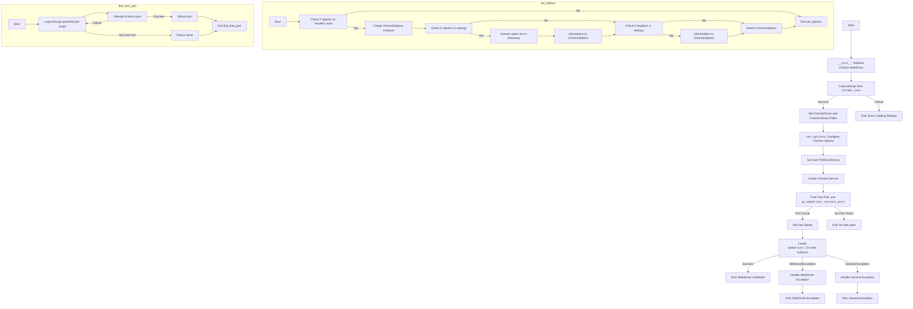

## ИНСТРУКЦИЯ:

Анализируй предоставленный код подробно и объясни его функциональность. Ответ должен включать три раздела:  

1. **<алгоритм>**: Опиши рабочий процесс в виде пошаговой блок-схемы, включая примеры для каждого логического блока, и проиллюстрируй поток данных между функциями, классами или методами.  
2. **<mermaid>**: Напиши код для диаграммы в формате `mermaid`, проанализируй и объясни все зависимости, 
    которые импортируются при создании диаграммы. 
    **ВАЖНО!** Убедитесь, что все имена переменных, используемые в диаграмме `mermaid`, 
    имеют осмысленные и описательные имена. Имена переменных вроде `A`, `B`, `C`, и т.д., не допускаются!  
    
    **Дополнительно**: Если в коде есть импорт `import header`, добавьте блок `mermaid` flowchart, объясняющий `header.py`:\
    ```mermaid
    flowchart TD
        Start --> Header[<code>header.py</code><br> Determine Project Root]
    
        Header --> import[Import Global Settings: <br><code>from src import gs</code>] 
    ```

3. **<объяснение>**: Предоставьте подробные объяснения:  
   - **Импорты**: Их назначение и взаимосвязь с другими пакетами `src.`.  
   - **Классы**: Их роль, атрибуты, методы и взаимодействие с другими компонентами проекта.  
   - **Функции**: Их аргументы, возвращаемые значения, назначение и примеры.  
   - **Переменные**: Их типы и использование.  
   - Выделите потенциальные ошибки или области для улучшения.  

Дополнительно, постройте цепочку взаимосвязей с другими частями проекта (если применимо).  

Это обеспечивает всесторонний и структурированный анализ кода.
## Формат ответа: `.md` (markdown)
**КОНЕЦ ИНСТРУКЦИИ**

## <алгоритм>

**Блок-схема работы класса `Chrome`:**

1. **Инициализация (`__init__`)**:
    *   Начало: Получение `user_agent` (из аргумента или генерируется случайный).
    *   Пример: `user_agent = {'User-Agent': 'Mozilla/5.0 ...'}` или `user_agent = None`
    *   Загрузка настроек из `chrome.json` (с использованием `j_loads`).
        *   Если файл не найден или ошибка, завершение.
    *   Пример: `settings = { "driver": { "chromedriver": [...], "chrome_binary": [...]}, "headers": {...}}`
    *   Определение путей `chromedriver_path` и `binary_location` на основе `settings` и глобальных настроек.
        *   Пример: `chromedriver_path = "C:/.../bin/webdrivers/chrome/125.0.6422.14/chromedriver.exe"`
        *   Пример: `binary_location = "C:/.../bin/webdrivers/chrome/125.0.6422.14/win64-125.0.6422.14/chrome-win64/chrome.exe"`
    *   Создание и настройка `ChromeOptions` через `set_options(settings)`.
        *   Добавление пути к профилю пользователя (папка `User Data`).
    *   Пример:  `options = ChromeOptions()`
    *   Создание `ChromeService` с путем к бинарному файлу Chrome.
        *   Пример: `service = ChromeService(executable_path="C:/.../chrome.exe")`
    *   Поиск свободного порта с помощью `gs.webdriver_current_port`
        *   Увеличение `gs.webdriver_current_port` на 1.
        *   Если порт найден, добавление `--port` в опции.
        *   Если порт не найден в диапазоне, завершение.
    *   Обработка ошибок при настройке.
2. **Запуск WebDriver (в `__init__`)**:
    *   Создание экземпляра `webdriver.Chrome` с настроенными `options` и `service`.
    *   Обработка ошибок `WebDriverException` и общих исключений.
        *   В случае ошибки - логирование и завершение.
3. **Поиск свободного порта (`find_free_port`)**:
    *   Цикл по диапазону портов от `start_port` до `end_port`.
    *   Попытка привязать сокет к порту.
        *   Если успешно, возврат порта.
        *   Если ошибка (порт занят), логгирование и переход к следующему порту.
    *   Если все порты заняты, возврат `None`.
4.  **Установка опций (`set_options`)**:
    *   Принимает настройки `settings` из `chrome.json`.
    *   Если `options` или `headers` отсутствуют в `settings`, завершение.
    *   Инициализируется `ChromeOptions`.
    *   Если `options` в `settings`:
        *   Преобразование списка `[key=value, key2=value2]` в словарь.
        *   Добавление каждой пары ключ-значение в `options` как аргумент `--key=value`.
    *   Если `headers` в `settings`:
        *   Добавление каждой пары ключ-значение в `options` как аргумент `--key=value`.
    *   Возврат объекта `ChromeOptions`.

## <mermaid>



**Зависимости `mermaid` диаграммы:**
*   `Start`, `End`, `EndSuccess`, `EndError`, `EndError2`: Точки начала и завершения процесса.
*   `Init`: Метод `__init__`, который является точкой входа в класс.
*   `LoadSettings`: Загрузка настроек из файла `chrome.json`.
*   `SetPaths`: Установка путей к `chromedriver` и бинарному файлу `chrome.exe`.
*   `SetOptions`: Настройка опций для `ChromeOptions` с помощью метода `set_options`.
*   `SetUserProfileDir`: Установка директории пользовательского профиля.
*    `CreateService`: Создание сервиса `ChromeService` с указанием пути к бинарному файлу.
*   `FindFreePort`: Поиск свободного порта в заданном диапазоне.
*   `SetPortOption`: Установка порта для WebDriver.
*   `CreateWebDriver`: Создание экземпляра `webdriver.Chrome`.
*   `HandleWebDriverException`: Обработчик исключения `WebDriverException`.
*   `HandleGeneralException`: Обработчик общих исключений.
*   `set_options`: поддиаграмма, описывающая метод `set_options`.
*   `find_free_port`: поддиаграмма, описывающая метод `find_free_port`.

## <объяснение>

### Импорты:

*   **`os`**: Обеспечивает взаимодействие с операционной системой, используется для работы с путями файлов и переменными окружения (`os.path.join`, `os.getenv`).
*   **`socket`**:  Используется для сетевого взаимодействия, в частности для проверки доступности портов (`socket.socket`).
*   **`pathlib.Path`**: Позволяет работать с путями файлов и директорий в объектно-ориентированном стиле (`Path`).
*   **`typing.List`, `typing.Dict`**: Используются для аннотаций типов, делая код более читаемым и проверяемым.
*   **`selenium.webdriver`**: Основной модуль для работы с веб-драйверами в Selenium (`webdriver.Chrome`).
*   **`selenium.webdriver.chrome.service.Service`**: Класс для управления сервисом ChromeDriver (`ChromeService`).
*   **`selenium.webdriver.chrome.options.Options`**: Класс для настройки параметров запуска браузера Chrome (`ChromeOptions`).
*   **`fake_useragent.UserAgent`**: Используется для генерации случайных user-agent строк (`UserAgent`).
*  **`selenium.common.exceptions.WebDriverException`**: Исключение при ошибках работы с WebDriver
*   **`src.gs`**: Импортирует глобальные настройки проекта, предоставляя доступ к путям, текущему порту для WebDriver и т.д.
*   **`src.utils.jjson.j_loads_ns`**: Функция для загрузки JSON-данных с поддержкой пространств имен (используется для загрузки `chrome.json`).
*   **`src.logger.logger`**: Используется для логирования событий и ошибок внутри приложения (`logger`).

### Классы:

*   **`Chrome(webdriver.Chrome)`**:
    *   **Роль**: Является подклассом `webdriver.Chrome`, расширяющим его функциональность дополнительными настройками и управлением.
    *   **Атрибуты**:
        *   `driver_name (str)`: Имя драйвера (`'chrome'`).
        *    `d (webdriver.Chrome)`: Экземпляр webdriver.Chrome, по умолчанию `None`.
        *   `options (ChromeOptions)`: Объект для настройки параметров запуска Chrome.
        *   `user_agent (dict)`: Словарь с настройками `User-Agent`.
    *   **Методы**:
        *   `__init__(self, user_agent=None, *args, **kwargs)`:
            *   **Назначение**: Инициализирует WebDriver Chrome с заданными параметрами, включая загрузку настроек из `chrome.json`, настройку путей и параметров запуска.
            *   **Пример**: `chrome_instance = Chrome(user_agent={"User-Agent": "..."})`.
        *   `find_free_port(self, start_port, end_port)`:
            *   **Назначение**: Ищет свободный порт в заданном диапазоне.
            *   **Пример**: `free_port = self.find_free_port(9500, 9599)`.
            *   **Возвращает**: Свободный порт или `None`.
        *   `set_options(self, settings=None)`:
            *   **Назначение**: Настраивает опции для Chrome WebDriver на основе настроек в `chrome.json`.
            *   **Пример**: `options = self.set_options(settings)`.
            *   **Возвращает**: Объект `ChromeOptions`.

### Функции:

*   В данном коде есть метод `__init__`,  `find_free_port` и `set_options` описанные выше.
*  Функция `j_loads_ns` импортирована из `src.utils.jjson` и используется для загрузки данных из json файла.

### Переменные:

*   `settings (dict)`: Хранит настройки, загруженные из `chrome.json`.
*   `chromedriver_path_parts (list)`: Части пути к исполняемому файлу ChromeDriver, взятые из `chrome.json`.
*   `chromedriver_path (str)`: Полный путь к исполняемому файлу ChromeDriver.
*   `binary_location_parts (list)`: Части пути к бинарному файлу Chrome, взятые из `chrome.json`.
*   `binary_location (str)`: Полный путь к исполняемому файлу Chrome.
*   `profile_directory (str)`: Путь к директории профиля пользователя Chrome.
*   `options (ChromeOptions)`: Объект, хранящий настройки Chrome.
*   `service (ChromeService)`: Объект, представляющий сервис ChromeDriver.
*   `free_port (int)`: Свободный порт, найденный функцией `find_free_port`.

### Потенциальные ошибки и области для улучшения:

*   **Обработка ошибок**: В коде есть `try-except` блоки для отлавливания исключений, но обработка ошибок для `WebDriverException`  и общих исключений пока не полная,  нужно добавить механизмы перезапуска драйвера или программы.
*   **Зависимости от `gs`**: Код сильно зависит от глобальных настроек (`gs`),  может быть сложно отслеживать поток данных и изменять настройки.
*   **Пути к файлам**: Жестко заданные пути в `chrome.json` могут быть проблематичными при переносе проекта, лучше использовать относительные пути или переменные окружения.
*    **Логирование**: Логирование используется для ошибок и важных событий, но для детальной отладки может потребоваться более подробное логирование.
*   **`user_agent`**: Использование случайного `UserAgent` может вызвать проблемы совместимости с некоторыми веб-сайтами. Предоставить пользователю возможность задавать свои `user_agent`.
*   **`chrome.json`**: Файл содержит как настройки WebDriver, так и профили, возможно, лучше разделить их на разные файлы конфигурации.
*   **Управление портами**: В данный момент используется линейный поиск порта, это может быть неэффективно.
*   **Управление версиями**: Отсутствует механизм автоматической загрузки нужной версии драйвера.
*   **Использование `j_loads`**: Предполагается, что `j_loads` является версией `j_loads_ns` без пространств имен. Это стоит явно указать.

### Взаимосвязи с другими частями проекта:

*   **`src.gs`**: Код напрямую взаимодействует с глобальными настройками, получая пути к бинарным файлам и текущий порт.
*   **`src.utils.jjson`**: Использует `j_loads_ns` для загрузки данных из файла `chrome.json`, что позволяет отделять конфигурации от кода.
*   **`src.logger.logger`**: Используется для логирования, что обеспечивает мониторинг работы приложения.
*   **`fake-useragent`**: Используется для создания случайных заголовков, что обеспечивает возможность имитировать различных пользователей, при работе с веб ресурсами.
*   **Selenium**: Является основой для работы с браузером, управляет действиями в браузере через WebDriver.

Этот анализ предоставляет подробное понимание функциональности кода, его зависимостей и потенциальных областей для улучшения.