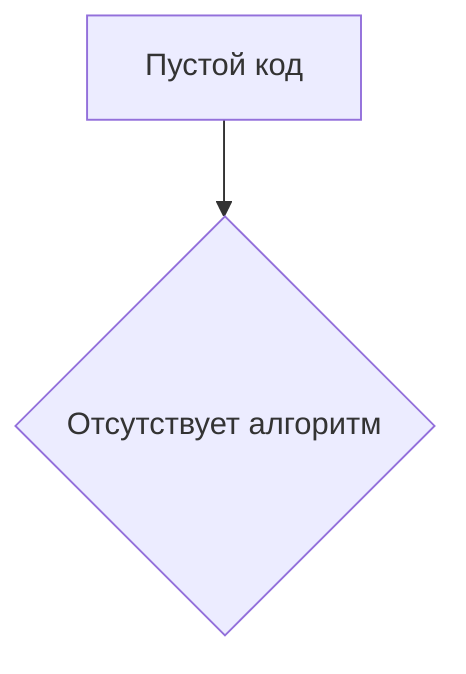

# Анализ кода (пустой файл)

**1. <input code>**

```
{\\rtf1}
```

**2. <algorithm>**

Поскольку предоставленный код пустой, алгоритм работы также отсутствует.  Невозможно построить блок-схему или продемонстрировать примеры.

**3. <mermaid>**



**4. <explanation>**

Предоставленный код представляет собой пустой файл, содержащий только разметку RTF.  Он не содержит никаких импортов, классов, функций или переменных.  Поэтому невозможна оценка его функциональности, связи с другими частями проекта и возможных ошибок.  

Отсутствие кода делает невозможным анализ и его объяснение.  Для дальнейшего анализа требуется предоставление действующего кода.