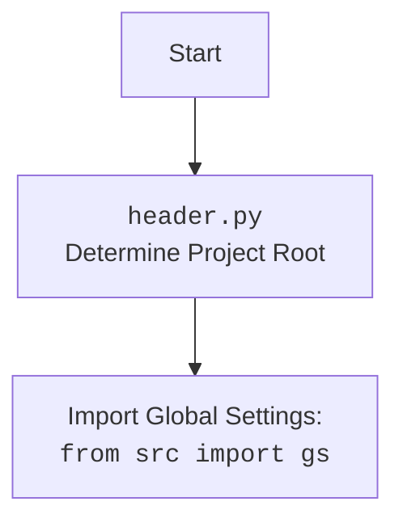

## АНАЛИЗ КОДА: `hypotez/src/webdriver/chrome/_examples/header.py`

### 1. <алгоритм>

**Блок-схема:**

```mermaid
graph TD
    A[Начало] --> B{Получение текущей рабочей директории: os.getcwd()};
    B --> C{Поиск индекса 'hypotez' в пути: os.getcwd().rfind('hypotez')};
    C --> D{Извлечение пути до корня проекта: os.getcwd()[:индекс + 11]};
    D --> E{Создание объекта Path для корня: Path(путь_корня)};
    E --> F{Добавление корня проекта в sys.path};
    F --> G{Создание объекта Path для папки src: Path(корень, 'src')};
    G --> H{Добавление корня проекта в sys.path};
     H -->I{Вывод пути корня проекта на печать: print(dir_root)};
     I --> J{Импорт необходимых библиотек(pathlib,json,re,src.gs,src.suppliers,src.product и тд)};
    J --> K[Конец];
```
**Примеры:**
*   **B**: Если `os.getcwd()` возвращает `/Users/user/projects/hypotez/src/webdriver/chrome/_examples`, то:
*   **C**: `os.getcwd().rfind('hypotez')` возвращает 21 (индекс начала подстроки 'hypotez').
*   **D**: `os.getcwd()[:21 + 11]` извлекает `/Users/user/projects/hypotez`.
*  **E**: `Path(путь_корня)` создает объект Path, представляющий путь к корню проекта.

**Поток данных:**

1.  Текущая рабочая директория (строка)  получается от `os.getcwd()`.
2.  Индекс `hypotez` находится внутри строки рабочей директории.
3.  Строка, представляющая путь к корню проекта, создается из рабочей директории.
4.  Объект `Path`, представляющий корень проекта, создается.
5.  Корень проекта добавляется в `sys.path` (список путей для поиска модулей).
6.  Объект `Path`, представляющий папку src, создается.
7.  Корень проекта добавляется в `sys.path`.
8.  Путь к корню проекта выводится на экран.
9. Импортируются все необходимые библиотеки
### 2. <mermaid>

```mermaid
flowchart TD
    Start[Начало] --> GetCurrentDir[Получить текущую рабочую директорию: os.getcwd()]
    GetCurrentDir --> FindHypotezIndex[Найти индекс 'hypotez': os.getcwd().rfind('hypotez')]
    FindHypotezIndex --> ExtractProjectRoot[Извлечь путь к корню проекта]
    ExtractProjectRoot --> CreatePathObject[Создать Path объект для корня проекта]
    CreatePathObject --> AddRootToSysPath[Добавить корень проекта в sys.path]
    AddRootToSysPath --> CreateSrcPathObject[Создать Path объект для папки 'src']
     CreateSrcPathObject --> AddRootToSysPath2[Добавить корень проекта в sys.path]
    AddRootToSysPath2 --> PrintProjectRoot[Вывести путь к корню проекта: print(dir_root)]
    PrintProjectRoot-->ImportLibs[Импорт необходимых библиотек(pathlib,json,re,src.gs,src.suppliers,src.product и тд)]
    ImportLibs-->End[Конец]

    style Start fill:#f9f,stroke:#333,stroke-width:2px
    style End fill:#ccf,stroke:#333,stroke-width:2px
```



**Описание зависимостей `mermaid`:**

1.  `Start`: Начало выполнения скрипта.
2.  `GetCurrentDir`: Получение текущей рабочей директории с помощью `os.getcwd()`. Эта операция не зависит от других частей, но является отправной точкой.
3.  `FindHypotezIndex`: Поиск индекса подстроки `hypotez` в полученной рабочей директории. Зависит от результата `GetCurrentDir`.
4.  `ExtractProjectRoot`: Извлечение пути до корня проекта на основе индекса, полученного на предыдущем шаге. Зависит от результата `FindHypotezIndex`.
5.   `CreatePathObject`: Создание объекта `Path` из строки пути до корня. Зависит от результата `ExtractProjectRoot`.
6.  `AddRootToSysPath`: Добавление пути к корню проекта в `sys.path` для импорта модулей. Зависит от объекта `Path`, созданного на предыдущем шаге.
7.  `CreateSrcPathObject`: Создание объекта `Path` для каталога `src`. Зависит от объекта `Path` для корня проекта.
8.   `AddRootToSysPath2`: Добавление пути к корню проекта в `sys.path` для импорта модулей. Зависит от объекта `Path`, созданного на предыдущем шаге.
9. `PrintProjectRoot`:  Вывод пути к корню проекта. Зависит от `CreatePathObject`.
10. `ImportLibs`: Импортирование необходимых модулей из `src`, а также стандартных библиотек `pathlib`, `json` и `re`. Зависит от изменения `sys.path`.
11. `End`: Конец выполнения скрипта.

### 3. <объяснение>

**Импорты:**

*   `sys`: Предоставляет доступ к некоторым переменным и функциям, которые взаимодействуют с интерпретатором Python. Используется для модификации `sys.path`.
*   `os`: Предоставляет функции для взаимодействия с операционной системой. Используется для получения текущей рабочей директории (`os.getcwd`).
*   `pathlib.Path`: Предоставляет удобный способ работы с файловыми путями. Используется для создания и манипулирования путями.
*  `json`:  Модуль для работы с JSON-данными. Используется для сериализации и десериализации объектов Python в JSON.
*  `re`: Модуль для работы с регулярными выражениями.
*   `src.gs`:  Глобальные настройки проекта.
*   `src.suppliers.Supplier`:  Класс, представляющий поставщика.
*   `src.product.Product`, `src.product.ProductFields`, `src.product.ProductFieldsLocators`: Классы и константы, относящиеся к продуктам, их полям и локаторам.
*   `src.category.Category`: Класс, представляющий категорию товара.
*   `src.utils.jjson`: Модуль с функциями для работы с JSON, включая `j_dumps` (сериализация), `j_loads` (десериализация),  `pprint` (красивый вывод)  и `save_text_file`.
*    `src.logger.logger`: Модуль для ведения логов.
*  `StringNormalizer`:  Класс для нормализации строк.
*  `ProductFieldsValidator`: Класс для валидации полей продуктов.

**Переменные:**

*   `dir_root`: `pathlib.Path` - объект, представляющий путь к корневой директории проекта. Получается динамически, вычисляется относительно места запуска скрипта.
*  `dir_src`: `pathlib.Path` - объект, представляющий путь к папке `src`. Создается относительно `dir_root`.

**Функции:**

*   `os.getcwd()`: Возвращает строку, содержащую путь к текущей рабочей директории.
*   `Path()`: Конструктор класса `pathlib.Path`, создаёт объект, представляющий файловый путь.
*  `rfind()`: Метод строк для поиска индекса последнего вхождения подстроки.
*  `sys.path.append()`: Добавляет путь к списку путей для импорта модулей.
*  `print()`: Стандартная функция для вывода информации в консоль.

**Объяснения:**

1.  **Определение корневой директории:**
    *   Код начинается с определения корневой директории проекта. Он использует `os.getcwd()` для получения текущей рабочей директории, а затем `rfind()` для поиска индекса подстроки `hypotez`. После этого извлекается путь до корня проекта,  с помощью среза строки.
    *   Объект `Path` создается для удобства работы с путями.
2.  **Добавление в `sys.path`:**
    *  Путь к корню проекта добавляется в `sys.path`, чтобы можно было импортировать модули из директории `src`. Это позволяет использовать модули из проекта в других частях программы.
    *  Добавление `dir_src` в `sys.path`  может быть избыточным, так как корень проекта уже добавлен.
3.  **Импорт модулей:**
    *   Код импортирует необходимые модули из пакетов `src`, такие как `gs` (глобальные настройки), `Supplier`, `Product`, `Category`, а также модули для работы с JSON, логгированием и нормализацией данных.
4.  **Общая логика:**
    *   Этот скрипт в основном предназначен для правильной настройки путей для импорта модулей из пакета `src` при запуске скриптов внутри проекта. Он настраивает окружение Python, добавляя корень проекта в список путей поиска модулей.

**Потенциальные ошибки и улучшения:**

1.  **Избыточное добавление `sys.path`:** Путь к корню проекта добавляется в `sys.path` дважды. Это не вызывает проблем, но является избыточным.
2.  **Жестко заданное имя `hypotez`**:  Имя каталога `hypotez` жестко задано в коде. Если имя проекта изменится, код нужно будет менять. Можно рассмотреть использование конфигурационного файла или переменной окружения для более гибкой настройки.
3.  **Магические числа**: использование магического числа `11` может сделать код менее читаемым. Можно использовать именованную константу для этого смещения.
4.  **Порядок импортов:** Импорты разделены на несколько блоков, что может усложнить чтение.
5.  **Импорт из `src.logger.logger`** Импортирует сразу несколько классов, но в основном в дальнейшем используется только `logger`.

**Цепочка взаимосвязей:**

*   `header.py` устанавливает путь к корню проекта и к каталогу `src`, что является базовой настройкой для других скриптов.
*   Другие модули, использующие `from src import ...`, зависят от корректной работы этого скрипта.
*   `header.py` импортирует модули, которые используются для работы с настройками, данными, логгированием, поэтому это ключевой модуль в проекте.