# Анализ JSON-конфигурации для Chrome WebDriver

## 1. <алгоритм>

Данный JSON-файл представляет собой конфигурацию для управления Chrome WebDriver. Он содержит различные настройки, включая параметры запуска браузера, пути к исполняемым файлам, заголовки HTTP и настройки профиля.

**Блок-схема:**

```mermaid
graph LR
    A[Начало] --> B(Загрузка JSON-конфигурации);
    B --> C{Извлечение options};
    C -- "log-level" --> D[Настройка уровня логирования];
    C -- "disable-dev-shm-usage" --> E[Отключение dev-shm];
    C -- "remote-debugging-port" --> F[Установка порта для удаленной отладки];
    C -- "arguments" --> G[Установка аргументов командной строки];
        G --> G1[Пример: "--kiosk" - запуск в режиме киоска];
        G --> G2[Пример: "--disable-gpu" - отключение GPU];
    C --> H{Извлечение disabled_options};
    H -- "headless" --> I[Отключение headless режима];

    H --> J{Извлечение profile_directory};
    J -- "os" --> K[Путь к профилю пользователя (OS)];
    J -- "internal" --> L[Внутренний путь к профилю];
    J -- "testing" --> M[Путь к профилю для тестирования];
    
    J --> N{Извлечение binary_location};
    N -- "os" --> O[Путь к исполняемому файлу Chrome (OS)];
        O --> O1[Пример: "C:\\\\Program Files\\\\Google\\\\Chrome\\\\Application\\\\chrome.exe"];
    N -- "exe" --> P[Путь к исполняемому файлу ChromeDriver];
        P --> P1[Пример: "bin\\\\webdrivers\\\\chrome\\\\125.0.6422.14\\\\chromedriver.exe"];
    N -- "binary" --> Q[Путь к исполняемому файлу Chrome];
        Q --> Q1[Пример: "bin\\\\webdrivers\\\\chrome\\\\125.0.6422.14\\\\win64-125.0.6422.14\\\\chrome-win64\\\\chrome.exe"];
    N -- "chromium" --> R[Путь к исполняемому файлу Chromium];
    R --> R1[Пример: "bin\\\\webdrivers\\\\chromium\\\\chrome-win\\\\chrome.exe"];
    
    N --> S{Извлечение headers};
    S --> T[Установка HTTP-заголовков для запросов];
        T --> T1[Пример: "User-Agent" - информация о браузере];
        T --> T2[Пример: "Accept" - форматы данных для приема];
        T --> T3[Пример: "Accept-Charset" - кодировка символов];
        T --> T4[Пример: "Accept-Encoding" - методы сжатия];
        T --> T5[Пример: "Accept-Language" - язык контента];
        T --> T6[Пример: "Connection" - тип соединения];
    
    S --> U{Извлечение proxy_enabled};
    U --> V[Установка использования proxy];
    V --> W[Завершение];
```

```mermaid
graph LR
    subgraph Конфигурация Chrome WebDriver
    A[options] --> B(log-level);
    A --> C(disable-dev-shm-usage);
    A --> D(remote-debugging-port);
    A --> E(arguments);
        E --> E1["--kiosk"];
        E --> E2["--disable-gpu"];
    F[disabled_options] --> G(headless);
    H[profile_directory] --> I(os);
    H --> J(internal);
    H --> K(testing);
    L[binary_location] --> M(os);
        M --> M1["C:\\\\Program Files\\\\Google\\\\Chrome\\\\Application\\\\chrome.exe"]
    L --> N(exe);
        N --> N1["bin\\\\webdrivers\\\\chrome\\\\125.0.6422.14\\\\chromedriver.exe"]
    L --> O(binary);
        O --> O1["bin\\\\webdrivers\\\\chrome\\\\125.0.6422.14\\\\win64-125.0.6422.14\\\\chrome-win64\\\\chrome.exe"]
    L --> P(chromium);
        P --> P1["bin\\\\webdrivers\\\\chromium\\\\chrome-win\\\\chrome.exe"]
    Q[headers] --> R("User-Agent");
    Q --> S("Accept");
    Q --> T("Accept-Charset");
    Q --> U("Accept-Encoding");
    Q --> V("Accept-Language");
    Q --> W("Connection");
    X[proxy_enabled] --> Y;
    end
    
    style A fill:#f9f,stroke:#333,stroke-width:2px
    style F fill:#f9f,stroke:#333,stroke-width:2px
    style H fill:#f9f,stroke:#333,stroke-width:2px
    style L fill:#f9f,stroke:#333,stroke-width:2px
    style Q fill:#f9f,stroke:#333,stroke-width:2px
    style X fill:#f9f,stroke:#333,stroke-width:2px
```

## 2. <mermaid>



**Описание зависимостей:**

Диаграмма показывает иерархическую структуру JSON-объекта. Она представляет собой набор ключей (параметров) и их соответствующих значений. 

*   `options`: Содержит общие настройки запуска браузера.
    *   `log-level`: Уровень детализации логирования.
    *   `disable-dev-shm-usage`: Отключение общего доступа к памяти для разработчиков (может помочь при проблемах с производительностью).
    *   `remote-debugging-port`: Порт для удаленной отладки Chrome.
    *   `arguments`: Список аргументов командной строки, передаваемых Chrome при запуске.
*   `disabled_options`: Содержит настройки, которые должны быть отключены.
    *   `headless`: Режим работы браузера без графического интерфейса (отключено).
*   `profile_directory`: Содержит пути к каталогам профилей Chrome.
    *   `os`: Путь для профиля пользователя (зависит от операционной системы).
    *   `internal`: Внутренний путь к профилю.
    *   `testing`: Путь к профилю для тестирования.
*   `binary_location`: Содержит пути к исполняемым файлам.
    *   `os`: Путь к исполняемому файлу Chrome для ОС.
    *   `exe`: Путь к исполняемому файлу ChromeDriver.
    *   `binary`: Путь к исполняемому файлу Chrome.
    *  `chromium`: Путь к исполняемому файлу Chromium.
*   `headers`: Содержит HTTP-заголовки, отправляемые браузером при запросах.
    *   `User-Agent`: Информация о браузере.
    *   `Accept`: Типы данных, которые браузер может принимать.
    *   `Accept-Charset`: Кодировки символов, поддерживаемые браузером.
    *   `Accept-Encoding`: Методы сжатия, поддерживаемые браузером.
    *   `Accept-Language`: Предпочитаемые языки.
    *   `Connection`: Тип соединения.
*   `proxy_enabled`: Указывает, используется ли прокси-сервер.

## 3. <объяснение>

Этот JSON-файл содержит конфигурацию для веб-драйвера Chrome. Он определяет, как Chrome должен запускаться и взаимодействовать с веб-страницами.

**Раздел "options"**:

*   `log-level`: Устанавливает уровень логирования для драйвера. Значение `"5"` скорее всего соответствует `DEBUG`.
*   `disable-dev-shm-usage`: Отключает использование `/dev/shm`. Это может быть полезно в Docker контейнерах, где `/dev/shm` может быть мал.
*   `remote-debugging-port`: Устанавливает порт для удаленной отладки. Значение `"0"` означает, что порт будет выбран динамически.
*   `arguments`: Список аргументов командной строки, передаваемых при запуске Chrome.
    *   `--kiosk`: Запускает браузер в полноэкранном режиме, что обычно используется для отображения веб-приложений на дисплеях (киосках).
    *   `--disable-gpu`: Отключает аппаратное ускорение графики, что может решить проблемы совместимости на некоторых машинах.

**Раздел "disabled_options"**:

*   `headless`: Запуск браузера без видимого окна. В данном случае, этот параметр отключен. Это означает, что браузер будет запускаться в обычном режиме с окном.

**Раздел "profile_directory"**:

*   `os`: Путь к профилю пользователя Chrome. `%LOCALAPPDATA%` – переменная окружения Windows, указывающая на папку локальных данных пользователя.
*   `internal`: Внутренний путь к каталогу профиля, используемый драйвером.
*   `testing`: Путь к каталогу профиля для тестовых запусков.

**Раздел "binary_location"**:

*   `os`: Путь к исполняемому файлу Chrome.
*   `exe`: Путь к исполняемому файлу `chromedriver.exe`, который является драйвером для управления браузером.
*   `binary`: Путь к исполняемому файлу браузера chrome.exe.
*   `chromium`: Путь к исполняемому файлу браузера chromium.exe

**Раздел "headers"**:

*   Здесь определены пользовательские HTTP-заголовки, которые будут использоваться браузером при отправке HTTP-запросов.
    *   `User-Agent`: Имитирует браузер Chrome. Это помогает веб-серверам правильно обрабатывать запросы.
    *   `Accept`, `Accept-Charset`, `Accept-Encoding`, `Accept-Language`, `Connection`: Устанавливают параметры для определения типов контента, кодировок и языка, поддерживаемых клиентом, а также тип соединения.

**Раздел "proxy_enabled"**:
* `proxy_enabled`: Указывает, что прокси-сервер не используется.

**Взаимосвязь с другими частями проекта**:

Этот JSON-файл, вероятно, используется внутри проекта для настройки Chrome WebDriver, который, в свою очередь, управляет браузером в рамках автоматизированных тестов или других задач, требующих взаимодействия с веб-страницами. Пути к исполняемым файлам, профилям и прочее используются при инициализации драйвера. Заголовки используются для корректного взаимодействия браузера с серверами.

**Потенциальные ошибки и улучшения**:

*   **Абсолютные пути**: Использование абсолютных путей в `binary_location` (например, `C:\\Program Files\\...`) делает конфигурацию менее переносимой. Лучше использовать относительные пути или переменные окружения, а также проверять существование файлов перед использованием.
*   **Версии драйверов**: Необходимо убедиться, что версия `chromedriver.exe` совместима с версией Chrome.
*  **Зависимость от ОС:** Конфигурация имеет OS-зависимые пути, необходимо добавить варианты для других ОС
*   **Поддержка Chromium**: Необходимо обеспечить корректную поддержку Chromium, так как указан отдельный исполняемый файл.
*   **Согласованность:** Обеспечить согласованность между `binary` и `chromium`, чтобы проект не зависел от конкретного исполняемого файла браузера
*   **Логирование**: `log-level` = 5, что соответствует debug, хорошо для разработки, а для продакшена нужно будет изменить уровень.
* **Неудобное представление данных:** все настройки находятся в 1 json файле, что будет неудобно при большом количестве параметров, необходимо разнести по смысловым блокам или вынести в отдельные json файлы

Этот анализ дает полное представление о структуре и функциональности данной JSON-конфигурации, а также подчеркивает возможные проблемы и области для улучшения.