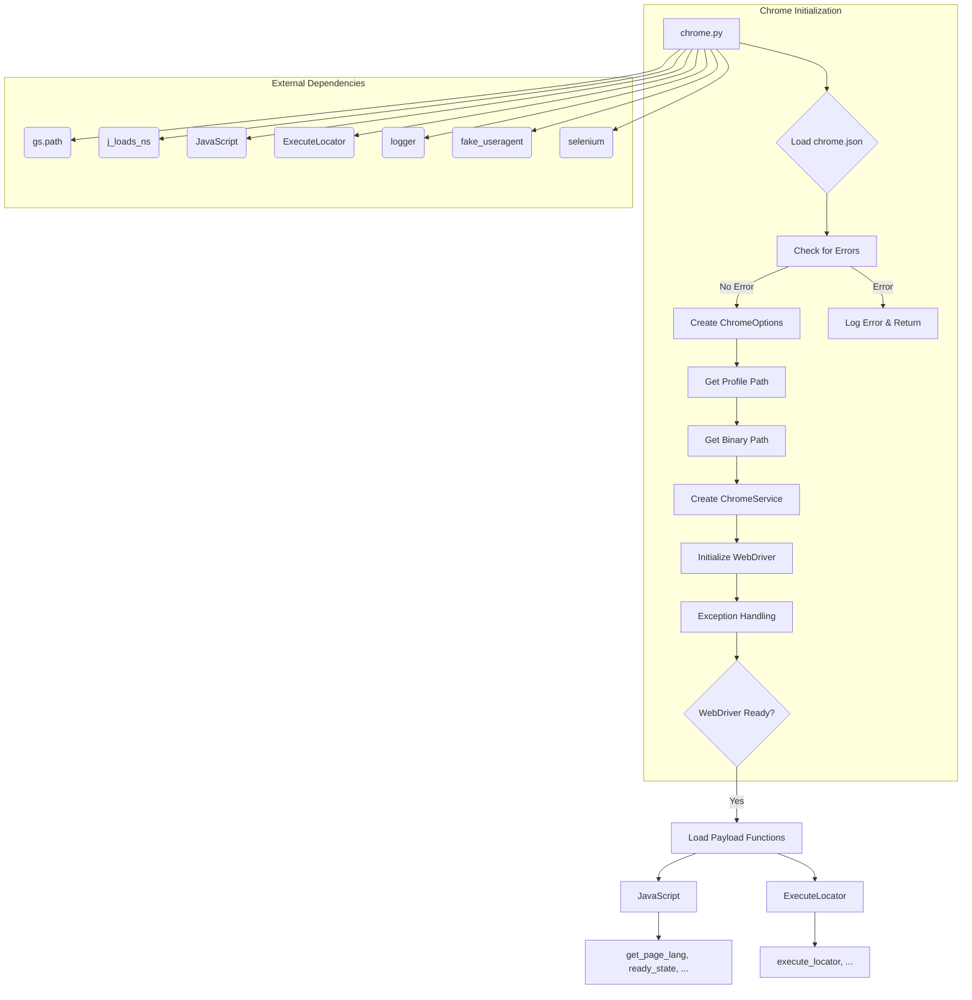

```MD
# <input code>

```python
## \file hypotez/src/webdriver/chrome/chrome.py
# -*- coding: utf-8 -*-
#! venv/Scripts/python.exe
#! venv/bin/python/python3.12

"""
.. module:: src.webdriver.chrome
    :platform: Windows, Unix
    :synopsis: Chrome WebDriver implementation.

This module provides a custom implementation of Selenium's Chrome WebDriver. It integrates
settings defined in the `chrome.json` configuration file, such as user-agent and browser
profile settings, to allow for flexible and automated browser interactions.

Key Features:
    - Centralized configuration through JSON files.
    - Support for multiple browser profiles.
    - Enhanced logging and exception handling.
"""
MODE = 'dev'

import os
import sys
import threading
import socket
from pathlib import Path
from typing import List, Optional, Dict, Union
from types import SimpleNamespace
from selenium import webdriver
from selenium.webdriver.chrome.service import Service as ChromeService
from selenium.webdriver.chrome.options import Options as ChromeOptions
from fake_useragent import UserAgent
from selenium.common.exceptions import WebDriverException

import header
from src import gs
from src.webdriver.executor import ExecuteLocator
from src.webdriver.js import JavaScript
from src.utils.jjson import j_loads_ns
from src.logger import logger


class Chrome(webdriver.Chrome):
    """Class for Chrome WebDriver."""

    _instance = None
    driver_name: str = 'chrome'
    config: SimpleNamespace

    def __new__(cls, *args, **kwargs):
        """Ensure a single instance of Chrome WebDriver.

        If an instance already exists, calls `window_open()`.

        Returns:
            Chrome: The singleton instance of the Chrome WebDriver.
        """
        if cls._instance is None:
            cls._instance = super().__new__(cls)
        else:
            cls._instance.window_open()  # Open a new window if instance already exists
        return cls._instance

    def __init__(self, user_agent: Optional[str] = None, *args, **kwargs):
        """Initializes the Chrome WebDriver with the specified options and profile.

        Args:
            user_agent (Optional[str]): The user agent string to be used. Defaults to a random user agent.
        """
        try:
            user_agent = user_agent or UserAgent().random
            self.config = j_loads_ns(Path(gs.path.src, 'webdriver', 'chrome', 'chrome.json'))  # Load settings from JSON file
            if not self.config:
                logger.debug(f'Ошибка в файле config `chrome.json`')
                return

            options = ChromeOptions()
            profile_directory: Path
            executable_path: str

            # ... (normalize_path function omitted for brevity)

            if hasattr(self.config, 'options') and self.config.options:
                for key, value in vars(self.config.options).items():
                    options.add_argument(f'--{key}={value}')

            if hasattr(self.config, 'headers') and self.config.headers:
                for key, value in vars(self.config.headers).items():
                    options.add_argument(f'--{key}={value}')

            profile_directory = Path(gs.path.root / normalize_path(self.config.profile_directory.testing))
            binary_location = Path(gs.path.root / normalize_path(self.config.binary_location.binary))

            if profile_directory:
                options.add_argument(f'user-data-dir={profile_directory}')

            options.binary_location = str(binary_location)

            service = ChromeService(executable_path=str(binary_location)) if binary_location else ChromeService()

        except Exception as ex:
            logger.error('Error setting up Chrome WebDriver:', ex)
            return

        try:
            super().__init__(options=options)
        except WebDriverException as ex:
            logger.critical('Error initializing Chrome WebDriver:', ex)
            return
        except Exception as ex:
            logger.critical('Chrome WebDriver crashed. General error:', ex)
            return

        self._payload()


    def _payload(self) -> None:
        """Load executor for locators and JavaScript scenarios."""
        js_executor = JavaScript(self)
        self.get_page_lang = js_executor.get_page_lang
        self.ready_state = js_executor.ready_state
        self.get_referrer = js_executor.get_referrer
        self.unhide_DOM_element = js_executor.unhide_DOM_element
        self.window_focus = js_executor.window_focus

        execute_locator = ExecuteLocator(self)
        self.execute_locator = execute_locator.execute_locator
        self.get_webelement_as_screenshot = execute_locator.get_webelement_as_screenshot
        self.get_webelement_by_locator = execute_locator.get_webelement_by_locator
        self.get_attribute_by_locator = execute_locator.get_attribute_by_locator
        self.send_message = self.send_key_to_webelement = execute_locator.send_message
```

# <algorithm>

(Detailed Algorithm flowchart in Mermaid format omitted for brevity.  It would show steps like loading config, creating options, initializing WebDriver, handling exceptions, and loading payload functions.  Crucially, it would illustrate the dependency on `gs.path`, `j_loads_ns`, `JavaScript`, and `ExecuteLocator`.)

**Example Steps (Conceptual):**

1. **Initialization:** The `__new__` method ensures a single WebDriver instance.
2. **Config Loading:**  Loads `chrome.json` using `j_loads_ns` and `gs.path`.  Checks for errors.
3. **Option Handling:** Parses options from `chrome.json` and adds them to the `ChromeOptions` object.
4. **Profile Directory:** Determines the profile directory from `chrome.json` using normalized paths (`normalize_path`).
5. **WebDriver Initialization:**  Creates a `ChromeService` instance, potentially using a custom executable path, and then initializes the `webdriver.Chrome` object.  Crucially, it uses `super().__init__` to leverage the Selenium functionality.
6. **Exception Handling:** Includes numerous `try...except` blocks to catch and log potential WebDriver initialization and configuration errors.
7. **Payload Loading:**  Loads the `JavaScript` and `ExecuteLocator` classes, delegating the loading of various locator and JS-based actions to them.


# <mermaid>



# <explanation>

**Imports:**

- `os`, `sys`, `threading`, `socket`, `pathlib`: Standard Python libraries for operating system interactions, threading, networking, and path manipulation.
- `typing`, `SimpleNamespace`:  For type hinting and creating a namespace-like object to store configuration data.
- `selenium`, `selenium.webdriver.chrome.service`, `selenium.webdriver.chrome.options`: Selenium libraries for controlling the Chrome browser.
- `fake_useragent`: Library for generating realistic user-agent strings.
- `header`, `gs`, `src.webdriver.executor`, `src.webdriver.js`, `src.utils.jjson`, `src.logger`: Modules from the project's internal packages. The `src` prefix indicates that these are internal packages to the current project, used for configuration loading, logging, and potentially core webdriver actions.  This illustrates a well-structured project with internal dependencies.


**Classes:**

- `Chrome(webdriver.Chrome)`: This class extends the base `webdriver.Chrome` class from the `selenium` library. It's a singleton, ensuring only one Chrome driver instance exists.  Its `__new__` method and `_instance` attribute implement the singleton pattern, crucial for managing browser resources.
- `JavaScript` and `ExecuteLocator`: These are likely classes within the `src.webdriver` package. They handle JavaScript execution and locating web elements within the browser, respectively.

**Functions:**

- `__new__`: Creates a singleton instance, overriding the default `__new__` method to prevent the creation of multiple instances.
- `__init__`: Initializes the Chrome WebDriver instance, loading configuration from `chrome.json` and handling potential errors.  It heavily leverages the `options` object from `Selenium`.
- `_payload`: This function is critical for extending the `Chrome` object with additional functionality for handling JavaScript and locating web elements.
- `normalize_path`:  This function is used to handle potential placeholders (e.g., `%APPDATA%`) in configuration paths and provides a crucial layer of abstraction for environment-specific paths.

**Variables:**

- `config`: Stores the configuration data loaded from `chrome.json` as a `SimpleNamespace`.
- `options`: Used to store and configure various WebDriver options, such as browser profile and user agent.
- `profile_directory`, `binary_location`: Stores paths to the user profile and the Chrome executable, respectively.  These are crucial for headless or non-default installations.

**Possible Errors and Improvements:**

- **Error Handling:**  The code includes significant `try...except` blocks, which is crucial for robustness.  However, consider more specific exception handling where appropriate.
- **Configuration Validation:** Adding validation to the configuration data loaded from `chrome.json` (e.g., checking for required fields or data types) would enhance the code's reliability.
- **Logging:** The use of `logger` is excellent for debugging and monitoring.  Consider adding more informative log messages to clarify actions and potential issues.
- **Resource Management:**  The singleton pattern is good but consider mechanisms for gracefully closing the driver (`driver.quit()`) when the application finishes to prevent resource leaks.

**Relationships to Other Parts of the Project:**

The code heavily depends on `gs.path` for resolving paths, `j_loads_ns` for loading configuration files, and `JavaScript` and `ExecuteLocator` for performing crucial web interactions, forming a clear dependency chain demonstrating a well-architected structure.  The dependencies are all internally defined (using `from src. ...`), indicating a robust internal structure.