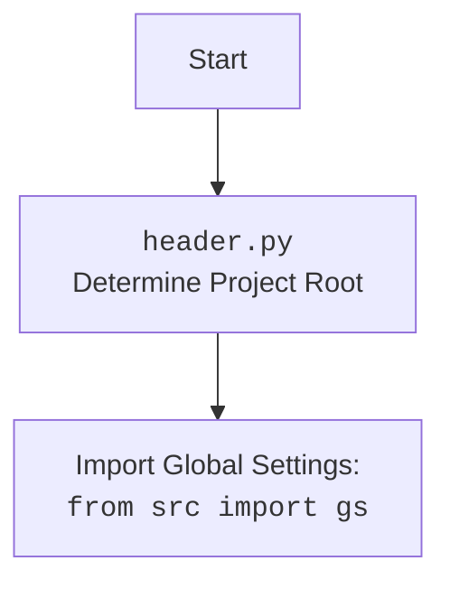

## АНАЛИЗ КОДА: `hypotez/src/webdriver/chrome/chrome.py`

### 1. <алгоритм>
   
   **Блок-схема работы `Chrome` класса:**
   
   ```mermaid
   graph LR
    A[Начало] --> B{Существует ли экземпляр?};
    B -- Да --> C[Открыть новое окно];
    C --> J;
    B -- Нет --> D[Создать экземпляр];
    D --> E[Загрузить настройки из `chrome.json`];
    E --> F{Проверка `chrome.json`};
    F -- Ошибка --> G[Логирование ошибки и выход];
    F -- OK --> H[Настройка ChromeOptions];
    H --> I[Нормализация путей];
    I --> K{Проверка профиля};
    K -- Профиль есть --> L[Добавить профиль в ChromeOptions];
    K -- Нет профиля --> M;
    L --> M[Установка бинарного пути];    
    M --> N[Инициализация Chrome Service];
    N --> O{Проверка исключений};
    O -- Ошибка --> P[Логирование ошибки и выход];
    O -- Нет ошибки --> Q[Инициализация WebDriver];
    Q --> R{Проверка исключений WebDriver};
    R -- Ошибка --> S[Логирование ошибки и выход];
    R -- Нет ошибки --> T[Загрузка Payload];
    T --> J[Конец]
   ```
   
   **Пояснения к блок-схеме:**
   
   1. **Начало:** Вызывается конструктор класса `Chrome`.
   2. **Существует ли экземпляр?:** Проверяет, существует ли уже созданный экземпляр класса (`_instance`).
   3. **Открыть новое окно:** Если экземпляр уже существует, открывается новое окно браузера.
   4. **Создать экземпляр:** Если экземпляра нет, то создаётся новый.
   5. **Загрузить настройки из `chrome.json`:** Загружаются настройки из файла `chrome.json` в объект `SimpleNamespace`.
   6. **Проверка `chrome.json`:** Проверяется, успешно ли загрузились настройки из файла.
   7. **Логирование ошибки и выход:** В случае ошибки при загрузке настроек, выводится сообщение в лог и происходит выход.
   8. **Настройка `ChromeOptions`:** Создается объект `ChromeOptions` для настройки параметров браузера.
   9. **Нормализация путей:** Пути к профилю и бинарному файлу нормализуются с использованием переменных окружения.
   10. **Проверка профиля:** Проверяется, существует ли указанный каталог профиля.
   11. **Добавить профиль в `ChromeOptions`:** Если профиль существует, он добавляется в параметры браузера.
   12. **Установка бинарного пути:** Устанавливается путь к исполняемому файлу Chrome.
   13. **Инициализация `Chrome Service`:** Инициализируется сервис для управления браузером.
   14. **Проверка исключений:** Проверяется, возникли ли исключения при подготовке параметров и сервиса.
   15. **Логирование ошибки и выход:** Если возникли исключения, выводятся сообщения в лог и происходит выход.
   16. **Инициализация `WebDriver`:** Инициализируется экземпляр `webdriver.Chrome` с заданными параметрами.
   17. **Проверка исключений WebDriver:** Проверяется, возникли ли исключения при инициализации `WebDriver`.
   18. **Логирование ошибки и выход:** Если возникли исключения при инициализации `WebDriver`, выводятся сообщения в лог и происходит выход.
   19. **Загрузка `Payload`:** Загружается `payload` — необходимые для работы `JS` сценарии и локаторы.
   20. **Конец:** Конец работы конструктора.
   
   **Пример:**
   
   ```python
   from src.webdriver.chrome import Chrome
   
   # Первый вызов создаст экземпляр драйвера
   driver1 = Chrome()
   
   # Второй вызов вернет тот же экземпляр и откроет новое окно
   driver2 = Chrome()
   
   driver1.get("https://www.example1.com")
   driver2.get("https://www.example2.com")
   
   #  Теперь два окна от одного и того же экземпляра драйвера
   ```
   
### 2. <mermaid>
    
```mermaid
    flowchart TD
        Start(Начало) --> LoadConfig[Загрузить конфигурацию из chrome.json];
        LoadConfig --> CheckConfig{Конфигурация загружена?};
        CheckConfig -- Нет --> LogErrorConfig[Логировать ошибку конфигурации];
        LogErrorConfig --> End(Конец);
        CheckConfig -- Да --> InitOptions[Инициализировать ChromeOptions];
        InitOptions --> AddConfigOptions{Добавить опции из конфигурации};
        AddConfigOptions --> AddCustomOptions{Добавить пользовательские опции};
        AddCustomOptions --> AddHeadersOptions{Добавить опции из заголовков};
        AddHeadersOptions --> NormalizePaths[Нормализовать пути профиля и бинарника];
        NormalizePaths --> CheckProfile{Профиль существует?};
        CheckProfile -- Да --> AddProfileOption[Добавить опцию профиля];
        CheckProfile -- Нет --> SetBinaryPath;
        AddProfileOption --> SetBinaryPath[Установить путь к бинарнику];
        SetBinaryPath --> InitService[Инициализировать Chrome Service];
        InitService --> InitWebDriver[Инициализировать WebDriver];
        InitWebDriver --> LoadPayload[Загрузить payload (js executor, execute locator)];
        LoadPayload --> End;
```

**Зависимости `mermaid`:**
   
*   **`Start`**: Начало процесса инициализации экземпляра класса `Chrome`.
*   **`LoadConfig`**: Загрузка конфигурации из файла `chrome.json` с использованием `src.utils.jjson.j_loads_ns`.
*   **`CheckConfig`**: Проверка успешности загрузки конфигурации.
*    **`LogErrorConfig`**: Логирование ошибки загрузки конфигурации с использованием `src.logger.logger`.
*   **`InitOptions`**: Создание экземпляра `ChromeOptions` для настройки параметров браузера.
*   **`AddConfigOptions`**: Добавление опций из конфигурации `chrome.json` в `ChromeOptions`.
*   **`AddCustomOptions`**: Добавление пользовательских опций, переданных при инициализации класса, в `ChromeOptions`.
*   **`AddHeadersOptions`**: Добавление заголовков из конфигурации `chrome.json` в `ChromeOptions`.
*   **`NormalizePaths`**: Нормализация путей к профилю и бинарному файлу с использованием переменных окружения.
*   **`CheckProfile`**: Проверка существования каталога профиля.
*   **`AddProfileOption`**: Добавление опции профиля в `ChromeOptions`.
*   **`SetBinaryPath`**: Установка пути к исполняемому файлу Chrome.
*   **`InitService`**: Инициализация сервиса `ChromeService` с путём к исполняемому файлу.
*   **`InitWebDriver`**: Инициализация экземпляра `webdriver.Chrome` с заданными `ChromeOptions` и сервисом.
*   **`LoadPayload`**: Загрузка `payload` (инициализация `JavaScript` и `ExecuteLocator`) для управления браузером.
*   **`End`**: Конец процесса инициализации.

**Диаграмма для `header.py`:**
    


### 3. <объяснение>

   **Импорты:**

   - `os`:  Используется для работы с переменными окружения (например, `os.environ.get`).
   - `sys`:  Используется для доступа к параметрам и функциям среды выполнения.
   - `pathlib.Path`: Используется для работы с файловыми путями в объектно-ориентированном стиле.
   - `typing.Optional`, `typing.List`:  Используется для статической типизации, указывая, что аргумент может быть `None` или списком.
   - `types.SimpleNamespace`: Используется для создания объекта с произвольными атрибутами (используется для хранения конфигурации).
   - `selenium.webdriver`: Основной модуль Selenium для управления браузером.
   - `selenium.webdriver.chrome.service.Service`: Используется для запуска и управления Chrome Driver.
   - `selenium.webdriver.chrome.options.Options`: Используется для настройки параметров Chrome.
   - `fake_useragent.UserAgent`: Используется для генерации случайных User-Agent.
   - `selenium.common.exceptions.WebDriverException`: Используется для обработки исключений, возникающих при работе с WebDriver.
   - `header`:  Используется для определения корневой директории проекта. Зависимости показаны на `mermaid`.
   - `src`: Содержит глобальные настройки и другие модули проекта.
   - `src.webdriver.executor.ExecuteLocator`: Класс для поиска и взаимодействия с веб-элементами.
   - `src.webdriver.js.JavaScript`: Класс для выполнения JavaScript в браузере.
   - `src.utils.jjson.j_loads_ns`: Функция для загрузки JSON в `SimpleNamespace`.
   - `src.logger.logger.logger`:  Объект для логирования.
 

   **Класс `Chrome`:**
   
   - **Роль:** Предоставляет интерфейс для управления браузером Chrome, реализуя паттерн Singleton.
   - **Атрибуты:**
      - `_instance`: Статический атрибут, хранящий единственный экземпляр класса.
      - `driver_name`: Имя драйвера (`chrome`).
      - `config`: Конфигурация браузера, загруженная из JSON.
   - **Методы:**
       - `__new__`: Обеспечивает создание только одного экземпляра класса.
       - `__init__`: Инициализирует драйвер с заданными опциями, загружает конфигурации из JSON, настраивает `ChromeOptions`, `Service`, инициализирует `WebDriver` и вызывает `_payload`.
       - `_payload`: Загружает необходимые для работы `JS` сценарии и локаторы.
   
   **Функции:**
   
    - `normalize_path(path: str) -> str`:
        - **Аргументы:**
            - `path`: Путь, который нужно нормализовать.
        - **Возвращает:** Нормализованный путь с заменой переменных окружения.
        - **Назначение:** Заменяет плейсхолдеры `%APPDATA%` и `%LOCALAPPDATA%` реальными значениями переменных окружения.
        - **Пример:** `normalize_path('%APPDATA%/test')` может вернуть `C:\\Users\\user\\AppData\\Roaming\\test` в зависимости от значений переменных окружения.

   **Переменные:**

    - `user_agent`: Строка, представляющая User-Agent браузера (может быть задана или сгенерирована случайно).
    - `options`: Список строк, представляющих дополнительные параметры Chrome.
    - `options_obj`: Объект `ChromeOptions`, содержащий настройки браузера.
    - `profile_directory`: Путь к каталогу профиля пользователя.
    - `binary_location`: Путь к исполняемому файлу Chrome.
    - `service`: Объект `ChromeService` для управления браузером.
   
   **Потенциальные ошибки и улучшения:**
   
   - **Обработка ошибок:**
        - Код уже имеет обработку исключений, но можно добавить более специфичные исключения и их обработку, чтобы лучше понимать причины ошибок.
        - Можно добавить retry logic для случаев, когда WebDriver не запускается с первого раза.
   - **Конфигурация:**
       - Можно сделать конфигурацию более гибкой, позволяя передавать ее не только из файла, но и через аргументы конструктора.
       - Можно добавить валидацию данных из JSON-файла.
   - **Производительность:**
       - Можно добавить возможность использовать уже запущенный Chrome, а не создавать новый экземпляр при каждом вызове, если это не мешает выполнению сценария.
   - **Улучшение нормализации:**
        - Поддержка других переменных окружения
        - Обработка некорректных путей (например, если путь пустой или не существует).
        - Добавить проверку корректности пути.
   
   **Взаимосвязи с другими частями проекта:**
   
   - `src.webdriver.executor.ExecuteLocator`: Этот класс используется для выполнения действий над элементами на странице (например, `click`, `send_keys`, `get_text`).
   - `src.webdriver.js.JavaScript`: Этот класс используется для выполнения JS-кода на странице (например, для скроллинга, изменения состояния DOM).
   - `src.utils.jjson.j_loads_ns`: Этот модуль используется для загрузки настроек из JSON-файла.
   - `src.logger.logger`: Этот модуль используется для логирования событий и ошибок.
   - `header`: Определяет корень проекта для работы с относительными путями.
   
   Таким образом, `chrome.py` является центральным компонентом для управления браузером Chrome, используя настройки из `chrome.json`, `ExecuteLocator` и `JavaScript`, логируя все действия и ошибки, а также взаимодействуя с остальными частями проекта.