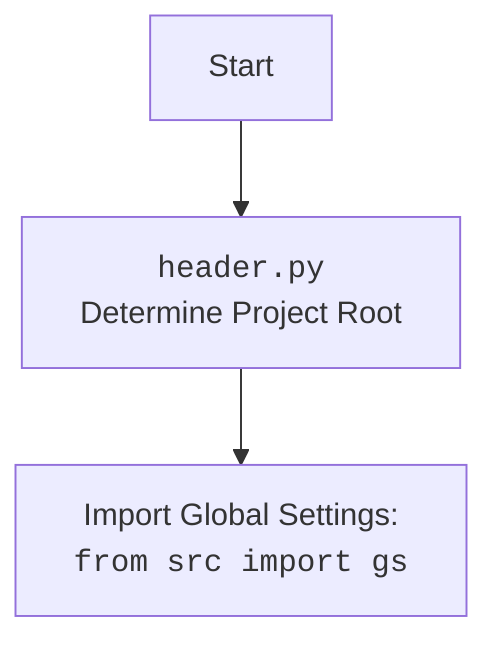

## ИНСТРУКЦИЯ:

Анализируй предоставленный код подробно и объясни его функциональность. Ответ должен включать три раздела:  

1. **<алгоритм>**: Опиши рабочий процесс в виде пошаговой блок-схемы, включая примеры для каждого логического блока, и проиллюстрируй поток данных между функциями, классами или методами.  
2. **<mermaid>**: Напиши код для диаграммы в формате `mermaid`, проанализируй и объясни все зависимости, 
    которые импортируются при создании диаграммы. 
    **ВАЖНО!** Убедитесь, что все имена переменных, используемые в диаграмме `mermaid`, 
    имеют осмысленные и описательные имена. Имена переменных вроде `A`, `B`, `C`, и т.д., не допускаются!  
    
    **Дополнительно**: Если в коде есть импорт `import header`, добавьте блок `mermaid` flowchart, объясняющий `header.py`:\
    ```mermaid
    flowchart TD
        Start --> Header[<code>header.py</code><br> Determine Project Root]
    
        Header --> import[Import Global Settings: <br><code>from src import gs</code>] 
    ```

3. **<объяснение>**: Предоставьте подробные объяснения:  
   - **Импорты**: Их назначение и взаимосвязь с другими пакетами `src.`.  
   - **Классы**: Их роль, атрибуты, методы и взаимодействие с другими компонентами проекта.  
   - **Функции**: Их аргументы, возвращаемые значения, назначение и примеры.  
   - **Переменные**: Их типы и использование.  
   - Выделите потенциальные ошибки или области для улучшения.  

Дополнительно, постройте цепочку взаимосвязей с другими частями проекта (если применимо).  

Это обеспечивает всесторонний и структурированный анализ кода.
## Формат ответа: `.md` (markdown)
**КОНЕЦ ИНСТРУКЦИИ**
## <алгоритм>

1. **Инициализация Chrome:**
   - Загрузка настроек из `chrome.json`.
   - Определение пути к `chromedriver`.
   - Инициализация сервиса `webdriver.chrome.service.Service`.
   - Создание объекта `webdriver.chrome.options.Options`.
   - Добавление опций из файла конфигурации (например, `--disable-infobars`).
   - Установка режима окна (`kiosk`, `windowless`, `full_window`).
   - Добавление пользовательских опций, если они переданы при инициализации.
   - Установка User-Agent (случайный, если не задан).
   - Настройка прокси, если включены в настройках.
   - Определение директории профиля Chrome.
   - Создание экземпляра `webdriver.Chrome` с заданными настройками.
   - Инициализация `_payload` (загрузка методов).
     - Создание экземпляра `src.webdriver.js.JavaScript` и добавление методов в текущий класс
     - Создание экземпляра `src.webdriver.executor.ExecuteLocator` и добавление методов в текущий класс
   - Обработка ошибок `WebDriverException` и `Exception`.
2. **Настройка прокси (set_proxy):**
   - Получение словаря прокси из `src.webdriver.proxy.get_proxies_dict`.
   - Выбор рабочего прокси из списка (случайным образом перебирает прокси и вызывает `src.webdriver.proxy.check_proxy`).
   - Если рабочий прокси найден, добавляет его в опции Chrome (`--proxy-server`).
3. **Инициализация методов (_payload):**
    - Создание экземпляра `src.webdriver.js.JavaScript` и добавление методов:
        - `get_page_lang`,
        - `ready_state`,
        - `get_referrer`,
        - `unhide_DOM_element`,
        - `window_focus`.
    - Создание экземпляра `src.webdriver.executor.ExecuteLocator` и добавление методов:
        - `execute_locator`,
        - `get_webelement_as_screenshot`,
        - `get_webelement_by_locator`,
        - `get_attribute_by_locator`,
        - `send_message`, `send_key_to_webelement`.
4. **Пример использования (if __name__ == "__main__":):**
   - Создание экземпляра `Chrome` в режиме `full_window`.
   - Открытие страницы `https://google.com`.

**Пример использования:**
   ```python
   driver = Chrome(profile_name="test_profile", user_agent="My Custom User Agent", window_mode="kiosk")
   driver.get("https://example.com")
   ```

   - Этот пример создаст экземпляр Chrome с именем профиля `test_profile`, пользовательским `user_agent` и в режиме `kiosk`.

## <mermaid>
```mermaid
flowchart TD
    subgraph Chrome Class
    Start(Начало) --> LoadSettings(Загрузка настроек из chrome.json);
    LoadSettings --> ChromeDriverPath(Определение пути к chromedriver);
    ChromeDriverPath --> InitService(Инициализация Service(chromedriver_path));
    InitService --> InitOptions(Инициализация Options);
    InitOptions --> AddConfigOptions(Добавление опций из файла настроек);
    AddConfigOptions --> SetWindowMode(Установка режима окна);
    SetWindowMode --> AddCustomOptions(Добавление пользовательских опций);
    AddCustomOptions --> SetUserAgent(Установка User-Agent);
    SetUserAgent --> CheckProxyEnabled(Проверка proxy_enabled);
        CheckProxyEnabled -- True --> SetProxy(Настройка прокси);
        CheckProxyEnabled -- False --> SetProfileDir(Настройка директории профиля);
    SetProxy --> SetProfileDir;
    SetProfileDir --> CreateWebDriver(Создание экземпляра WebDriver);
    CreateWebDriver --> InitPayload(Инициализация _payload);
     InitPayload --> End(Конец);
    end
    
    subgraph Set Proxy Function
    SetProxyStart(Начало set_proxy)-->GetProxiesDict(Получение словаря прокси);
    GetProxiesDict-->SelectWorkingProxy(Выбор рабочего прокси из списка);
        SelectWorkingProxy -- Рабочий прокси найден --> AddProxyOption(Добавление опции прокси в Options);
        SelectWorkingProxy -- Рабочий прокси не найден --> ProxyNotFound(Логирование предупреждения об отсутствии прокси);
    AddProxyOption --> SetProxyEnd(Конец set_proxy);
    ProxyNotFound --> SetProxyEnd;
    end
    
    subgraph Payload Function
    InitPayloadStart(Начало _payload) --> CreateJSInstance(Создание экземпляра JavaScript);
    CreateJSInstance --> AddJSMethods(Добавление JS методов);
    AddJSMethods --> CreateExecutorInstance(Создание экземпляра ExecuteLocator);
    CreateExecutorInstance --> AddExecutorMethods(Добавление Executor методов);
    AddExecutorMethods --> InitPayloadEnd(Конец _payload);
     end
   
    Start --> SetProxyStart
    Start --> InitPayloadStart
   
    
    
    classDef imported fill:#f9f,stroke:#333,stroke-width:2px
    class LoadSettings, ChromeDriverPath, InitService, InitOptions, AddConfigOptions, SetWindowMode, AddCustomOptions, SetUserAgent, CheckProxyEnabled, SetProfileDir, CreateWebDriver, InitPayload  imported
     class  GetProxiesDict, SelectWorkingProxy, AddProxyOption, ProxyNotFound  imported
    class CreateJSInstance, AddJSMethods,CreateExecutorInstance, AddExecutorMethods imported
```


## <объяснение>

**Импорты:**

-   `os`: Предоставляет функции для работы с операционной системой, используется для получения переменных окружения.
-   `pathlib.Path`: Позволяет работать с путями файлов и директорий в объектно-ориентированном стиле.
-   `typing.Optional, typing.List`: Используются для статической типизации и указания необязательных параметров и списков.
-   `selenium.webdriver.Chrome`: Основной класс для управления браузером Chrome.
-   `selenium.webdriver.chrome.options.Options`: Класс для настройки опций Chrome.
-   `selenium.webdriver.chrome.service.Service`: Класс для управления сервисом chromedriver.
-   `selenium.common.exceptions.WebDriverException`: Исключение, выбрасываемое при ошибках WebDriver.
-   `src`:  Корневой пакет проекта.
    - `src.gs`: Глобальные настройки проекта, включая пути.
    - `src.webdriver.executor`: Модуль для выполнения действий через локаторы.
    - `src.webdriver.js`: Модуль для выполнения JavaScript кода в браузере.
    - `src.webdriver.proxy`: Модуль для работы с прокси.
    - `src.utils.jjson`: Модуль для работы с JSON-файлами.
    - `src.logger.logger`: Модуль для логирования.
-   `fake_useragent.UserAgent`: Библиотека для генерации случайных User-Agent.
-    `random`:  Модуль для генерации случайных чисел, в данном случае используется для случайной выборки прокси.

**Класс `Chrome`:**

-   **Роль**: Расширение класса `selenium.webdriver.Chrome` для упрощения управления браузером Chrome и добавления дополнительной функциональности, такой как управление профилями, прокси и кастомными опциями.
-   **Атрибуты**:
    -   `driver_name: str = 'chrome'`: Имя драйвера, для идентификации.
-   **Методы**:
    -   `__init__(self, profile_name, chromedriver_version, user_agent, proxy_file_path, options, window_mode, *args, **kwargs)`:
        -   Конструктор класса, инициализирует драйвер Chrome, устанавливает все необходимые опции (путь к `chromedriver`, user-agent, прокси, режим окна и т.д.).
        -   Загружает настройки из `chrome.json`.
        -   Настраивает путь к профилю.
        -   Перехватывает исключения при инициализации драйвера.
    -   `set_proxy(self, options: Options) -> None`:
        -   Настраивает прокси для драйвера. Получает список прокси, выбирает рабочий, и устанавливает его в опциях Chrome.
    -    `_payload(self) -> None`:
       -  Инициализирует исполнителей для локаторов и JavaScript сценариев, добавляя их как атрибуты класса.

**Функции:**

-   `__init__`: Конструктор класса Chrome, отвечает за инициализацию и настройку браузера.
    -   Аргументы: `profile_name`, `chromedriver_version`, `user_agent`, `proxy_file_path`, `options`, `window_mode`, и дополнительные `*args`, `**kwargs`.
    -   Возвращаемое значение: `None`
    -   Назначение: Инициализация экземпляра драйвера Chrome с заданными настройками.
-   `set_proxy`: Настраивает прокси для Chrome.
    -   Аргументы: `options: Options`.
    -   Возвращаемое значение: `None`.
    -   Назначение: Устанавливает прокси в опции Chrome, добавляя аргумент `--proxy-server`.
-   `_payload`: Загружает исполнителей для локаторов и JavaScript сценариев.
    - Аргументы: `None`.
    - Возвращаемое значение: `None`.
    - Назначение: Инициализация и добавление методов из  `src.webdriver.js.JavaScript` и `src.webdriver.executor.ExecuteLocator`

**Переменные:**

-   `settings`: Объект, содержащий настройки, загруженные из `chrome.json`.
-   `chromedriver_path`: Путь к исполняемому файлу `chromedriver`.
-   `service`: Экземпляр `selenium.webdriver.chrome.service.Service`.
-   `options_obj`: Экземпляр `selenium.webdriver.chrome.options.Options`.
-   `profile_directory`: Путь к директории профиля пользователя Chrome.
-   `user_agent`: Строка, представляющая пользовательского агента.
-    `proxies_dict`: Словарь прокси
-    `all_proxies`: Список всех прокси
-    `working_proxy`: Словарь выбранного прокси
-    `protocol`: Тип протокола прокси
-   `j`: экземпляр класса `src.webdriver.js.JavaScript`
-   `execute_locator`: экземпляр класса `src.webdriver.executor.ExecuteLocator`

**Потенциальные ошибки и области для улучшения:**

-   **Обработка ошибок:** Код уже обрабатывает `WebDriverException` и общие исключения, но можно добавить более подробную обработку ошибок (например, специфические ошибки при работе с прокси).
-   **Конфигурация прокси:** В настоящее время выбирается первый рабочий прокси из списка. Может потребоваться более сложная логика выбора прокси или механизм ротации прокси.
-   **Логирование:** Можно добавить более подробное логирование (например, время выполнения каждой операции).
-   **Управление версиями chromedriver:**  Хранение версий `chromedriver` в настройках не является идеальным решением, лучше использовать менеджер `chromedriver` для автоматического управления версиями.
-  **Управление профилями:**   Можно расширить логику управления профилями, например добавить удаление профилей при необходимости.
-  **Код дублируется**:  Инициализация методов `JavaScript` и `ExecuteLocator` вынесена в метод `_payload`, что является хорошей практикой. Однако, можно улучшить структуру, если добавить абстрактный класс, от которого будут наследоваться все драйверы.

**Взаимосвязь с другими частями проекта:**

-   **`src.gs`**: Используется для получения глобальных настроек, таких как пути к файлам и директориям, а так же настроек webdriver.
-   **`src.webdriver.proxy`**: Используется для работы с прокси (получение списка прокси и проверка их работоспособности).
-   **`src.utils.jjson`**: Используется для загрузки настроек из JSON файла.
-    **`src.logger.logger`**: Используется для логирования событий.
-   **`src.webdriver.executor`**:  Используется для выполнения действий над элементами, используя локаторы.
-  **`src.webdriver.js`**: Используется для выполнения js кода в браузере.

**Дополнительно:**
-   Код обеспечивает гибкость при настройке браузера, позволяя передавать параметры как при инициализации, так и использовать настройки из файла.
-   Использование `fake_useragent` обеспечивает рандомизацию User-Agent, что помогает избежать блокировок.
-   Метод `set_proxy` делает код более модульным и удобным в использовании.
-   Код является расширяемым и легко может быть адаптирован для поддержки других браузеров или новых опций Chrome.