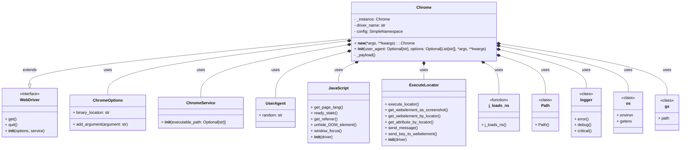

## <алгоритм>

1.  **Инициализация:**
    *   Вызывается метод `__new__` для создания или получения экземпляра класса `Chrome`.
    *   Если экземпляр не существует (`cls._instance is None`), создается новый экземпляр через `super().__new__(cls)`. Иначе вызывается метод `window_open` у существующего экземпляра.
    *   Вызывается метод `__init__` для инициализации экземпляра.

2.  **Настройка User-Agent:**
    *   Если `user_agent` передан как аргумент, используется он.
    *   Иначе генерируется случайный user-agent с помощью `UserAgent().random`.

    *   **Пример:**
        ```python
        # user_agent = None
        # Использование случайного user-agent
        user_agent = UserAgent().random  # user_agent = "Mozilla/5.0 (Windows NT 10.0; Win64; x64) AppleWebKit/537.36 (KHTML, like Gecko) Chrome/114.0.0.0 Safari/537.36"
        # user_agent = "My Custom User Agent"
        # Использование пользовательского user-agent
        ```

3.  **Загрузка конфигурации:**
    *   Загружаются настройки из `chrome.json` с помощью функции `j_loads_ns`.
    *   Если загрузка не удалась, выводится сообщение об ошибке и выполнение прерывается.
    *   **Пример:**
        ```json
        // Файл chrome.json
        {
            "options": ["--disable-extensions", "--start-maximized"],
            "headers": {
                "accept-language": "en-US,en",
                "accept": "text/html,application/xhtml+xml,application/xml;q=0.9,image/avif,image/webp,*/*;q=0.8"
            },
            "profile_directory": {
                "testing": "%LOCALAPPDATA%/Hypotez/Chrome/User Data"
            },
            "binary_location": {
                "binary": "%APPDATA%/Hypotez/chrome/chrome.exe"
            }
        }
        ```

4.  **Настройка Chrome Options:**
    *   Создается объект `ChromeOptions`.
    *   Из конфигурации добавляются опции `config.options`.
    *   Добавляются пользовательские опции `options`.
    *   Из конфигурации добавляются заголовки `config.headers` как аргументы командной строки.
    *   **Пример:**
        ```python
        options_obj = ChromeOptions()
        # Из config.json ->  options_obj.add_argument("--disable-extensions")
        # Из config.json ->  options_obj.add_argument("--start-maximized")
        # Из options -> options_obj.add_argument("--headless")
        # Из options -> options_obj.add_argument("--disable-gpu")
        # Из config.json -> options_obj.add_argument("--accept-language=en-US,en")
        # Из config.json -> options_obj.add_argument("--accept=text/html,application/xhtml+xml,application/xml;q=0.9,image/avif,image/webp,*/*;q=0.8")
        ```

5.  **Нормализация путей:**
    *   Пути из конфигурации, содержащие плейсхолдеры (`%APPDATA%`, `%LOCALAPPDATA%`), заменяются на реальные пути.
    *   **Пример:**
        ```python
        # config.profile_directory.testing = '%LOCALAPPDATA%/Hypotez/Chrome/User Data'
        # gs.path.root =  Path('C:/Users/username/project/')
        # profile_directory = Path('C:/Users/username/project/C:/Users/username/AppData/Local/Hypotez/Chrome/User Data')
        ```

6.  **Настройка профиля и бинарного файла:**
    *   Устанавливается путь к каталогу профиля пользователя.
    *   Устанавливается путь к исполняемому файлу Chrome.

7.  **Инициализация ChromeService:**
    *   Создается `ChromeService` с путем к исполняемому файлу, если он указан. Иначе создается без пути.
    *   **Пример:**
        ```python
        #  binary_location = Path('C:/Users/username/project/C:/Users/username/AppData/Roaming/Hypotez/chrome/chrome.exe')
        # service = ChromeService(executable_path='C:/Users/username/project/C:/Users/username/AppData/Roaming/Hypotez/chrome/chrome.exe')
        ```

8.  **Инициализация WebDriver:**
    *   Создается экземпляр `webdriver.Chrome` с настроенными опциями и сервисом.

9.  **Инициализация payload:**
    *   Вызывается метод `_payload` для настройки `js_executor` и `execute_locator`.
    *   Методы из `js_executor` и `execute_locator` присваиваются экземпляру `Chrome`.

10. **Использование:**
    *   Пример использования в `if __name__ == "__main__":` демонстрирует создание экземпляра `Chrome`, открытие страницы и завершение работы.
    *   **Пример:**
        ```python
        driver = Chrome(options=["--headless", "--disable-gpu"])
        driver.get(r"https://google.com")
        ```

## <mermaid>



**Анализ зависимостей `mermaid`:**

*   **`Chrome`**: Класс, представляющий собой кастомную реализацию Chrome WebDriver. Он наследуется от `webdriver.Chrome`, использует `ChromeOptions` для настройки браузера, `ChromeService` для управления сервисом драйвера, `UserAgent` для генерации user-agent, `JavaScript` и `ExecuteLocator` для расширения функциональности, `j_loads_ns` для загрузки конфигурации из JSON, `Path` для работы с файловой системой, `logger` для логирования и `os` для доступа к переменным окружения, а также `gs` для доступа к путям проекта.
*   **`WebDriver`**: Интерфейс (абстрактный класс) из `selenium`, представляющий собой веб-драйвер. `Chrome` наследуется от него.
*   **`ChromeOptions`**: Класс из `selenium`, используемый для настройки параметров запуска Chrome.
*   **`ChromeService`**: Класс из `selenium`, управляющий процессом драйвера Chrome.
*   **`UserAgent`**: Класс из `fake_useragent`, используемый для генерации случайных строк user-agent.
*   **`JavaScript`**: Класс из проекта, реализующий методы для выполнения JavaScript в контексте браузера.
*   **`ExecuteLocator`**: Класс из проекта, предоставляющий методы для поиска и взаимодействия с элементами веб-страницы.
*  **`j_loads_ns`**: Функция из проекта, используемая для загрузки JSON-конфигураций.
*  **`Path`**: Класс из библиотеки `pathlib`, используемый для работы с путями в файловой системе.
*   **`logger`**: Модуль логирования.
*   **`os`**:  Модуль для доступа к переменным окружения.
*   **`gs`**: Модуль для доступа к путям проекта.

## <объяснение>

**Импорты:**

*   `os`: Используется для работы с переменными окружения, например, для получения путей `%APPDATA%` и `%LOCALAPPDATA%`.
*   `sys`:  Используется для доступа к параметрам и функциям, специфичным для времени выполнения Python.
*   `pathlib.Path`: Используется для работы с файловыми путями в объектно-ориентированном стиле, что делает код более читаемым.
*   `typing.Optional, List`: Используется для указания типов переменных, делая код более понятным и предсказуемым. `Optional` указывает, что переменная может быть либо определенного типа, либо `None`. `List` указывает, что переменная является списком.
*   `types.SimpleNamespace`: Используется для создания простых объектов, которые могут быть использованы для хранения данных, загруженных из JSON-файла.
*   `selenium.webdriver`: Импортирует основной класс `webdriver` из библиотеки Selenium.
*   `selenium.webdriver.chrome.service.Service as ChromeService`: Импортирует класс `Service` для управления процессом драйвера Chrome.
*   `selenium.webdriver.chrome.options.Options as ChromeOptions`: Импортирует класс `Options` для настройки параметров запуска Chrome.
*   `fake_useragent.UserAgent`: Импортирует класс `UserAgent` для генерации случайных строк user-agent.
*   `selenium.common.exceptions.WebDriverException`:  Импортирует исключение, которое может быть вызвано при ошибках WebDriver.
*   `header`:  Похоже, что это пользовательский модуль, связанный с заголовками, но он не используется напрямую в данном коде, возможно, использовался для других функций, но остался в импорте.
*   `src.gs`: Импортирует модуль, содержащий глобальные переменные, включая пути к файлам проекта (`gs.path`).
*   `src.webdriver.executor.ExecuteLocator`: Импортирует класс `ExecuteLocator`, предназначенный для выполнения действий с веб-элементами.
*    `src.webdriver.js.JavaScript`: Импортирует класс `JavaScript` для выполнения JS-кода в браузере.
*    `src.utils.jjson.j_loads_ns`: Импортирует функцию `j_loads_ns` для загрузки JSON-конфигурации.
*   `src.logger.logger`:  Импортирует модуль логирования для записи сообщений об ошибках, предупреждениях и отладочной информации.

**Классы:**

*   `Chrome(webdriver.Chrome)`:
    *   **Назначение**: Расширяет класс `webdriver.Chrome` из Selenium для создания пользовательской реализации WebDriver с кастомными настройками. Использует паттерн Singleton, гарантируя создание только одного экземпляра драйвера.
    *   **Атрибуты**:
        *   `_instance`: Хранит единственный экземпляр класса `Chrome`.
        *   `driver_name`: Содержит имя драйвера ('chrome').
        *   `config`: Хранит конфигурацию, загруженную из `chrome.json`.
    *   **Методы**:
        *   `__new__(cls, *args, **kwargs)`: Гарантирует, что создается только один экземпляр класса (Singleton). Если экземпляр существует, вызывается метод `window_open`.
        *   `__init__(self, user_agent: Optional[str] = None, options: Optional[List[str]] = None, *args, **kwargs)`: Инициализирует драйвер, устанавливает user-agent, загружает конфигурацию из `chrome.json`, настраивает параметры запуска Chrome, а также инициализирует `js_executor` и `execute_locator`.
        *   `_payload(self)`: Инициализирует `JavaScript` и `ExecuteLocator` и связывает их методы с методами экземпляра класса `Chrome`.

**Функции:**

*   `normalize_path(path: str) -> str`:
    *   **Аргументы**:
        *   `path`: Строка пути с плейсхолдерами.
    *   **Возвращаемое значение**: Нормализованная строка пути.
    *   **Назначение**: Заменяет плейсхолдеры `%APPDATA%` и `%LOCALAPPDATA%` в строке пути на соответствующие значения из переменных окружения.
    *    **Пример**:
    ```python
    normalize_path("%APPDATA%/Hypotez/Chrome") # Возвращает "C:/Users/username/AppData/Roaming/Hypotez/Chrome" если os.environ.get("APPDATA")=="C:/Users/username/AppData/Roaming"
    ```

**Переменные:**

*   `MODE`: Глобальная переменная, определяющая режим работы. В данном случае установлена в `'dev'`.
*   `user_agent`: Хранит user-agent строку, либо пользовательскую, либо сгенерированную случайным образом.
*   `options`: Список дополнительных опций для Chrome, передаваемых через аргументы или из файла `json`.
*   `options_obj`: Объект типа `ChromeOptions`, хранящий настройки для запуска Chrome.
*   `service`: Объект типа `ChromeService`, используемый для управления процессом драйвера.
*    `profile_directory`: Объект типа `Path`, содержащий путь к профилю пользователя Chrome.
*    `binary_location`: Объект типа `Path`, содержащий путь к исполняемому файлу Chrome.
*    `js_executor`: Экземпляр класса `JavaScript`, предоставляющий методы для выполнения JavaScript.
*    `execute_locator`: Экземпляр класса `ExecuteLocator`, предоставляющий методы для поиска и взаимодействия с элементами веб-страницы.

**Потенциальные ошибки и области для улучшения:**

*   **Обработка ошибок**: В блоках `try-except` используются `logger.error` и `logger.critical`, но не предпринимается попытка повторного запуска или коррекции ошибок, что может привести к преждевременному завершению программы.
*   **Неопределенное поведение при ошибке `chrome.json`**: Если файл `chrome.json` не загружается, то метод `__init__` завершается, не вызывая исключения, что может привести к неожиданному поведению.
*   **Недостаточная гибкость**: Код привязан к определенной структуре `chrome.json`, что делает сложным добавление новых конфигурационных параметров.
*   **Отсутствие тестов**: Отсутствуют юнит-тесты для проверки работы драйвера и его настроек.

**Цепочка взаимосвязей с другими частями проекта:**

*   `src.webdriver.executor.ExecuteLocator`: Класс используется для выполнения действий с веб-элементами. Он зависит от `src.webdriver.chrome.chrome.Chrome`, поскольку `ExecuteLocator` инициализируется с экземпляром драйвера.
*   `src.webdriver.js.JavaScript`: Класс используется для выполнения JavaScript-кода в браузере. Он также зависит от `src.webdriver.chrome.chrome.Chrome` так как экземпляр класса `JavaScript` инициализируется с драйвером.
*   `src.utils.jjson.j_loads_ns`: Функция используется для загрузки конфигурации из `chrome.json`, что влияет на инициализацию класса `Chrome`.
*   `src.logger.logger`: Используется для ведения логов, поэтому все остальные модули могут использовать его для записи сообщений.
*   `src.gs`: Модуль используется для определения путей к файлам, и от него зависит поиск файла конфигурации `chrome.json` и пути к исполняемым файлам.

В целом, код представляет собой хорошо структурированный класс для управления браузером Chrome, но требует улучшения в части обработки ошибок, гибкости и тестирования.