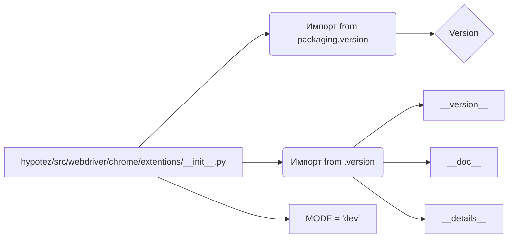

```MD
# Анализ файла hypotez/src/webdriver/chrome/extentions/__init__.py

## <input code>

```python
## \file hypotez/src/webdriver/chrome/extentions/__init__.py
# -*- coding: utf-8 -*-\
#! venv/Scripts/python.exe
#! venv/bin/python/python3.12

"""
.. module: src.webdriver.chrome.extentions 
	:platform: Windows, Unix
	:synopsis:

"""
MODE = 'dev'

"""
	:platform: Windows, Unix
	:synopsis:

"""


"""
	:platform: Windows, Unix
	:synopsis:

"""


"""
  :platform: Windows, Unix

"""
"""
  :platform: Windows, Unix
  :platform: Windows, Unix
  :synopsis:
"""MODE = 'dev'
  
""" module: src.webdriver.chrome.extentions """


from packaging.version import Version
from .version import __version__, __doc__, __details__
```

## <algorithm>

Этот файл, скорее всего, служит для инициализации модуля `extentions` в рамках проекта `hypotez`. Алгоритм крайне упрощен, так как он содержит лишь импорты и константу.  Пошаговая блок-схема:

1. **Импорт:** Модуль `packaging.version` импортируется для работы с версиями.  Модуль `.version` (из текущего пакета) импортирует переменные `__version__`, `__doc__`, и `__details__`.
   * **Пример:**  `from packaging.version import Version` - импортирует класс `Version`.

2. **Инициализация:**  Константа `MODE` инициализируется значением 'dev'.  Это может быть параметр конфигурации, используемый в других частях проекта для выбора режима работы (например, "dev", "prod").
   * **Пример:** `MODE = 'dev'`


## <mermaid>



## <explanation>

**Импорты:**

* `from packaging.version import Version`: Импортирует класс `Version` из пакета `packaging`. Это позволяет работать с версиями программного обеспечения.  Эта библиотека, скорее всего, необходима для корректного управления версиями пакетов и модулей внутри проекта.
* `from .version import __version__, __doc__, __details__`: Импортирует переменные `__version__`, `__doc__`, и `__details__` из модуля `version.py` в текущей директории (`.version`).  Это, скорее всего, метаданные модуля, такие как версия, описание, или дополнительная информация.

**Классы:**

В этом файле нет классов.

**Функции:**

В этом файле нет функций.

**Переменные:**

* `MODE = 'dev'`:  Строковая переменная, вероятно, используемая для конфигурации. Вероятно, определяет текущий режим работы приложения (например, "dev" для разработки, "prod" для производства).

**Возможные ошибки или области для улучшений:**

* **Не хватает документации:** Несмотря на присутствующие docstrings, они очень общие.  Необходимо более подробное описание назначения переменной `MODE` и импортированных переменных из `.version`.
* **Неясная цель файла:** Файл выглядит неполным.  Он должен иметь функции или классы, которые отвечают за инициализацию или конфигурацию расширений. Сейчас он содержит только константу и импорты.

**Взаимосвязи с другими частями проекта:**

Данный файл, вероятно,  включается в другие части проекта при импорте. При помощи `import` он определяет, какие модули и переменные доступны внутри `hypotez`.  Наличие файла `version.py` указывает на то, что данная структура поддерживает управление версиями компонентов проекта `hypotez`.


**Общий вывод:**

Файл `__init__.py` используется для инициализации модуля,  содержащего константу `MODE` и переменные с метаданными, вероятно, относящимися к версии расширений Chrome, однако, без дополнительного контекста невозможно точно определить полную функциональность.  Необходимы более подробные знания структуры проекта `hypotez`.