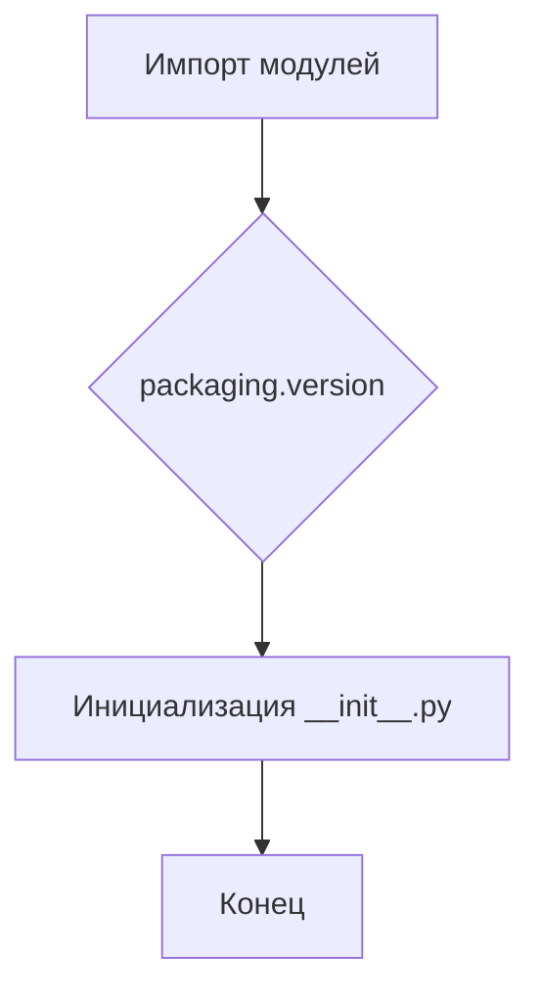

# <input code>

```python
## \file hypotez/src/webdriver/chrome/extentions/__init__.py
# -*- coding: utf-8 -*-
#! venv/Scripts/python.exe
#! venv/bin/python/python3.12

"""
.. module: src.webdriver.chrome.extentions 
	:platform: Windows, Unix
	:synopsis:

"""
MODE = 'dev'

"""
	:platform: Windows, Unix
	:synopsis:

"""


"""
	:platform: Windows, Unix
	:synopsis:

"""


"""
  :platform: Windows, Unix

"""
"""
  :platform: Windows, Unix
  :platform: Windows, Unix
  :synopsis:
"""MODE = 'dev'
  
""" module: src.webdriver.chrome.extentions """


from packaging.version import Version
from .version import __version__, __doc__, __details__
```

# <algorithm>

Этот файл `__init__.py` — это инициализирующий модуль для пакета `src.webdriver.chrome.extentions`.  Он не содержит сложной логики.  Основная функция — импорт необходимых модулей.  Поскольку нет явных вызовов функций или методов, блок-схема будет очень простой.

**Блок-схема:**



**Пример:**

Файл импортирует `Version` из `packaging.version` и другие переменные (`__version__`, `__doc__`, `__details__`) из подмодуля `.version`.  Этот импорт позволяет другим модулям в пакете использовать эти переменные и функции.


# <mermaid>

```mermaid
graph LR
    subgraph Пакетирование
        A[packaging.version] --> B(Version);
        subgraph Модуль __init__.py
          B --> C[__init__.py];
          subgraph Подмодуль
            C --> D[version];
            D --> E(__version__);
            D --> F(__doc__);
            D --> G(__details__);
        end
    end
```

# <explanation>

**Импорты:**

- `from packaging.version import Version`: Импортирует класс `Version` из пакета `packaging.version`.  Этот пакет используется для работы с версиями программного обеспечения.  Связь с `src` — через импорт из внешней библиотеки, не принадлежащей проекту.

- `from .version import __version__, __doc__, __details__`: Импортирует переменные `__version__`, `__doc__`, `__details__` из файла `version.py`, который, вероятно, находится в той же директории (`.`)  что и `__init__.py`.  Это позволяет использовать информацию о версии, документации и других деталях пакета `extentions`. Связь с `src` — через относительный импорт, показывая, что файл `version.py` является частью текущего пакета.

**Классы:**

В данном файле нет определений классов.

**Функции:**

В файле нет функций.

**Переменные:**

- `MODE = 'dev'`: Переменная, скорее всего, используется для управления режимом работы.  Например, `dev` — это режим разработки, в отличие от `prod`. Эта переменная скорее всего используется другими частями проекта для выбора различных конфигураций.  Тип — строка.

**Возможные ошибки и улучшения:**

- Отсутствует документация для переменной `MODE`.  Необходимо добавить комментарий с описанием возможных значений и их применений.
- Отсутствие описания, как используется значение `MODE`.
- Нет обработки ошибок при импорте из `packaging.version` или `.version`.  Если возникнет проблема с импортом, то код не сможет работать.

**Взаимосвязи с другими частями проекта:**

Вероятно, этот модуль входит в структуру проекта, связанную с автоматизацией тестирования или управления браузером. Файл `version.py` содержит информацию о версии модуля, используемого для контроля версий и зависимостей, что позволяет управлять обновлениями.


```