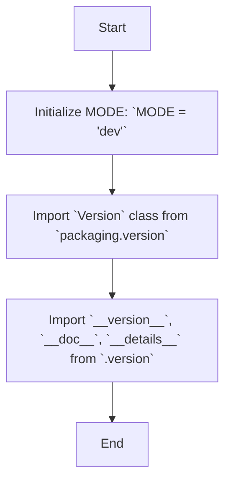

## Анализ кода `hypotez/src/webdriver/chrome/extentions/__init__.py`

### <алгоритм>
1. **Инициализация**:
   - Объявляется переменная `MODE` и присваивается ей значение `'dev'`. Это, вероятно, используется для определения режима работы приложения (разработка, тестирование, продакшн).
   - Пример: `MODE = 'dev'` означает, что расширения находятся в режиме разработки.

2. **Импорт зависимостей**:
   - Из библиотеки `packaging.version` импортируется класс `Version`.
   - Пример: `from packaging.version import Version` используется для работы с версиями пакетов.

3. **Импорт из локального модуля `version.py`**:
   - Из локального модуля `version.py` импортируются три переменные:
     - `__version__`: Строка, содержащая информацию о версии расширения.
     - `__doc__`: Строка документации для модуля.
     - `__details__`: Строка с более подробной информацией о расширении.
   - Пример: `from .version import __version__, __doc__, __details__` используется для получения информации о версии и документации текущего пакета.

### <mermaid>

### <объяснение>

**Импорты**:
- `packaging.version`: Это библиотека Python для работы с версиями пакетов. `from packaging.version import Version` импортирует класс `Version`, который позволяет сравнивать и обрабатывать версии.

- `from .version import __version__, __doc__, __details__`:
  - `.` (точка) означает, что импорт идет из модуля `version.py`, находящегося в той же директории, что и текущий файл `__init__.py`.
  - `__version__`: Переменная, содержащая строку версии текущего пакета (например, "1.0.0"). Используется для отслеживания и управления версиями.
  - `__doc__`: Переменная, содержащая строку документации для текущего пакета. Используется для отображения справочной информации.
  - `__details__`: Переменная, содержащая строку с подробной информацией о пакете. Используется для предоставления расширенной информации.

**Переменные**:
- `MODE`: Строковая переменная, используемая для определения текущего режима работы расширения (например, "dev" для разработки, "prod" для продакшена). Эта переменная может влиять на различные аспекты работы расширения, например, какие функции будут доступны, уровень логирования или используемые параметры конфигурации.

**Файл `version.py`**
  - Файл `version.py` не предоставлен, но исходя из импортов можно предположить, что он содержит определения переменных `__version__`, `__doc__`, `__details__`.

**Цепочка взаимосвязей:**
- Этот `__init__.py` файл находится в пакете `src.webdriver.chrome.extentions`. Он является точкой входа в этот пакет.
- `packaging.version` используется как внешняя библиотека, для версионирования.
- Локальный модуль `version.py` предоставляет информацию о версии, документацию и детали текущего пакета.
- Приложение может использовать переменную `MODE` для настройки своего поведения в зависимости от режима работы.

**Потенциальные ошибки или области для улучшения:**
- Необходима более точная и конкретная документация о том, как и для чего используется переменная `MODE`.
- В зависимости от назначения проекта `MODE` может быть реализован как более сложная система конфигурации.
- Файл `version.py` должен быть должным образом документирован и содержать всю необходимую информацию о версии и описании.
- В текущем коде не используется класс `Version` из библиотеки `packaging.version`, что является областью для улучшения. Этот класс можно использовать, если необходима более сложная работа с версиями.