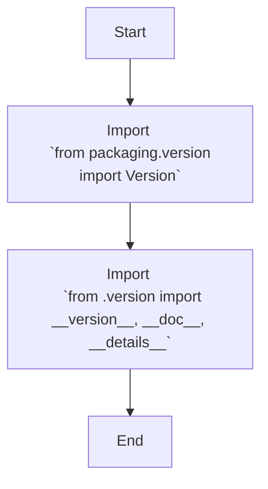

## АНАЛИЗ КОДА: `hypotez/src/webdriver/chrome/extentions/__init__.py`

### <алгоритм>

1.  **Импорт `Version` из `packaging.version`:**
    *   Пример: `from packaging.version import Version`
    *   Импортирует класс `Version` для работы с версиями пакетов.
2.  **Импорт из `src.webdriver.chrome.extentions.version`:**
    *   Пример: `from .version import __version__, __doc__, __details__`
    *   Импортирует переменные `__version__`, `__doc__` и `__details__` из модуля `version.py`.

### <mermaid>

**Описание `mermaid` диаграммы:**

*   `Start`: Начало процесса.
*   `ImportVersion`: Импорт класса `Version` из библиотеки `packaging.version`.
*   `ImportVersionInfo`: Импорт переменных `__version__`, `__doc__`, и `__details__` из модуля `version.py`, расположенного в той же директории (`.` означает текущую директорию).
*   `End`: Конец процесса.

### <объяснение>

**Импорты:**

*   `from packaging.version import Version`:
    *   Назначение: Импортирует класс `Version` из библиотеки `packaging`. Этот класс используется для представления и сравнения версий программного обеспечения.
    *   Связь с другими пакетами: Библиотека `packaging` не входит в стандартную библиотеку Python и обычно устанавливается отдельно (например, через `pip install packaging`). Она используется для стандартизированной работы с версиями.
*   `from .version import __version__, __doc__, __details__`:
    *   Назначение: Импортирует переменные `__version__`, `__doc__` и `__details__` из файла `version.py`, расположенного в той же директории, что и `__init__.py`.
    *   Связь с другими пакетами: Модуль `version.py` является частью текущего пакета `src.webdriver.chrome.extentions`.
    *   `__version__`: Строка, представляющая текущую версию пакета.
    *   `__doc__`: Строка, представляющая документацию пакета (может быть docstring модуля).
    *   `__details__`: Строка, содержащая более подробную информацию о пакете, например, список изменений (changelog).

**Классы:**

*   В данном коде нет классов, только импорты.

**Функции:**

*   В данном коде нет функций, только импорты.

**Переменные:**

*   `__version__`: Строка, содержащая версию текущего пакета, например, "1.0.0".
*   `__doc__`: Строка, содержащая документацию к модулю.
*   `__details__`: Строка, содержащая дополнительную информацию о версии, например, заметки о релизе.

**Цепочка взаимосвязей:**

1.  Файл `__init__.py` является точкой входа в пакет `src.webdriver.chrome.extentions`.
2.  Он импортирует класс `Version` из сторонней библиотеки `packaging` для работы с версиями.
3.  Он импортирует переменные о версии из модуля `version.py`, который является частью этого же пакета.
4.  Таким образом, `__init__.py` собирает вместе и предоставляет основную информацию о версии пакета.

**Потенциальные ошибки и области для улучшения:**

1.  **Отсутствие описания:** Код содержит много пустых строк, комментариев без пояснений и ненужных дублирований. Это не является ошибкой, но усложняет чтение и понимание кода.
2.  **Отсутствие логики:** Файл `__init__.py` обычно используется для инициализации пакета. В текущем варианте код только импортирует и переносит переменные, не выполняя никакой дополнительной логики. Возможно, в будущем здесь будет добавлена инициализация, например, создание экземпляров классов или установка параметров.

**Дополнительные замечания:**
*   Использование docstring в начале файла в виде `"""module: src.webdriver.chrome.extentions"""` является хорошей практикой для документирования модуля.
*   Запись `#! venv/Scripts/python.exe` или `#! venv/bin/python/python3.12` в начале файла указывает интерпретатор Python, используемый для запуска скрипта, в данном случае это не является необходимым для `__init__.py`.
*   Код является базовой структурой пакета, и для понимания его полной функциональности необходимо просмотреть содержимое модуля `version.py`