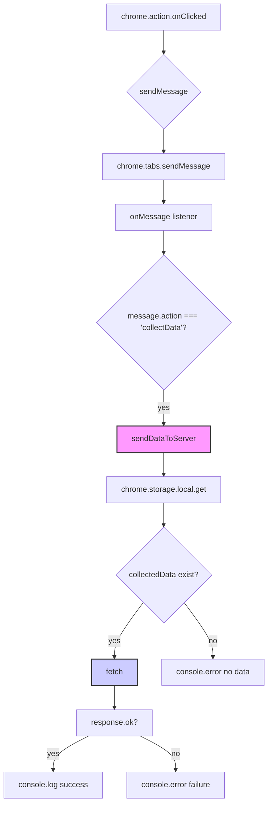

```MD
# Анализ кода background.js

## <input code>

```javascript
// background.js

chrome.action.onClicked.addListener((tab) => {
    chrome.tabs.sendMessage(tab.id, { action: 'collectData', url: tab.url });
});

/**
 * This function listens for messages sent from other parts of the extension, 
 * such as content scripts or other background scripts, using the `chrome.runtime.sendMessage()` method.
 * 
 * Here's a breakdown of what each part does:
 * 
 * - `chrome.runtime.onMessage.addListener()`: This function sets up a listener for messages sent from other parts of the extension.
 * - `(message, sender, sendResponse) => { ... }`: This is an arrow function that defines what should happen when a message is received. It takes three parameters:
 *   - `message`: The message object sent from the sender.
 *   - `sender`: Information about the sender of the message, such as its ID and whether it is a tab or another extension.
 *   - `sendResponse`: A function that can be used to send a response back to the sender if needed.
 * - `if (message.action === 'collectData') { ... }`: This condition checks if the received message has a property named `action` with a value of `'collectData'`. This is often used to determine the purpose or type of the message.
 * - `sendDataToServer(message.url)`: If the received message has an action of `'collectData'`, this function calls another function named `sendDataToServer()` and passes the URL from the message as an argument. This typically triggers some action or behavior in response to the received message.
 * 
 * In summary, this function listens for messages with the action `'collectData'`, and when such a message is received, it triggers the `sendDataToServer()` function, presumably to collect data and send it to a server.
 */
chrome.runtime.onMessage.addListener((message, sender, sendResponse) => {
    if (message.action === 'collectData') {
        sendDataToServer(message.url);
    }
});

function sendDataToServer(url) {
    const serverUrl = 'http://127.0.0.1/hypotez/catch_request.php'; // Change to your server endpoint
    chrome.storage.local.get('collectedData', (result) => {
        const collectedData = result.collectedData;
        if (collectedData) {
            fetch(serverUrl, {
                method: 'POST',
                headers: {
                    'Content-Type': 'application/json'
                },
                body: JSON.stringify(collectedData)
            })
                .then(response => {
                    if (!response.ok) {
                        throw new Error('Failed to send data to server');
                    }
                    console.log('Data sent to server successfully');
                })
                .catch(error => {
                    console.error('Error sending data to server:', error);
                });
        } else {
            console.error('No collected data found');
        }
    });
}
```

## <algorithm>

**Шаг 1:** Обработчик клика по иконке расширения.
```
+-----------------+
|  onClicked     |
+-----------------+
| tab             |
+--------+--------+
|        |        |
+--------+--------+
| sendMessage(tab)|
+-----------------+
| collectData     |
+-----------------+
|  url            |
+-----------------+

```

**Шаг 2:** Функция получения данных с текущей страницы.
```
+-----------------+
| onMessage      |
+-----------------+
| message        |
+--------+--------+
|        |        |
+--------+--------+
|  action       |
+--------+--------+
| collectData |
+--------+--------+
| url           |
+-----------------+
| sendDataToServer|
+-----------------+

```

**Шаг 3:** Отправка данных на сервер.
```
+-----------------+
| sendDataToServer |
+-----------------+
| url             |
+--------+--------+
|        |        |
+--------+--------+
| storage.local |
+--------+--------+
|     get       |
+--------+--------+
| collectedData|
+-----------------+
|  fetch(serverUrl)|
+--------+--------+
|        |        |
+--------+--------+
|  response      |
+--------+--------+
|  ok            |
+-----------------+

```


## <mermaid>



**Объяснение зависимостей**:

* `chrome.action.onClicked`, `chrome.tabs.sendMessage`, `chrome.runtime.onMessage`:  Это API расширений Chrome, предоставляющие возможность взаимодействия между различными частями расширения.
* `chrome.storage.local`:  Часть API хранилища данных в расширении Chrome.  Используется для доступа к `collectedData`.
* `fetch`:  Стандартная функция JavaScript для выполнения HTTP запросов.
*  Зависимость `sendDataToServer` — функция в текущем расширении, использующая `fetch` для взаимодействия с внешним сервером.
*  Зависимость от `catch_request.php` на стороне сервера, который обрабатывает полученные данные.

## <explanation>

**Импорты:**  Нет явных импортов, код использует встроенные API Chrome.

**Классы:** Нет классов, только функции.

**Функции:**

* `chrome.action.onClicked.addListener`: Обработчик события клика по иконке расширения, отправляющий сообщение в активную вкладку.
* `sendDataToServer(url)`: Принимает `url` и отправляет `collectedData` на сервер `http://127.0.0.1/hypotez/catch_request.php` с помощью `fetch`.  Обрабатывает ответ сервера.
* `chrome.runtime.onMessage.addListener`: Слушает сообщения `'collectData'` от других частей расширения (например, скриптов контента). Вызывает `sendDataToServer` для отправки данных.


**Переменные:**

* `serverUrl`:  Строка с URL сервера. Важно, чтобы этот адрес был верным и доступным.
* `collectedData`:  Переменная, содержащая данные, которые нужно отправить.  Должна быть предварительно собрана и помещена в хранилище `chrome.storage.local`.

**Возможные ошибки и улучшения:**

* **Отсутствие валидации данных**:  Код не проверяет, что `collectedData` является допустимым объектом JSON.  Необходимо добавить проверку, чтобы избежать ошибок при сериализации.
* **Обработка ошибок при отправке**: Непосредственно в `fetch` не обрабатывается задержка или отсутствие ответа сервера,  важно добавить более сложную логику обработки ошибок (например, ограниченное количество попыток).
* **Глобальные переменные**: Необходимо, чтобы данные, которые будут отправлены, существовали в момент вызова `sendDataToServer`, иначе это будет ошибка.
* **Обработка ответа сервера**: Код не обрабатывает разные статусы ответа.  Нужно добавить поддержку разных кодов ответа от сервера (`response.status`).
* **Идентификация источника данных**: Нет проверки отправляемого `url`. Важно убедиться в корректности URL и контексте, откуда пришло сообщение.
* **Логирование действий**:  Добавление более подробных сообщений для отладки (`console.log`) и возможности отследить работу функции.

**Взаимосвязи с другими частями проекта:**

Код напрямую зависит от `catch_request.php` на серверной стороне для обработки полученных данных.  Также предполагается, что скрипты контента собирают данные, которые затем отправляются в `background.js` посыланием сообщения с действием `'collectData'`.


**Рекомендации:**

1. **Валидация данных:**  Проверить корректность `collectedData` перед отправкой.
2. **Обработка ошибок HTTP запросов:** Добавить `try...catch` для обработки ошибок `fetch`.
3. **Обработка ошибок сервера:** Проверить код ответа сервера (например, `response.status`) и обработать некорректные коды.
4. **Логирование:** Добавить подробное логирование, чтобы отслеживать поток данных и потенциальные ошибки.

В целом, код выполняет свою задачу, но требует улучшений для повышения надежности и производительности.