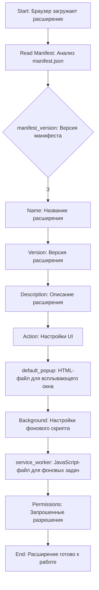

## Анализ `manifest.json`

### 1. **<алгоритм>**

1. **Начало**: Браузер загружает расширение.
2. **Чтение `manifest.json`**: Браузер анализирует `manifest.json`, чтобы понять структуру и разрешения расширения.
3. **Раздел `manifest_version`**: Определяет версию формата файла манифеста. В данном случае это версия 3.
    *  *Пример:* `manifest_version: 3` - Указывает на использование версии 3 манифеста, что требует соблюдения определенных правил и возможностей.
4. **Раздел `name`**:  Задает имя расширения.
    *  *Пример:* `name: "URL Sender"` - Задает отображаемое имя расширения, которое будет видно пользователю в списке расширений.
5. **Раздел `version`**: Указывает версию расширения.
    *  *Пример:* `version: "1.0"` - Определяет версию расширения, полезно для отслеживания обновлений.
6. **Раздел `description`**: Описывает назначение расширения.
    *  *Пример:* `description: "Sends the URL of the current page to a local server."` - Предоставляет краткое описание функциональности расширения, отображаемое в списке расширений.
7. **Раздел `action`**: Определяет настройки пользовательского интерфейса (UI) расширения.
    * **Подраздел `default_popup`**: Указывает HTML-файл для отображения всплывающего окна при нажатии на иконку расширения.
        *  *Пример:* `default_popup: "popup.html"` -  Указывает файл `popup.html`, который будет загружен во всплывающем окне.
8. **Раздел `background`**: Определяет настройки фонового скрипта.
    * **Подраздел `service_worker`**: Указывает JavaScript-файл для выполнения фоновых задач.
        *  *Пример:* `service_worker: "background.js"` - Указывает файл `background.js`, который будет работать в фоновом режиме, даже если нет активного всплывающего окна.
9. **Раздел `permissions`**: Перечисляет разрешения, необходимые для работы расширения.
    *  *Пример:* `permissions: ["activeTab", "storage"]` - Запрашивает разрешения: `activeTab` для доступа к URL активной вкладки и `storage` для хранения данных в локальном хранилище браузера.
10. **Конец**: Расширение готово к работе, и браузер будет запускать  `background.js` в фоновом режиме, а также покажет `popup.html` при нажатии на иконку расширения.

### 2. **<mermaid>**

**Объяснение диаграммы `mermaid`:**
- `Start`: Начальная точка процесса, когда браузер загружает расширение.
- `ReadManifest`: Этап, когда браузер читает и анализирует файл `manifest.json`.
- `ManifestVersion`: Блок, проверяющий версию манифеста. Отдельная ветка для `manifest_version: 3`.
- `Name`: Получение имени расширения из `name`.
- `Version`: Получение версии расширения из `version`.
- `Description`: Получение описания расширения из `description`.
- `Action`: Блок, содержащий настройки UI.
- `DefaultPopup`: Блок, определяющий HTML-файл для всплывающего окна.
- `Background`: Блок, содержащий настройки фонового скрипта.
- `ServiceWorker`: Блок, определяющий JavaScript-файл для фоновых задач.
- `Permissions`: Блок, содержащий запрашиваемые разрешения.
- `End`: Конечная точка, указывающая, что расширение готово к работе.

### 3. **<объяснение>**

**Импорты**: В данном коде нет явных импортов, поскольку это файл конфигурации (JSON). Однако, неявно импортируется функциональность браузера по обработке JSON-манифестов и запуску расширений на основе этих манифестов.

**Классы**:
В данном `manifest.json` нет классов. Это конфигурационный файл, а не файл с исполняемым кодом, следовательно, здесь нет классов, атрибутов или методов.

**Функции**:
Здесь нет функций. `manifest.json` содержит декларативные данные о расширении, а не исполняемый код.

**Переменные**:
- `"manifest_version"`: Строковая переменная, указывающая версию файла манифеста (в данном случае, `3`).
- `"name"`: Строковая переменная, содержащая название расширения ("URL Sender").
- `"version"`: Строковая переменная, содержащая версию расширения ("1.0").
- `"description"`: Строковая переменная, содержащая описание расширения ("Sends the URL of the current page to a local server.").
- `"action"`: Объект, описывающий действие расширения.
  - `"default_popup"`: Строковая переменная, указывающая HTML-файл для всплывающего окна ("popup.html").
- `"background"`: Объект, описывающий фоновый скрипт.
  - `"service_worker"`: Строковая переменная, указывающая JavaScript-файл для фонового скрипта ("background.js").
- `"permissions"`: Массив строк, содержащий необходимые разрешения для работы расширения.
   - `"activeTab"`: Строка, предоставляющая расширению доступ к URL активной вкладки.
   - `"storage"`: Строка, предоставляющая расширению доступ к локальному хранилищу браузера.

**Объяснение**:

Файл `manifest.json` является ключевым для любого расширения Chrome, так как он сообщает браузеру, как устанавливать, запускать и обрабатывать расширение. Этот файл определяет основные параметры, такие как имя, описание и используемые разрешения.

- `manifest_version`: Важен для совместимости расширения с браузером. Версия 3 является текущей рекомендуемой версией.
- `name`, `version`, `description`: Эти поля предоставляют информацию о расширении для пользователя в магазине расширений Chrome и в интерфейсе управления расширениями.
- `action.default_popup`: Указывает на HTML-файл, который будет отображаться при нажатии на иконку расширения. Это основной пользовательский интерфейс расширения.
- `background.service_worker`: Указывает на файл, который будет работать в фоновом режиме. Это скрипт для выполнения фоновых задач, таких как отправка URL на сервер.
- `permissions`: Перечисляет разрешения, которые расширение запрашивает у пользователя, необходимые для его работы. В данном случае необходимы разрешения `activeTab` для доступа к текущей вкладке и `storage` для сохранения данных локально.

**Цепочка взаимосвязей с другими частями проекта:**

- `popup.html`: Взаимодействует с пользователем, предоставляя интерфейс для взаимодействия с функциональностью расширения.
- `background.js`: Выполняет основную логику отправки URL на сервер, и работает в фоновом режиме, чтобы обеспечить функциональность, даже если окно всплывающего окна закрыто.

**Потенциальные ошибки и области для улучшения:**

- **Обработка ошибок**:  Отсутствует явная обработка ошибок при отправке URL. В `background.js` следует добавить обработку ошибок сетевых запросов.
- **Безопасность:** Если расширение обменивается данными с сервером, необходимо продумать меры безопасности, такие как использование HTTPS и аутентификации.
- **Масштабируемость**: Если планируется добавлять больше функциональности, стоит рассмотреть более сложную архитектуру для управления фоновыми скриптами и взаимодействием между компонентами расширения.
- **Управление хранилищем**: Если расширение хранит данные, то следует продумать механизмы для их синхронизации и резервирования, если это требуется.