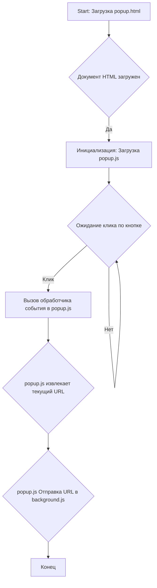
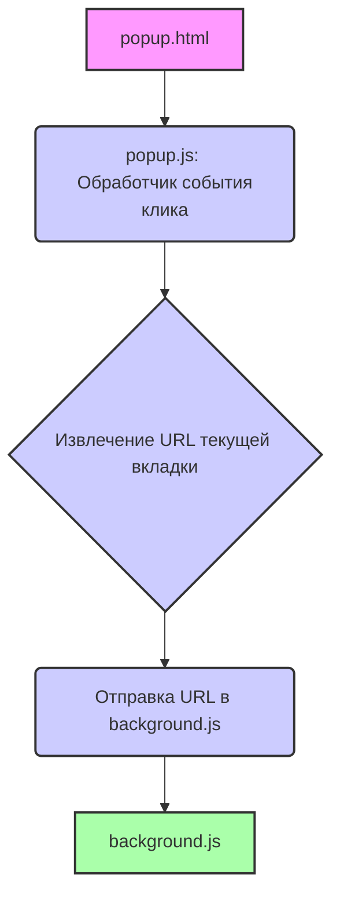

## Анализ кода `popup.html`

### 1. <алгоритм>

**Блок-схема:**

**Пример:**
1. **A**: Браузер открывает `popup.html`.
2. **B**: HTML документ полностью загружен.
3. **C**: Браузер загружает и выполняет `popup.js`, привязанный к этому HTML.
4. **D**: Скрипт ждет, когда пользователь нажмет на кнопку с `id="sendUrlButton"`.
5. **E**: Пользователь нажимает на кнопку "Send URL". Вызывается обработчик в `popup.js`.
6. **F**: Скрипт `popup.js` извлекает текущий URL активной вкладки браузера.
7. **G**: `popup.js` отправляет извлеченный URL в `background.js` для дальнейшей обработки.
8. **H**: Процесс завершен, и скрипт продолжает ожидать дальнейших действий пользователя.

### 2. <mermaid>

**Объяснение зависимостей:**

- `popup.html` является отправной точкой и загружает `popup.js`.
- `popup.js` обрабатывает события (например, клик по кнопке), извлекает URL и передаёт его в `background.js`.
- `background.js`  обрабатывает URL, полученный из `popup.js`.

### 3. <объяснение>

- **Импорты:** В данном файле `popup.html` нет импортов.
- **Классы:** В HTML файле нет классов, он определяет структуру веб-страницы.
- **Функции:**
  - HTML не содержит функций как таковых, но подключает `popup.js`, который будет содержать JavaScript-функции для обработки действий пользователя.
- **Переменные:**
  - `MODE = 'debug'` – эта переменная определена в самом начале файла и указывает на режим работы. (Указывает на режим отладки, но это не имеет отношения к HTML, а, скорее, к скрипту, который будет использовать эту переменную).

**Подробное объяснение:**

- `popup.html` - это базовый HTML файл для всплывающего окна расширения Chrome.
-   Файл содержит `<head>` и `<body>`.
-   Внутри `<head>`:
    - `<title>URL Sender</title>`: Заголовок окна.
    - ``: Ссылка на JavaScript файл, который будет содержать логику обработки пользовательского ввода и передачи URL.
-   Внутри `<body>`:
    - `<button id="sendUrlButton">Send URL</button>`: Кнопка, на которую пользователь нажимает для отправки URL. `id="sendUrlButton"` используется JavaScript для определения того, на какую кнопку кликнул пользователь.
- **Цепочка взаимосвязей с другими частями проекта:**
  - Этот файл (`popup.html`) является частью расширения Chrome, которое предназначено для получения URL текущей страницы.
  - `popup.html` взаимодействует с `popup.js` (который, скорее всего, получит URL текущей вкладки и отправит его `background.js`).
  - `background.js` (фоновый скрипт расширения) будет обрабатывать полученный URL (скорее всего, отправляя его на сервер или сохраняя куда-либо).

**Потенциальные ошибки или области для улучшения:**

1.  **Отсутствие обработки ошибок:** В `popup.html` нет обработки ошибок. Например, если `popup.js` не загрузится.
2.  **Безопасность:** Нет никаких проверок на безопасность.
3.  **Улучшения интерфейса:** HTML код минималистичен, можно добавить стилей и визуальных элементов для улучшения UX.
4.  **Интеграция с `background.js`:** Не описано явно, как именно URL передается в `background.js`. Необходимо добавить детали об этом.

**Дополнительные замечания:**
- Файл содержит комментарий `# -*- coding: utf-8 -*-`, который указывает на кодировку UTF-8, что позволяет использовать Unicode символы.
- Строка `#! venv/Scripts/python.exe` указывает путь к интерпретатору Python (необходимо для запуска скриптов, но не используется в данном контексте).
- Строка `MODE = 'debug'` может использоваться в `popup.js` для отладки.