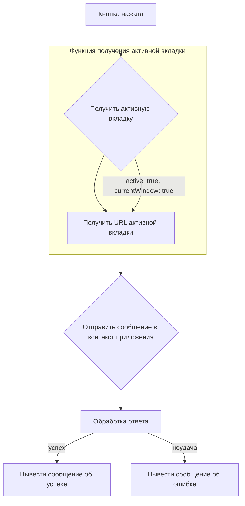

# Анализ кода popup.js

**1. <input code>**

```javascript
document.getElementById("sendUrlButton").addEventListener("click", () => {
    alert("Hello, world!");
    chrome.tabs.query({ active: true, currentWindow: true }, (tabs) => {
        let activeTab = tabs[0];
        let activeTabUrl = activeTab.url;
        
        chrome.runtime.sendMessage({ action: "sendUrl", url: activeTabUrl }, (response) => {
            if (response.status === "success") {
                alert("URL sent successfully!");
            } else {
                alert("Failed to send URL.");
            }
        });
    });
});
```

**2. <algorithm>**



**Пример:** Пользователь нажимает кнопку "sendUrlButton".  Функция `query` в `chrome.tabs` возвращает массив `tabs` содержащий активную вкладку. Если активная вкладка существует, `activeTabUrl` содержит URL вкладки. Далее отправляется сообщение в контекст расширения с `action: "sendUrl"` и `url`.  В зависимости от ответа (success или ошибка), пользователь получает соответствующее сообщение.

**3. <mermaid>**

```mermaid
graph LR
    subgraph "Popup.js"
        A[sendUrlButton] --> B(addEventListener);
        B --> C{chrome.tabs.query};
        C --> D[activeTab];
        D --> E(activeTabUrl);
        E --> F(chrome.runtime.sendMessage);
        F --> G[Обработка ответа];
        G --> H[alert(success/failure)];
    end
    subgraph "Контекст приложения"
        F -- (sendUrl) --> I[Обработка сообщения];
        I --> J[url];
        J --> K(Обработка URL);
        K --> L(sendUrl);
        L --> M[Успех/Ошибка];
        M --> F;
    end
```

**4. <explanation>**

* **Импорты:**  В данном коде нет явных импортов. Все используемые функции (`document.getElementById`, `chrome.tabs.query`, `chrome.runtime.sendMessage`) являются встроенными возможностями для работы с DOM и расширениями Chrome.

* **Классы:** В коде нет классов.

* **Функции:**
    * `document.getElementById("sendUrlButton").addEventListener("click", ...)`: Привязывает обработчик события `click` к элементу с id `sendUrlButton`. При клике на кнопку выполняется функция, содержащаяся в коллбэке.
    *  `chrome.tabs.query(...)`: Запрос на получение активной вкладки в текущем окне.  Аргумент  `{ active: true, currentWindow: true }`  определяет критерии поиска (активная вкладка в текущем окне).  `tabs` -- это массив объектов вкладок.
    * `chrome.runtime.sendMessage(...)`: Отправляет сообщение в контекст приложения (background script).  Объект сообщения содержит `action: "sendUrl"` и `url` активной вкладки. `response` – объект, который содержит ответ из контекста приложения.
    * Анонимная функция в `addEventListener`  : обрабатывает нажатие кнопки, получая URL активной вкладки и отправляя его в контекст приложения.

* **Переменные:**
    * `activeTab`: Содержит объект активной вкладки.
    * `activeTabUrl`: Содержит строку URL активной вкладки.
    * `response`:  Полученный ответ из контекста приложения.

* **Возможные ошибки и улучшения:**

    * **Отсутствие проверки существования активной вкладки:** Код не проверяет, существует ли активная вкладка. Если ее нет, то `tabs[0]` вызовет ошибку.  Необходимо добавить проверку `if (tabs.length > 0)` для предотвращения ошибки.
    * **Обработка ошибок в sendMessage:** Код не обрабатывает потенциальные ошибки при отправке сообщения. Должен быть обработчик ошибок (`catch`) при вызове `chrome.runtime.sendMessage`.
    * **Отсутствует обработка неверного формата URL:**  Код не проверяет, что полученное значение `activeTabUrl` является корректным URL. В случае, если это не строка,  произойдет ошибка.  Необходима валидация `activeTabUrl`.
    * **Неясный ответ:**  В коде контекста приложения (background script) нет информации о том, что произошло с запрошенным URL.  Для более надежной проверки нужно вернуть расширенную информацию об успехе или ошибке, например `response.message`.
* **Взаимосвязи с другими частями проекта:**  Команда `chrome.runtime.sendMessage` позволяет передавать данные между расширением и контекстом приложения. Контекст приложения отвечает на сообщение, которое обрабатывает URL.  Предполагается существование `background.js` (или другого файла контекста приложения), который обрабатывает полученный URL и отправляет ответ в поп-ап.

**Заключение:** Код выполняет простую функциональность – отправку URL активной вкладки в контекст приложения. Однако для повышения надежности и устойчивости следует добавить проверки и обработку ошибок.