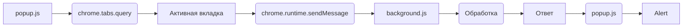

# Анализ кода popup.js

**1. <input code>**

```javascript
document.getElementById("sendUrlButton").addEventListener("click", () => {
    alert("Hello, world!");
    chrome.tabs.query({ active: true, currentWindow: true }, (tabs) => {
        let activeTab = tabs[0];
        let activeTabUrl = activeTab.url;
        
        chrome.runtime.sendMessage({ action: "sendUrl", url: activeTabUrl }, (response) => {
            if (response.status === "success") {
                alert("URL sent successfully!");
            } else {
                alert("Failed to send URL.");
            }
        });
    });
});
```

**2. <algorithm>**

**Блок-схема:**

```mermaid
graph TD
    A[Клик на "sendUrlButton"] --> B{Получить активную вкладку};
    B --> C[Получить URL активной вкладки];
    C --> D[Отправить сообщение в background.js];
    D --> E{Обработка ответа};
    E -- response.status = "success" --> F[Alert "URL sent successfully!"];
    E -- Иное --> G[Alert "Failed to send URL."];
    subgraph Обработка ответа
        D -. Отправляется-> H[background.js];
        H --> I[Обработка сообщения];
        I --> J[Отправка ответа];
        J -. Ответ-> E;
    end
```

**Пример:**

Пользователь кликает по кнопке "sendUrlButton". Код ищет активную вкладку. Если найдена активная вкладка с URL `https://example.com`, код отправляет сообщение в background.js с действием "sendUrl" и URL `https://example.com`. background.js обрабатывает сообщение и возвращает ответ в popup.js. В зависимости от статуса ответа, в popup.js выводится соответствующее сообщение.


**3. <mermaid>**



**Описание диаграммы:**

Диаграмма отображает поток данных. popup.js использует API `chrome.tabs.query` для получения активной вкладки. Затем, используя `chrome.runtime.sendMessage`, отправляет сообщение в `background.js`. `background.js` обрабатывает это сообщение, и отправляет ответ обратно в `popup.js`, который выводит соответствующее сообщение с помощью `alert`.

**4. <explanation>**

* **Импорты:** В данном коде нет прямых импортов, т.к. он использует встроенные API Chrome.

* **Классы:** Нет классов.

* **Функции:** Нет функций, кроме анонимных функций в `addEventListener`.

* **Переменные:**
    * `activeTab`: Содержит объект вкладки, полученный из API.  Тип - объект.
    * `activeTabUrl`: Хранит строковое значение URL активной вкладки. Тип - строка.


* **Возможные ошибки или области для улучшений:**
    * Отсутствие обработки ошибок: Код не обрабатывает случай, когда `chrome.tabs.query` не находит активную вкладку или при других ошибках.
    * Вместо `alert` можно использовать более современные методы отображения сообщений пользователю (например, уведомления).
    * Необходимо более подробное логирование (например, при отправке запроса и при получении ответа).
    * Не указан `background.js`, что является существенным недостатком для анализа.


**Цепочка взаимосвязей:**

`popup.js` взаимодействует с `chrome.tabs` API для получения информации о вкладке. Используя `chrome.runtime.sendMessage`, передает запрос в `background.js`, который выполняет необходимую обработку и возвращает ответ.


**Дополнительные комментарии:**

Код демонстрирует простой механизм взаимодействия между popup-виджетом и сервисом расширения (`background.js`).  Для корректной работы,  необходимо наличие `background.js`, который обрабатывает сообщение `sendUrl` и отвечает в `popup.js`.  В `background.js` должна быть функция, которая обрабатывает полученные данные.