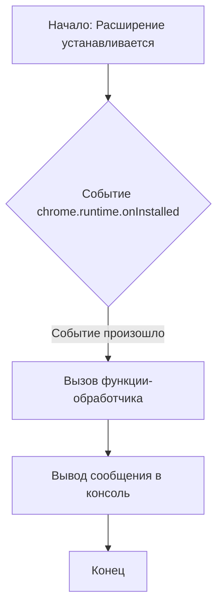

## Анализ кода `hypotez/src/webdriver/chrome/extentions/openai/background.js`

### <алгоритм>

1. **Событие установки расширения:**
   - Браузер отслеживает событие `chrome.runtime.onInstalled`, которое срабатывает при установке, обновлении или включении расширения.
   - Пример: Пользователь установил расширение "OpenAI Model Interface".
2. **Реакция на событие:**
   - Когда событие `onInstalled` срабатывает, вызывается функция-обработчик.
   - Пример: Функция `() => { console.log('OpenAI Model Interface Extension Installed'); }`
3. **Логирование в консоль:**
   - Функция-обработчик выводит в консоль браузера сообщение `OpenAI Model Interface Extension Installed`.
   - Пример: В консоли разработчика Chrome появится сообщение "OpenAI Model Interface Extension Installed".

### <mermaid>

### <объяснение>

**Импорты:**

В данном коде отсутствуют импорты, так как он использует API браузера Chrome, который доступен глобально в контексте расширения.

**Классы:**

В данном коде нет классов.

**Функции:**

*   `chrome.runtime.onInstalled.addListener(callback)`:
    *   **Аргументы:**
        *   `callback`: Функция, которая будет вызвана при возникновении события `onInstalled`.
    *   **Возвращает:** `undefined`
    *   **Назначение:** Регистрирует обработчик события `onInstalled`, который срабатывает, когда расширение устанавливается, обновляется или включается.
    *   **Пример:** Когда расширение "OpenAI Model Interface" впервые устанавливается, функция `() => { console.log('OpenAI Model Interface Extension Installed'); }` будет выполнена.

*   `() => { console.log('OpenAI Model Interface Extension Installed'); }`:
    *   **Аргументы:** Отсутствуют.
    *   **Возвращает:** `undefined`
    *   **Назначение:** Выводит сообщение в консоль браузера, подтверждая установку расширения.
    *   **Пример:** При вызове этой функции в консоли разработчика Chrome появится сообщение "OpenAI Model Interface Extension Installed".

**Переменные:**

В данном коде нет переменных, но есть использование API Chrome:
* `chrome.runtime`: Объект API Chrome, предоставляющий доступ к информации о расширении и его среде выполнения.
* `onInstalled`: Событие, которое срабатывает при установке, обновлении или включении расширения.
* `addListener`: Метод объекта `chrome.runtime.onInstalled`, который позволяет зарегистрировать функцию-обработчик для события.

**Цепочка взаимосвязей с другими частями проекта:**

Данный файл `background.js` является частью расширения Chrome. Он напрямую не взаимодействует с другими файлами проекта `hypotez` напрямую через импорты, но как часть расширения может взаимодействовать с другими частями расширения через API браузера Chrome. Например, этот скрипт может отправлять сообщения на скрипты пользовательского интерфейса (например `popup.js` или `content.js`) и/или обрабатывать сообщения от других частей расширения.

**Потенциальные ошибки или области для улучшения:**

1.  **Отсутствие обработки ошибок:** В коде отсутствует обработка возможных ошибок. При работе с API Chrome всегда полезно добавлять проверки и обработку исключительных ситуаций.
2.  **Базовый функционал:** Данный код выполняет только логирование установки расширения. В реальном приложении он должен выполнять более важные функции, например инициализировать контекст работы расширения, загружать и обрабатывать настройки, подготавливать обработчики сообщений.
3.  **Отсутствие асинхронности:** В данном коде нет асинхронных операций. Для более сложных операций, например, сетевых запросов, следует использовать `async/await` или `Promises`.