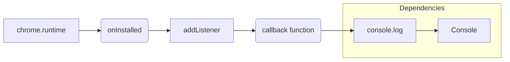

1. <input code>
```javascript
chrome.runtime.onInstalled.addListener(() => {
    console.log('OpenAI Model Interface Extension Installed');
});
```

2. <algorithm>

```mermaid
graph TD
    A[chrome.runtime.onInstalled.addListener] --> B{Event Triggered?};
    B -- Yes --> C[console.log('OpenAI Model Interface Extension Installed')];
    B -- No --> D[Do Nothing];
```

**Описание алгоритма:**

Код служит обработчиком события `onInstalled`, которое генерируется браузером Chrome при установке расширения.

* **Шаг 1**: Функция `chrome.runtime.onInstalled.addListener` регистрирует обработчик для события `onInstalled`.  Это функция-обработчик, которая будет вызвана при установке.
* **Шаг 2**:  Когда событие `onInstalled` происходит (например, при установке расширения), запускается функция в `addListener`.
* **Шаг 3**: Внутри функции вызывается `console.log('OpenAI Model Interface Extension Installed')`, которая выводит сообщение в консоль разработчика браузера.
* **Шаг 4**: Если событие `onInstalled` не произошло, то функция ничего не делает.

**Пример:**  Пользователь устанавливает расширение. Браузер генерирует событие `onInstalled`.  Обработчик вызывается. В консоли разработчика отображается сообщение.


3. <mermaid>


**Описание диаграммы:**

* `chrome.runtime`: Объект API браузера Chrome, предоставляющий методы для взаимодействия с расширением.
* `onInstalled`: Свойство объекта `chrome.runtime`, которое представляет собой событие установки расширения.
* `addListener`: Метод, который регистрирует функцию-обработчик для события `onInstalled`.
* `callback function`: Функция, которая выполняется при срабатывании события.
* `console.log`: Функция для вывода сообщений в консоль браузера.
* `Console`: Представляет объект консоли, куда выводится сообщение.

**Зависимости:**  Код напрямую зависит от возможностей API `chrome.runtime`, предоставляемых браузером Chrome. Он не использует сторонние библиотеки или модули.

4. <explanation>

**Импорты:**  Нет импортов, так как код использует встроенные возможности API Chrome.

**Классы:** Нет классов.

**Функции:**

* `chrome.runtime.onInstalled.addListener`:  Эта функция, предоставляемая API Chrome, регистрирует функцию-обработчик для события `onInstalled`.  Она принимает в качестве аргумента функцию-обработчик (лямбда-выражение в данном случае) и не возвращает никаких значений.


**Переменные:** Нет явно объявленных переменных.

**Возможные ошибки/улучшения:**

* **Отсутствие логирования других событий:**  Код обрабатывает только событие `onInstalled`.  В реальном расширении, вероятно, потребуется реагировать на другие события (например, активацию/деактивацию,  загрузку данных).
* **Отсутствие конфигурации или настроек:**  Код не использует никакие конфигурационные параметры.  При необходимости добавления настроек нужно было бы использовать соответствующие механизмы Chrome.
* **Отсутствие дальнейшей обработки:**  В текущем виде код просто выводит сообщение, но не выполняет никакой другой логики.

**Цепочка взаимосвязей:**  Это расширение, поэтому напрямую взаимодействует с Chrome API. Нет связей с другими частями проекта, так как это всего лишь небольшой фрагмент кода установки.