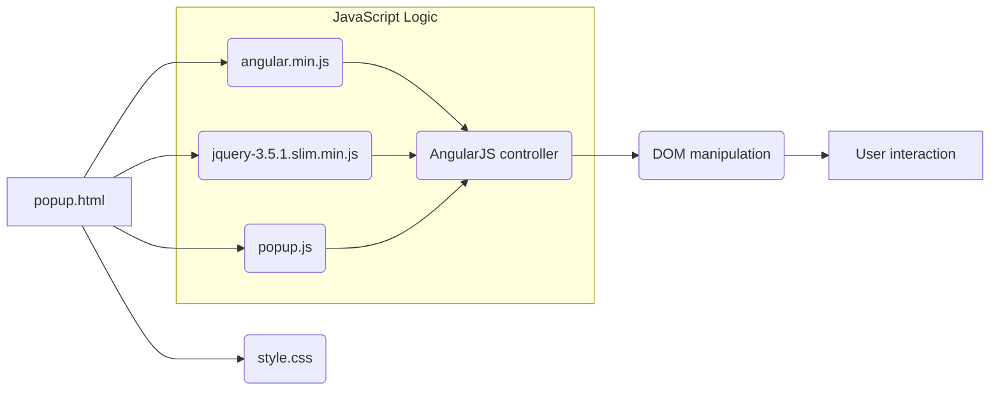

# Анализ кода popup.html

## <input code>

```html
<!-- содержимое файла popup.html -->
```

## <algorithm>

Пошаговая блок-схема алгоритма работы кода затруднена, так как код представляет собой HTML-шаблон для веб-приложения.  Он не содержит логики в виде функций или классов. Основной функционал, скорее всего, будет реализован в связанном JavaScript-файле (popup.js).

## <mermaid>



**Объяснение диаграммы:**

* **popup.html:**  Основной HTML-шаблон.
* **angular.min.js, jquery-3.5.1.slim.min.js, popup.js, style.css:** Внешние ресурсы, необходимые для функционирования. Связь с `popup.html` осуществляется через теги `<script>` и `<link>`.
* **AngularJS controller (F):** Предполагаемый JavaScript контроллер, который реализует взаимодействие с DOM и пользовательским вводом.
* **DOM manipulation (G):**  Изменение содержимого страницы, ответов и реакция на события.
* **User interaction (H):**  Взаимодействие пользователя с интерфейсом (ввод текста, нажатие кнопок).

## <explanation>

Этот код представляет собой HTML-шаблон для веб-приложения, вероятно, расширения Chrome. Он описывает пользовательский интерфейс, который, по всей видимости, взаимодействует с моделью OpenAI.  Ключевой функционал, как ожидается, находится в связанном JavaScript-файле `popup.js`.

**Импорты:**

* `angular.min.js`:  Файл минифицированного JavaScript-фреймворка AngularJS. Используется для создания динамического интерфейса и двусторонней связи с данными.
* `jquery-3.5.1.slim.min.js`:  Фреймворк jQuery, обеспечивающий облегченный доступ к DOM.
* `popup.js`: Файл JavaScript, содержащий логику приложения. Здесь, вероятно, будут определения функций, связанных с отправкой запросов к OpenAI, обработкой ответов и обновлением интерфейса.
* `style.css`: Файл с стилями для оформления интерфейса.

**Классы:**

* В данном HTML нет определения классов в традиционном понимании.  Возможно, AngularJS предоставляет функционал для создания контроллеров (в `popup.js`) и взаимодействия с ними в шаблоне.

**Функции:**

* В `popup.html` нет определений функций.  Функционал, вероятно, будет определен в `popup.js`.  Например, функции `sendMessage()`, `trainModel()` и т.д. будут реализовывать логику отправки запросов к API и обработки данных.

**Переменные:**

* `MODE`:  Устанавливает режим приложения ('debug').
* `selectedAssistant`, `message`, `response`, `trainingData`, `trainingStatus`:  Переменные, хранящие данные, которые будут использоваться `popup.js` для хранения и обновления информации.


**Возможные ошибки и улучшения:**

* **Отсутствие JavaScript кода:**  Для полного понимания функциональности необходимо рассмотреть `popup.js`.
* **Неявная зависимость:**  Предполагается использование AngularJS.  Без анализа `popup.js` трудно определить полную структуру и зависимости проекта.
* **Недостаток документации:**  В данном файле отсутствует подробная документация, что затрудняет понимание. Документируйте JavaScript-код, добавив комментарии с описанием функций, переменных и логики.

**Цепочка взаимосвязей:**

`popup.html` - `popup.js` (JavaScript код) - OpenAI API (возможно) - Подключаемые библиотеки AngularJS и jQuery.  Связь между `popup.js` и другими частями проекта неясна без анализа кода `popup.js`.


```