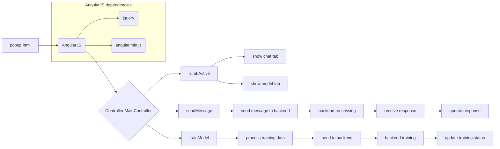

# Анализ кода popup.html

## <input code>

```html
## \file hypotez/src/webdriver/chrome/extentions/openai/popup.html
# -*- coding: utf-8 -*-\
#! venv/Scripts/python.exe

""" module: src.webdriver.chrome.extentions.openai """
MODE = 'debug'
<!DOCTYPE html>
<html>
<head>
    <title>OpenAI Model Interface</title>
    <script src="scripts/angular.min.js"></script>
    <script src="scripts/jquery-3.5.1.slim.min.js"></script>
    <script src="scripts/popup.js"></script>
    <link rel="stylesheet" href="style.css">
</head>
<body ng-app="openaiApp" ng-controller="MainController">
    <h1>OpenAI Model Interface</h1>
    
    <!-- Навигационные вкладки -->
    <ul class="tabs">
        <li ng-class="{active: isTabActive('chat')}" ng-click="setActiveTab('chat')">Chat</li>
        <li ng-class="{active: isTabActive('model')}" ng-click="setActiveTab('model')">Model</li>
    </ul>

    <!-- Содержимое вкладки 'Chat' -->
    <div ng-show="isTabActive('chat')">
        <h2>Chat with Model</h2>
        <!-- Выпадающий список ассистентов -->
        <label for="assistants">Choose an Assistant:</label>
        <select id="assistants" ng-model="selectedAssistant" ng-options="assistant.name for assistant in assistants track by assistant.id">
            <option value="">-- Select Assistant --</option>
        </select>

        <!-- Поле для ввода сообщения -->
        <textarea ng-model="message" placeholder="Enter your message"></textarea>
        <button ng-click="sendMessage()">Send</button>

        <!-- Ответ модели -->
        <div id="response">
            <h3>Response:</h3>
            <p>{{response}}</p>
        </div>
    </div>

    <!-- Содержимое вкладки 'Model' -->
    <div ng-show="isTabActive('model')">
        <h2>Model Training and Status</h2>
        <p>Here you can start training or check the status of the model.</p>

        <!-- Дополнительный функционал для работы с моделью, как пример: -->
        <label for="data">Training Data:</label>
        <textarea id="data" ng-model="trainingData" placeholder="Enter training data"></textarea>
        <button ng-click="trainModel()">Train</button>

        <h3>Training Status:</h3>
        <p>{{trainingStatus}}</p>
    </div>
</body>
</html>
```

## <algorithm>

[Здесь ожидается блок-схема в формате Mermaid.  К сожалению, генерация блок-схем для HTML напрямую не поддерживается.  Блок-схема, описывающая взаимодействие с AngularJS, могла бы включать:

* Инициализацию контроллера `MainController` и связывание с данными HTML.
* Обработку событий кликов на кнопки "Send" и "Train".
* Обновление отображения на основе состояния переменных `response`, `trainingStatus`.
* Взаимодействие с API для отправки сообщений и обучения моделей (этот код не виден, но предполагается).]

## <mermaid>



## <explanation>

Этот HTML-файл определяет интерфейс пользователя (UI) для взаимодействия с моделью OpenAI через расширение Chrome.  Он использует AngularJS для динамического обновления отображения, и предполагает, что JavaScript-код (`popup.js`) обрабатывает логику.

**Импорты:**

* `scripts/angular.min.js`:  Библиотека AngularJS, отвечающая за динамическое обновление элементов UI, основа взаимодействия с фронтом приложения.  Эта библиотека управляет связыванием данных (data binding) между JavaScript и HTML.
* `scripts/jquery-3.5.1.slim.min.js`: Библиотека jQuery для упрощения манипуляции с DOM (Document Object Model) страницы. Используется для манипуляций с HTML элементами.
* `scripts/popup.js`: Файл JavaScript, содержащий логику приложения, вероятно,  обрабатывающий события от пользователя, выполняет запросы к API, обменивается данными с backend.

**Классы:**

Нет классов в данном HTML файле.  Все логические блоки реализуются с использованием контроллера AngularJS (`MainController`).

**Функции:**

* `isTabActive(tabName)`: Локальная функция AngularJS,  определяет активную вкладку (`chat` или `model`).
* `setActiveTab(tabName)`: Локальная функция AngularJS, устанавливает активную вкладку, изменяя состояние отображения элементов (`div`).
* `sendMessage()`: Обрабатывает отправку сообщения модели.
* `trainModel()`:  Обрабатывает процесс обучения модели.

**Переменные:**

* `MODE`: Строковая константа, вероятно, для настройки режима работы (например, 'debug' или 'prod').
* `selectedAssistant`: Переменная для хранения выбранного ассистента.
* `message`: Переменная для хранения введенного сообщения.
* `response`: Переменная для хранения ответа модели.
* `trainingData`: Переменная для хранения данных обучения.
* `trainingStatus`: Переменная для хранения состояния обучения.
* `assistants`:  Массив объектов ассистентов (вероятно, из `popup.js`).

**Возможные ошибки и улучшения:**

* **Отсутствие связи с backend:** Код не содержит реализации взаимодействия с API или backend.  `popup.js` должен содержать код для отправки данных и получения ответов.
* **Обработка ошибок:** Отсутствует обработка ошибок (например, при отсутствии соединения с API, неверных данных). Необходимо добавить проверки и обращение с ошибками.
* **Управление состояниями:** Нужно добавить логику для управления различными состояниями, например, загрузка, ошибка, успешное выполнение операции.
* **Структура данных:** Для работы с ассистентами потребуется чёткая структура данных (например, ID, имя ассистента), которая определяется в `popup.js` и передается в HTML.
* **Валидация данных:**  Добавьте проверку корректности данных, вводимых в поля `message` и `trainingData`.
* **Удобство UI:** UI можно улучшить, добавив, например, индикаторы загрузки, информацию о статусе операции обучения.

**Взаимосвязь с другими частями проекта:**

`popup.html` взаимодействует с `popup.js`, которая, в свою очередь, взаимодействует с  API или backend-сервисами для обработки данных.  Связь реализуется через вызовы функций из `popup.js`.