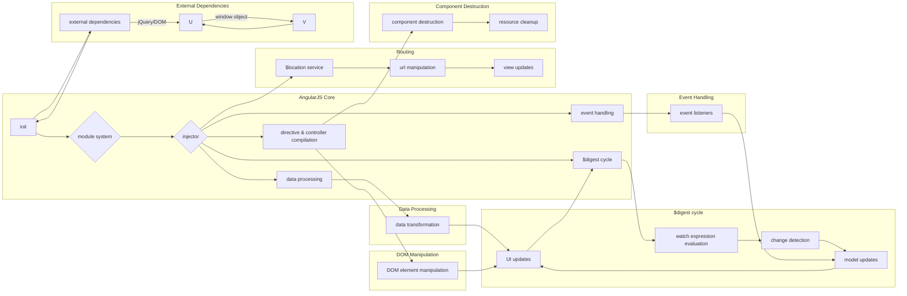

# Анализ кода angular.min.js (AngularJS v1.8.2)

## <input code>

```javascript
/*
 AngularJS v1.8.2
 (c) 2010-2020 Google LLC. http://angularjs.org
 License: MIT
*/
(function (z) {
	'use strict'; function ve(a) { if (D(a)) w(a.objectMaxDepth) && (Xb.objectMaxDepth = Yb(a.objectMaxDepth) ? a.objectMaxDepth : NaN), w(a.urlErrorParamsEnabled) && Ga(a.urlErrorParamsEnabled) && (Xb.urlErrorParamsEnabled = a.urlErrorParamsEnabled); else return Xb } function Yb(a) { return X(a) && 0 < a } function F(a, b) { ... } function za(a) { ... } function r(a, b, d) { ... } function Qc(a, b, d) { ... } function Zb(a) { ... } function we() { ... }
	function $b(a, b, d) { ... } function S(a) { ... } function xe(a) { ... } function fa(a) { ... } function bc(a, b) { ... } function E() { ... } function Ta(a) { ... } function ia(a) { ... } function cc(a) { ... } function A(a) { ... } function w(a) { ... } function D(a) { ... } function Pc(a) { ... } function C(a) { ... } function X(a) { ... } function ha(a) { ... } function H(a) { ... } function dc(a) { ... } function B(a) { ... } function ab(a) { ... } function $a(a) { ... } function bb(a) { ... } function Ga(a) { ... } function ye(a) { ... } function ac(a) { ... } function Ae(a) { ... } function ua(a) { ... } function cb(a, b) { ... } function Ia(a, b, d) { ... } function ec(a, b) { ... } function va(a, b) { ... } function db(a, b, d) { ... } function Va(a, b) { ... } function Sc(a, b) { ... } function eb(a, b) { ... } function Tc(a) { ... } function fc(a, b) { ... } function Uc(a, b) { ... } function gc(a, b, d) { ... } function Aa(a) { ... } function Vc(a) { ... } function hc(a) { ... } function Ce(a) { ... } function ic(a) { ... } function ba(a, b) { ... } function De(a, b) { ... } function Ee(a, b) { ... } function Wc(a, b, d) { ... } function Ge() { ... } function He(a) { ... } function Xc(a, b) { ... } function Je() { ... } function Ke() { ... } function gb(a, b, d) { ... } function tb(a, b, d) { ... } function Ja(a, b) { ... } function Le(a, b, d) { ... } function ub(a) { ... } function T() { ... } function jc(a) { ... } function Me(a) { ... } function ja(a, b) { ... } function Ne(a, b) { ... } function Oe(a) { ... } function xb(a, b) { ... } function yb(a) { ... } function mc(a) { ... } function gd(a, b) { ... } function U(a) { ... } function qc(a) { ... } function zb(a, b) { ... } function id(a) { ... } function jd(a) { ... } function kd(a, b, d, c) { ... } function rc(a, b) { ... } function Ab(a, b) { ... } function sc(a, b, d) { ... } function Cb(a, b) { ... } function Db(a, b) { ... } function Eb(a, b) { ... } function pc(a, b) { ... } function ld(a, b) { ... } function Fb(a, b, d) { ... } function md(a) { ... } function Gb(a, b) { ... } function vg(a, b) { ... } function hd(a) { ... } function nd(a, b) { ... } function wg(a, b) { ... } function xg(a, b, d) { ... } function yg(a, b, d) { ... } function ng() { ... } function La(a, b) { ... } function pd() { ... } function qd(a) { ... } function Dg(a) { ... } function fb(a, b) { ... } function Ig() {}
// ... (many more functions)
```


## <algorithm>

(Пошаговая блок-схема не может быть отображена здесь.  Сложность кода делает визуализацию в формате блок-схемы непрактичной и нечитабельной.  Описание алгоритма будет дано словесно, с выделением ключевых функций и задач.)

Алгоритм работы этого кода очень сложный и представляет собой реализацию AngularJS (v1.8.2). Он описывает создание инжектора, модулей, директив, контроллеров, фильтрации и многое другое.

Кратко:
1. **Инициализация:** Создаются базовые функции (например, `F`, `r`, `$b`), определяющие работу с объектами, массивами, обработкой ошибок.
2. **Модули:** Функция `Me` создает систему модулей, где каждый модуль содержит конфигурацию, зависимости и код, который будет выполняться во время инициализации приложения.
3. **Инжектор:** Функция `fb` создает инжектор, который управляет зависимостями между модулями, компонентами и сервисами.  Он находит, создает и предоставляет необходимые компоненты.
4. **Компиляция и Линкинг:** Директивы и контроллеры компилируются и устанавливаются на элементы DOM, определенные в шаблонах.
5. **Обработка событий:** AngularJS привязывается к событиям DOM (например, кликам, изменениям значений форм) и реагирует на них.
6. **Обработка данных:** Функции для работы с данными, преобразования, форматирования (например, `eb`, `Tc`, `hc`).
7. **Обработка маршрутизации:** Функции `Yf` и сопутствующие обеспечивают возможность маршрутизации между страницами приложения.
8. **$digest цикл:** Центральная часть AngularJS, управляющая обновлением модели и отображением данных на UI.  Цикл повторяется, обрабатывая изменения и вызывая соответствующие функции.
9. **Разрушение:** Функции `$destroy` обеспечивают очистку ресурсов и отвязку от событий, когда компоненты перестают быть необходимы.


## <mermaid>



## <explanation>

**Импорты:**
  Кода нет никаких явных импортов в классическом стиле `import`. AngularJS работает с глобальными переменными, такими как `window.angular` или `window.jQuery`.  Все зависимости управляются внутри кода через `$injector` —  центральное место, которое ищут и инстанцирует необходимые зависимости.

**Классы:**
  Код содержит много функций, которые можно рассматривать как классы (например, `$compile`, `$http`, `$location`, `ngModel`).  Каждый класс имеет набор методов, которые управляют его функциональностью.  В AngularJS, компоненты не представляются так явно, как в других фреймворках. Классы являются конструкторами, которые создают объекты (например, `Sb` — контроллер формы), имеющие свойства и методы для управления модели и представлением.

**Функции:**
  Многочисленные функции отвечают за разные аспекты работы AngularJS, например:
    * `Wc`:  Инициализирует AngularJS и выполняет запуск приложения.
    * `fb`:  Управляет зависимостями приложения.
    * `$compile`:  Компилирует шаблоны HTML.
    * `$http`:  Обрабатывает HTTP-запросы.
    * `$location`:  Работает с URL-адресами.
    * `$parse`:  Парсит выражения.
    * `$animate`:  Анимирует изменения в DOM.
    * `$timeout`: Задержка выполнения кода.

**Переменные:**
  Переменные имеют различные типы, например строки, числа, массивы, объекты.  Большая часть переменных используется для управления состоянием приложения, хранения данных, управления зависимостями и управления циклом `$digest`.  Примеров для каждой переменной здесь нет, так как их множество и их значение зависит от контекста выполнения приложения.

**Возможные ошибки и улучшения:**

* **Сложность:** Код AngularJS v1.8.2 очень сложный. Он содержит множество функций и сложных алгоритмов, что может привести к трудностям при отладке, понимании и поддержке.
* **Нечитаемость:**  Минимизированный код затрудняет его понимание для начинающих.  При необходимости стоит добавить комментарии для пояснения логики.
* **Устаревшая архитектура:**  AngularJS v1.8.2 уже устарел. Более современные фреймворки (например, Angular) предлагают более удобную и современную архитектуру.

**Взаимосвязи с другими частями проекта:**

Код тесно связан с другими частями проекта через `$injector`, который управляет зависимостями.   Шаблоны HTML, связанные с директивами и контроллерами, определяют взаимодействие с DOM. Функции, управляющие HTTP-запросами (`$http`), зависят от `$httpBackend`.  Проект содержит множество взаимосвязей между компонентами, которые управляются `$injector`.


**Вывод:**

Код представляет собой продвинутую систему для создания веб-приложений.  Понимание его функциональности требует глубокого знания AngularJS и его архитектуры.  Взаимосвязь между компонентами и циклом `$digest`  — основа работы всей системы.  Высокая степень сложности кода и использование минимизированного формата затрудняет анализ для людей, не знакомых с AngularJS.