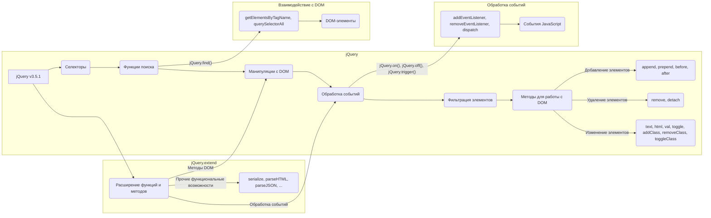

# Анализ кода jQuery 3.5.1

## <input code>

```javascript
/*! jQuery v3.5.1 -ajax,-ajax/jsonp,-ajax/load,-ajax/script,-ajax/var/location,-ajax/var/nonce,-ajax/var/rquery,-ajax/xhr,-manipulation/_evalUrl,-deprecated/ajax-event-alias,-effects,-effects/Tween,-effects/animatedSelector | (c) JS Foundation and other contributors | jquery.org/license */
// ... (остальной код)
```

## <algorithm>

Пошаговая блок-схема алгоритма работы jQuery 3.5.1 (фрагмент, описывающий обработку селекторов):

```mermaid
graph TD
    A[Инициализация jQuery] --> B{Проверка входных данных (e, t, n, r)}
    B -- "string"==typeof e && e --> C[Разбор селектора]
    B -- иначе --> D[Возврат пустого массива]
    C --> E{Проверка на наличие контекста}
    E -- контекст - t --> F[Выполнение селектора с контекстом]
    E -- иначе --> G[Выполнение селектора без контекста]
    F --> H[Построение результата]
    G --> H
    H --> I[Возврат результата]
    D --> I
```

**Пример:**

Если `e` - это строка "#myElement", то алгоритм пойдет по ветви `Проверка входных данных (e, t, n, r)`. Функция `se` будет анализировать данную строку как селектор. 

## <mermaid>




## <explanation>

**1. Импорты:**

Файл `jquery-3.5.1.slim.min.js` содержит минимизированную версию jQuery.  Он предоставляет множество функций для работы с DOM, обработкой событий, анимациями и т.д.  Нет прямых импортов в виде `import` из других `src`-пакетов, так как это JavaScript-библиотека. Внутри же кода присутствуют внутренние функции и методы, которые взаимодействуют между собой.

**2. Классы:**

В коде представлен класс `jQuery` (или `$`), который является основным классом библиотеки. Он имеет множество методов и свойств, которые позволяют взаимодействовать с DOM, напрмер, `$.ajax`,  `$.fn.ready`, `$.fn.append`, `$.fn.hide` и т.д.  Самый важный метод - `$.fn.init`.  Кроме `jQuery`, есть другие вспомогательные внутренние классы,  например, `Callbacks`, `Deferred`, `Offset`, и многие другие, которые представляют собой объекты, содержащие методы для выполнения конкретных задач.  

**3. Функции:**

Код содержит множество функций, каждая из которых выполняет определённую задачу.  Примеры: `$.each`, `$.grep`, `$.map`, `$.ajax`, `$.contains`, `$.parseHTML`, `$.param`, `$.css`, и т.д.  Эти функции отвечают за итерации по массивам, фильтрацию элементов, обработку Ajax запросов, проверку вложенности элементов, разбор HTML-кода,  и т.д.  

**4. Переменные:**

Код использует множество переменных, например, `$`, `w`, `g`, `x`, `m`, и т.д.  Большинство переменных представляют собой объекты, массивы или строки.  Они хранят значения, которые используются в различных функциях и методах.

**5. Возможные ошибки или области для улучшений:**

- **Сложность кода:** Код jQuery весьма сложный и объемный. Это может затруднить понимание его работы. Минимизация и чрезмерное сжатие могут затруднить отладку и поддержку.
- **Низкая читабельность:** Из-за сжатия и специфического синтаксиса код часто не очевиден для понимания.
- **Зависимости:** Не все зависимости ясны без контекста всего проекта. Но это обширная библиотека, которая устанавливает зависимости на уровне JavaScript.  

**Взаимосвязи с другими частями проекта:**

jQuery выступает как библиотека, предоставляющая функции для взаимодействия с DOM и обработку событий. Она может использоваться в приложениях, которые требуют манипулирования с HTML-содержимым, динамического обновления страницы и т.д.  Она взаимодействует с другими частями проекта, используя стандартные методы JavaScript, такие как DOM-манипуляции, обработчики событий.


**Заключение:**

jQuery - это мощная и сложная библиотека.  Этот анализ рассматривает лишь фрагмент кода, а полное понимание требует изучения всей библиотеки.  Внутренняя работа jQuery основана на селекторах CSS, обработке событий и множестве вспомогательных функций, что позволяет легко и эффективно манипулировать DOM.