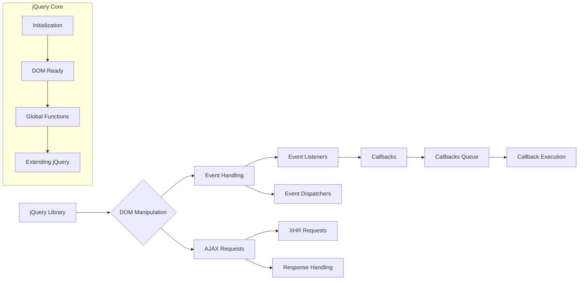

# Анализ кода jQuery 3.5.1

**1. <input code>**

```javascript
/*! jQuery v3.5.1 -ajax,-ajax/jsonp,-ajax/load,-ajax/script,-ajax/var/location,-ajax/var/nonce,-ajax/var/rquery,-ajax/xhr,-manipulation/_evalUrl,-deprecated/ajax-event-alias,-effects,-effects/Tween,-effects/animatedSelector | (c) JS Foundation and other contributors | jquery.org/license */
// ... (остальной код)
```

**2. <algorithm>**

К сожалению, построить полную пошаговую блок-схему для всего этого кода очень сложно.  Это огромный фрагмент, реализующий множество функций jQuery.  Основной алгоритм состоит из множества функций, отвечающих за разные части функциональности библиотеки.  Например:

* **Функции для работы с DOM (селекторы, манипуляции, клонирование):**  Алгоритм этих функций включает в себя поиск элементов в дереве DOM, фильтрацию, модификацию, создание новых элементов и др.  В зависимости от входных данных (селекторы, методы) выполняется различная обработка.

* **Функции для работы с событиями (события, обработчики):**  Алгоритм работы предполагает добавление и удаление обработчиков событий, проверку условий на основе событий и их обработку.  Передача данных происходит между обработчиками и исходным событием.

* **Функции для работы с Ajax запросами:**  Алгоритм включает в себя формирование запроса, отправку, обработку ответа и передачу данных между различными частями кода (например, между функцией AJAX и обработчиками событий).

В целом, алгоритм работы кода - это сложная структура взаимодействующих функций и методов, которые выполняют множество различных операций с DOM, событиями и AJAX.

**Пример (фрагмент):**
Функция `E.find(selector, context, results)` находит элементы в DOM, соответствующие селектору.
* Пример входных данных: `selector = '#myElement'`, `context = document`.
* Последовательность действий:
    1.  Проверяется, существует ли элемент с id `#myElement` в `document`
    2.  Если элемент найден, он добавляется в массив `results`
    3.  Если элемент не найден, возвращается пустой массив

**3. <mermaid>**



**Примечания к диаграмме:**

* **jQuery Library (A):**  Представляет собой всю библиотеку jQuery.
* **DOM Manipulation (B):**  Обработка элементов DOM (поиск, фильтрация, создание, изменение).
* **Event Handling (C):** Обработка событий.
* **AJAX Requests (D):** Запросы и обработка ответов на AJAX запросы.
* **XHR Requests (G):** Использование XMLHttpRequest для AJAX.
* **Response Handling (H):**  Обработка полученных данных.
* **Event Listeners (E):**  Объекты, отвечающие за прослушивание и реагирование на события.
* **Event Dispatchers (F):**  Объекты, которые вызывают обработчики событий.
* **Callbacks (I):**  Обработчики событий, которые вызываются в определенных точках кода.
* **Callbacks Queue (J):**  Очередь, в которой хранятся обработчики событий.
* **Callback Execution (K):**  Выполнение обработчика из очереди.


**4. <explanation>**

* **Импорты:**  В этом фрагменте кода нет импорта в традиционном смысле (например, `import ... from ...`).  Это функция, которую загружает браузер, и она работает непосредственно в контексте JavaScript-среды.  Это ядро библиотеки jQuery.

* **Классы:** `E` (jQuery) - главный класс, от которого наследуются все другие объекты.  Также присутствуют внутренние вспомогательные классы и объекты, которые отвечают за различные части функциональности jQuery, например, для работы с событиями, DOM-манипуляциями, AJAX-запросами и т.д.  Заметьте, что код использует концепцию цепочек вызовов (`chaining`).

* **Функции:**  Множество функций, реализующих различные функциональные возможности библиотеки, например:
    * `E.extend()`: Расширяет объект.
    * `E.each()`: Итерируется по массиву.
    * `E.find()`: Выполняет поиск элементов в DOM.
    * `E.ajax()`: AJAX запросы.
    * `E.parseHTML()`: Парсинг HTML-строк.
    * `E.css()`:  Доступ к стилям элементов.
    * `E.event.add()`:  Регистрация обработчиков событий.
    * `E.event.dispatch()`: Выполнение обработчиков событий.

* **Переменные:**  Переменные хранят данные, необходимые для выполнения функций (например, массивы, селекторы, параметры AJAX-запросов).

* **Возможные ошибки и улучшения:**  Сложность кода. Из-за большого объема кода и сложного взаимодействия функций, может быть трудно найти и исправить ошибки.  Также трудно определить, где могут быть потенциальные улучшения без более детального анализа каждой части функциональности. Код является результатом эволюции библиотеки и содержит много исторических деталей.

**Взаимосвязи с другими частями проекта:**

Код связан со многими другими частями проекта, в зависимости от того, какие функции jQuery используются.  Если используется функция `$.ajax()`, код взаимодействует с сервером и другими компонентами проекта, которые отвечают за обработку запросов.  Связь с другими частями проекта определяется контекстом использования jQuery в приложениях.


**Важно:** Этот анализ является общим.  Для более глубокого анализа конкретного функционала нужно проанализировать части кода, связанные с конкретными функциями.