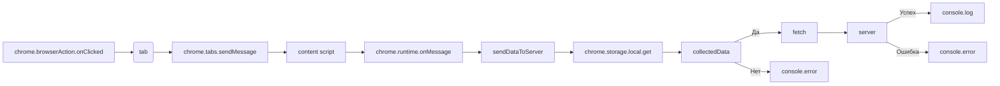

```MD
# Анализ кода background.js

## <input code>

```javascript
// background.js

chrome.browserAction.onClicked.addListener(tab => {
    chrome.tabs.sendMessage(tab.id, { action: 'collectData', url: tab.url });
});

/**
 * 
 * This function listens for messages sent from other parts of the extension, 
 * such as content scripts or other background scripts, using the `chrome.runtime.sendMessage()` method.
*
chrome.runtime.onMessage.addListener((message, sender, sendResponse) => {
    if (message.action === 'collectData') {
        sendDataToServer(message.url);
    }
});

function sendDataToServer(url) {
    const serverUrl = 'http://127.0.0.1/hypotez.online/api/'; // Change to your server endpoint
    chrome.storage.local.get('collectedData', (result) => {
        const collectedData = result.collectedData;
        if (collectedData) {
            fetch(serverUrl, {
                method: 'POST',
                headers: {
                    'Content-Type': 'application/json'
                },
                body: JSON.stringify(collectedData)
            })
                .then(response => {
                    if (!response.ok) {
                        throw new Error('Failed to send data to server');
                    }
                    console.log('Data sent to server successfully');
                })
                .catch(error => {
                    console.error('Error sending data to server:', error);
                });
        } else {
            console.error('No collected data found');
        }
    });
}
```

## <algorithm>

**Блок-схема:**

```mermaid
graph TD
    A[Клик на иконку расширения] --> B{Получить ID вкладки};
    B --> C[Отправить сообщение вью-скрипту];
    C --> D[Вью-скрипт собирает данные];
    D --> E[Отправить сообщение в background];
    E --> F{Сообщение "collectData"};
    F -- Да --> G[sendDataToServer(url)];
    F -- Нет --> H[Обработка другого сообщения];
    G --> I[Получить данные из хранилища];
    I --> J{Данные есть?};
    J -- Да --> K[Отправить данные на сервер];
    K --> L[Успешно?];
    L -- Да --> M[Вывести сообщение об успехе];
    L -- Нет --> N[Вывести сообщение об ошибке];
    J -- Нет --> O[Вывести сообщение об отсутствии данных];
    
    subgraph Сервер
        K --> P[Сервер обрабатывает данные]
        P --> Q[Результат]
        
    end
```

**Пример:**

Пользователь кликает по иконке расширения на вкладке с URL `https://example.com`.  `chrome.browserAction.onClicked` отправляет сообщение `collectData` вью-скрипту (content script) на текущей вкладке, включая URL.  Вью-скрипт собирает нужные данные и отправляет их в background.js с  `action: 'collectData'`.  Функция `sendDataToServer` получает URL, извлекает сохраненные данные из `chrome.storage.local`, отправляет их на сервер.


## <mermaid>



## <explanation>

**Импорты:**

В этом коде нет прямых импортов из `src.`, так как код написан в формате background.js и использует встроенные возможности Chrome API.

**Классы:**

Нет классов в данном коде.

**Функции:**

* `chrome.browserAction.onClicked.addListener(tab => ...)`: Слушает клики по иконке расширения и отправляет сообщение `collectData` в соответствующую вкладку.  Аргумент `tab` содержит информацию о вкладке, включая `tab.id` и `tab.url`.  
* `sendDataToServer(url)`: Отправляет данные на сервер.  Принимает URL как аргумент.  Использует `chrome.storage.local` для получения ранее собранных данных. Использует `fetch` для отправки POST запроса на сервер.  Обрабатывает успешный и неудачный ответы от сервера.


**Переменные:**

* `serverUrl`: Строковая переменная, содержащая URL сервера.
* `collectedData`: Переменная, содержащая данные, полученные из хранилища `chrome.storage.local`.  Это данные, которые собираются вью-скриптом и сохраняются.

**Возможные ошибки и улучшения:**

* **Обработка ошибок `fetch`:** Обработка ошибок в `fetch` очень важна.  Код должен корректно обрабатывать ситуации, когда запрос на сервер не выполняется или сервер возвращает ошибочный статус.
* **Время ожидания:** При использовании `fetch` желательно добавлять таймауты, чтобы предотвратить блокировку приложения при длительных операциях.
* **Управление данными:**  Коду не хватает явного описания того, какие данные собираются (`collectedData`). Желательно добавить логику проверки типа данных, которые собираются, чтобы избежать ошибок при сериализации в JSON.
* **Логирование:** Код уже содержит логирование. Но для дебага и отладки, желательно использовать более структурированные системы логирования.
* **Обработка `sender`:**  Функция `chrome.runtime.onMessage.addListener` принимает параметр `sender`, но он не используется.  В некоторых случаях может быть полезно знать, откуда пришло сообщение (например, с какой вкладки, другого расширения).

**Взаимосвязь с другими частями проекта:**

Код `background.js` взаимодействует с `content script` (вью-скриптом), который отвечает за сбор данных, и с сервером, который обрабатывает полученные данные. Расширение использует `chrome.storage.local` для временного сохранения собранных данных.  Вью-скрипт (content script) отвечает за инициирование сбора данных, взаимодействие с  `chrome.tabs` для отправки сообщений в  `background.js`, и обработку ответа от `chrome.runtime.onMessage`.  Вся функциональность связана для отправки и обработки запросов на сервер.