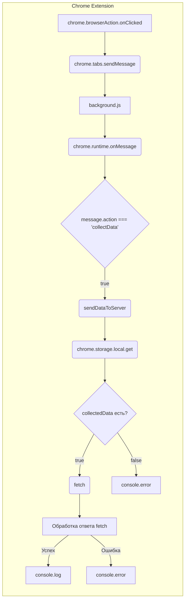

```MD
# Анализ кода background.js

## <input code>

```javascript
// background.js

chrome.browserAction.onClicked.addListener(tab => {
    chrome.tabs.sendMessage(tab.id, { action: 'collectData', url: tab.url });
});

/**
 * 
 * This function listens for messages sent from other parts of the extension, 
 * such as content scripts or other background scripts, using the `chrome.runtime.sendMessage()` method.
Here's a breakdown of what each part does:
- `chrome.runtime.onMessage.addListener()`: 
This function sets up a listener for messages sent from other parts of the extension.
- `(message, sender, sendResponse) => { ... }`: This is an arrow function that defines what should happen when a message is received. It takes three parameters:
  - `message`: The message object sent from the sender.
  - `sender`: Information about the sender of the message, such as its ID and whether it is a tab or another extension.
  - `sendResponse`: A function that can be used to send a response back to the sender if needed.
- `if (message.action === 'collectData') { ... }`: This condition checks if the received message has a property named `action` with a value of `'collectData'`. This is often used to determine the purpose or type of the message.
- `sendDataToServer(message.url)`: If the received message has an action of `'collectData'`, this function calls another function named `sendDataToServer()` and passes the URL from the message as an argument. This typically triggers some action or behavior in response to the received message.
In summary, this function listens for messages with the action `'collectData'`, and when such a message is received, it triggers the `sendDataToServer()` function, presumably to collect data and send it to a server.
 */
chrome.runtime.onMessage.addListener((message, sender, sendResponse) => {
    if (message.action === 'collectData') {
        sendDataToServer(message.url);
    }
});

function sendDataToServer(url) {
    const serverUrl = 'http://127.0.0.1/hypotez.online/api/'; // Change to your server endpoint
    chrome.storage.local.get('collectedData', (result) => {
        const collectedData = result.collectedData;
        if (collectedData) {
            fetch(serverUrl, {
                method: 'POST',
                headers: {
                    'Content-Type': 'application/json'
                },
                body: JSON.stringify(collectedData)
            })
                .then(response => {
                    if (!response.ok) {
                        throw new Error('Failed to send data to server');
                    }
                    console.log('Data sent to server successfully');
                })
                .catch(error => {
                    console.error('Error sending data to server:', error);
                });
        } else {
            console.error('No collected data found');
        }
    });
}
```

## <algorithm>

**Блок-схема:**

```mermaid
graph TD
    A[Клик на иконку расширения] --> B{Получить текущую вкладку};
    B --> C[Отправить сообщение в вкладку];
    C --> D{Принять сообщение};
    D -- message.action = 'collectData' --> E[Вызвать sendDataToServer(url)];
    D -- message.action != 'collectData' --> F[Игнорировать];
    E --> G[Получить сохраненные данные];
    G -- Данные есть --> H[Отправить POST запрос на сервер];
    G -- Данных нет --> I[Вывести сообщение об отсутствии данных];
    H --> J[Обработка ответа];
    J -- Успех --> K[Вывести сообщение об успехе];
    J -- Ошибка --> L[Вывести сообщение об ошибке];
```

**Пример:**

Пользователь кликает на иконку расширения на странице с URL `https://example.com`.  Вкладке отправляется сообщение `collectData` с URL `https://example.com`.  В `background.js`  получается сообщение.  Функция `sendDataToServer` получает URL и отправляет POST-запрос на сервер с данными, которые хранятся в `chrome.storage.local`.  Если данные успешно отправлены, на консоль выводится сообщение об успехе. В противном случае - сообщение об ошибке.


## <mermaid>



## <explanation>

**Импорты:**

В данном коде нет явных импортов, но используются встроенные объекты браузера, такие как `chrome.browserAction`, `chrome.tabs`, `chrome.runtime`, `chrome.storage.local` и `fetch`, которые предоставляют функциональность для взаимодействия с браузером и выполнения сетевых запросов.

**Классы:**

В коде нет классов.

**Функции:**

- `chrome.browserAction.onClicked.addListener(tab => ...)`:  Обработчик клика на иконку расширения.  Отправляет сообщение в активную вкладку.
- `chrome.runtime.onMessage.addListener(...)`: Обработчик сообщений. Слушает сообщения, отправленные из других частей расширения.  Обрабатывает сообщение с `action: 'collectData'` и вызывает `sendDataToServer`.
- `sendDataToServer(url)`: Функция, отправляющая POST-запрос на сервер с данными.
  - `serverUrl`:  Адрес сервера, куда отправляются данные. Важно менять его.
  - `chrome.storage.local.get('collectedData', ...)`:  Получает данные из хранилища браузера.
  - `fetch(...)`: Выполняет POST-запрос на сервер. Обрабатывает успешный ответ и ошибки.

**Переменные:**

- `tab`: Содержит информацию о текущей вкладке.
- `message`: Сообщение, полученное от другой части расширения.
- `sender`: Информация о отправителе сообщения.
- `sendResponse`: Функция для отправки ответа отправителю.
- `collectedData`: Данные, полученные из хранилища браузера, которые отправляются на сервер.

**Возможные ошибки и улучшения:**

- **Жесткое кодирование `serverUrl`:**  Адрес сервера зашит в коде. Лучше хранить его в настройках или конфигурационном файле.
- **Обработка ошибок `fetch`:**  В коде есть обработка ошибок, но можно добавить логгирование более подробной информации об ошибке, например, статусе HTTP.
- **Обработка `null` или `undefined` для `collectedData`:** Если `collectedData` может быть `null` или `undefined`, то нужно проверить это перед использованием в `fetch`.
- **Отправка ответа:** Функция `chrome.runtime.onMessage.addListener` должна возвращать `true`, чтобы продолжить обработку сообщения. В данном случае, это делается неявно, так как `sendDataToServer` асинхронная функция.
- **Ошибка передачи данных:**  Код не показывает, откуда данные `collectedData` берутся.
- **Отсутствие проверки на корректность URL**: Проверка валидности `url` в `sendDataToServer`
- **Обработка больших объемов данных**: Для отправки больших объемов данных целесообразно использовать методы более эффективной передачи данных (например, `FormData`).

**Взаимосвязи с другими частями проекта:**

Функция `sendDataToServer` предполагает существование части расширения (вероятно, скрипт `content.js` или другая часть расширения), которая собирает данные (`collectedData`) и отправляет их в `background.js` посредством `chrome.runtime.sendMessage()` или `chrome.tabs.sendMessage()`.  То есть,  функция `sendDataToServer` выполняет часть логики, которая необходима для отправки данных на сервер, а другая часть расширения собирает эти данные.