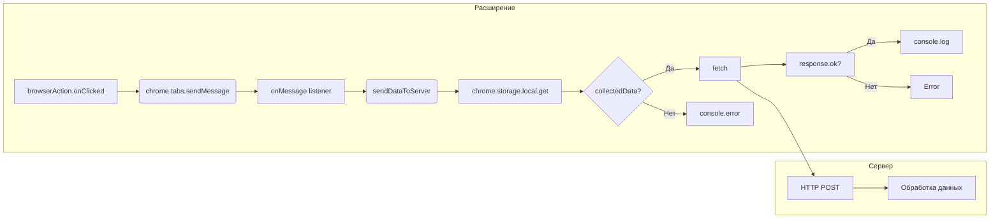

```MD
# Анализ кода background.js

## <input code>

```javascript
// background.js

chrome.browserAction.onClicked.addListener(tab => {
    chrome.tabs.sendMessage(tab.id, { action: 'collectData', url: tab.url });
});

/**
 * 
 * This function listens for messages sent from other parts of the extension, 
 * such as content scripts or other background scripts, using the `chrome.runtime.sendMessage()` method.
*
chrome.runtime.onMessage.addListener((message, sender, sendResponse) => {
    if (message.action === 'collectData') {
        sendDataToServer(message.url);
    }
});

function sendDataToServer(url) {
    const serverUrl = 'http://127.0.0.1/hypotez.online/api/'; // Change to your server endpoint
    chrome.storage.local.get('collectedData', (result) => {
        const collectedData = result.collectedData;
        if (collectedData) {
            fetch(serverUrl, {
                method: 'POST',
                headers: {
                    'Content-Type': 'application/json'
                },
                body: JSON.stringify(collectedData)
            })
                .then(response => {
                    if (!response.ok) {
                        throw new Error('Failed to send data to server');
                    }
                    console.log('Data sent to server successfully');
                })
                .catch(error => {
                    console.error('Error sending data to server:', error);
                });
        } else {
            console.error('No collected data found');
        }
    });
}
```

## <algorithm>

**Блок-схема:**

```mermaid
graph TD
    A[Клик на иконку расширения] --> B{Получить ID вкладки};
    B --> C[Отправить сообщение вьюпорта];
    C --> D[Получить сообщение "collectData"];
    D --> E[sendDataToServer(url)];
    E --> F[Получить данные из хранилища chrome.storage];
    F --> G{Данные найдены?};
    G -- Да --> H[Отправить POST-запрос на сервер];
    G -- Нет --> I[Вывести ошибку];
    H --> J[Обработать ответ сервера];
    J --> K[Успех];
    J --> L[Ошибка];
    K --> M[Лог успеха];
    L --> N[Лог ошибки];

```

**Пример:**

Пользователь кликает на иконку расширения на странице с URL `https://example.com`.  
A -> B -> C -> D -> E (url = 'https://example.com')
F - результат chrome.storage - collectedData = { data1: 'value1', data2: 'value2' }
E -> F -> G -> H (serverUrl = 'http://127.0.0.1/hypotez.online/api/')
H - ответ сервера - успешный.
H -> J -> K -> M

**Перемещение данных:**

Сообщение `{ action: 'collectData', url: tab.url }` передается из `background.js` в `content.js` (видимо, другой скрипт расширения).  
`content.js` собирает данные и сохраняет в `chrome.storage.local`.
`background.js` получает URL и отправляет POST-запрос на сервер с собранными данными.


## <mermaid>



## <explanation>

**Импорты:**

Нет явных импортов из `src.`.  Код использует API Chrome, такие как `chrome.browserAction`, `chrome.tabs`, `chrome.runtime`, `chrome.storage.local` и `fetch`.


**Классы:**

Нет явных классов.


**Функции:**

* **`chrome.browserAction.onClicked.addListener(tab => ...)`:** Обрабатывает клик на иконку расширения.  Получает текущую вкладку (`tab`) и отправляет сообщение `'collectData'` вьюпорту.
* **`chrome.runtime.onMessage.addListener(...)`:** Слушает сообщения, отправленные другим частям расширения.  Если получено сообщение с действием `'collectData'`, вызывает функцию `sendDataToServer`.
* **`sendDataToServer(url)`:** Отправляет POST-запрос на сервер с URL и собранными данными.
    * Принимает `url` (строка).
    * Использует `chrome.storage.local.get()` для получения данных из хранилища.
    * Инициализирует `serverUrl`.
    * Использует `fetch` для отправки POST-запроса.
    * Обрабатывает успешный/неуспешный ответ сервера.


**Переменные:**

* **`serverUrl`:** Строка, содержащая URL сервера.
* **`collectedData`:** Данные, полученные из хранилища.


**Возможные ошибки и улучшения:**

* **Отсутствие обработки ошибок при получении данных из хранилища:** Если `collectedData` не найдена, функция завершается с ошибкой. Стоит добавить проверку на `null` или `undefined`.
* **Отсутствие валидации данных:** Непонятно, какие данные ожидаются на сервере.  Стоит добавить валидацию данных перед отправкой на сервер.
* **Задержка:**  `sendDataToServer` делает запрос `fetch` асинхронно, но не использует `async/await`, что может привести к ошибкам в случае сложного поведения.  Рекомендуется использовать `async/await`.
* **Обработка различных типов ошибок:** Добавьте более конкретные сообщения об ошибках при обращении к хранилищу (`chrome.storage.local`) и во время отправки запроса (`fetch`).  Проверьте статус HTTP ответа, чтобы понять, почему запрос не удался.  Например, если статус `400`, сообщите об этом в логе.
* **Без учета ответа сервера:**  Не обрабатывается информация об успехе или неудаче отправки данных на сервер.

**Взаимосвязи с другими частями проекта:**

Вероятно, существует `content.js` (или подобный скрипт), который собирает данные с текущей страницы и сохраняет их в `chrome.storage.local`.  `background.js` взаимодействует с `content.js` с помощью сообщений, а затем отправляет эти собранные данные на сервер.  Также важно, чтобы сервер был готов получать POST-запросы с ожидаемым форматом данных.