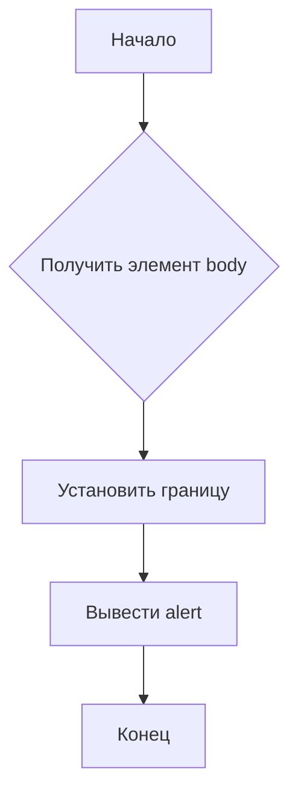

```MD
# Анализ кода borderify.js

1. **<input code>**

```javascript
document.body.style.border = "5px solid red";
alert();
```

2. **<algorithm>**



**Пошаговое описание:**

1. **Получить элемент body:** Код получает элемент `body` документа.
2. **Установить границу:** Код устанавливает свойство `border` элемента `body` со значением "5px solid red". Это добавляет красную границу шириной 5 пикселей к телу страницы.
3. **Вывести alert:** Код вызывает функцию `alert()`, которая отображает всплывающее окно с сообщением.
4. **Конец:** Выполнение кода завершается.

**Примеры:**

* Если страница загрузилась успешно, то будет добавлена красная граница к телу документа и выведено всплывающее окно.


3. **<mermaid>**

```mermaid
graph LR
    A[document] --> B(body);
    B --> C{style.border};
    C -- "5px solid red" --> D[alert()];
```

**Объяснение диаграммы:**

Диаграмма отображает поток данных. `document` - это глобальный объект, предоставляющий доступ к DOM. `body` - это элемент, представляющий тело страницы.  `style.border` - это свойство, которое изменяет границу элемента `body`. `alert()` - функция JavaScript, которая выводит диалоговое окно.


4. **<explanation>**

* **Импорты:** В данном коде нет импортов, так как он состоит из одной строки JavaScript-кода, выполняемого в контексте браузера. Он использует встроенные объекты и функции JavaScript.

* **Классы:** Нет классов.

* **Функции:**
    * `alert()`: встроенная функция JavaScript, которая отображает всплывающее диалоговое окно с указанным сообщением. Аргументов нет, ничего не возвращает.

* **Переменные:** Нет объявленных переменных.

* **Возможные ошибки или области для улучшений:**
    * Отсутствие валидации ввода.
    * Не учитывается возможность отсутствия элемента `body` в документе. 
    * Код не гибкий и может быть не переиспользуемым.


**Цепочка взаимосвязей с другими частями проекта:**

В данном случае код `borderify.js` не зависит от других файлов проекта. Он работает непосредственно в контексте браузера.  Этот пример демонстрирует простой сценарий, устанавливающий стили элемента `body` с помощью JavaScript. Если бы `borderify.js` был частью большего проекта, то существовала бы зависимость от других модулей, например, тех, которые управляют загрузкой страниц или управлением пользовательским интерфейсом.