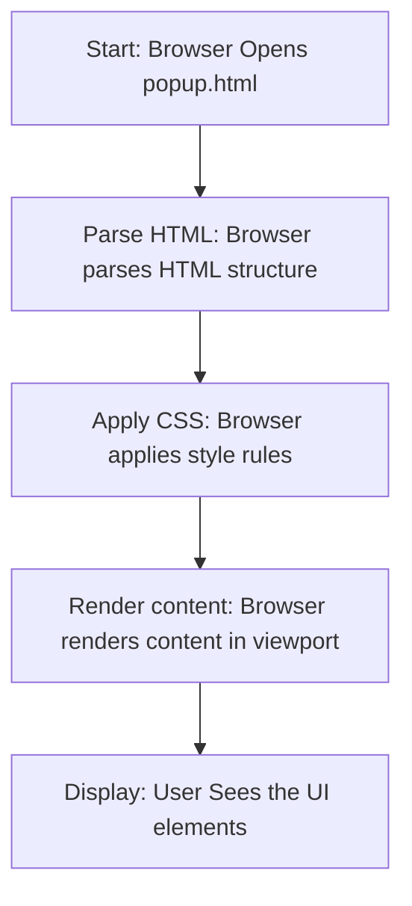

## АНАЛИЗ КОДА: `hypotez/src/webdriver/chrome/extentions/test_extention/html/popup.html`

### 1. <алгоритм>

Файл `popup.html` представляет собой HTML-страницу, которая отображается как всплывающее окно (popup) при нажатии на иконку расширения в браузере. Алгоритм работы этого файла предельно прост:

1.  **Инициализация HTML**: Браузер загружает и обрабатывает HTML-документ.
    *   *Пример*: Браузер читает теги `<!DOCTYPE html>`, `<html>`, `<head>`, `<body>` и строит DOM (Document Object Model).
2.  **Стилизация**: CSS-стили из секции `<style>` применяются к элементам страницы.
    *   *Пример*: `body { width: 200px; padding: 10px; }` устанавливает ширину и отступы для содержимого.
3.  **Отображение контента**: Отображаются элементы внутри тега `<body>`.
    *   *Пример*: Заголовок `<h1>hypotez</h1>` и абзац `
Click the extension icon to collect data from the current webpage.
` выводятся на экран.

**Поток данных:**

Поток данных в данном файле односторонний: Браузер (клиент) запрашивает файл `popup.html`, и браузер отображает HTML-контент на основе полученного файла. Нет интерактивного взаимодействия пользователя с сервером, нет Javascript, который мог бы обрабатывать данные.

### 2. <mermaid>

**Объяснение диаграммы `mermaid`:**

*   **`Start[Start: Browser Opens popup.html]`**: Начальная точка, когда браузер открывает `popup.html`.
*   **`ParseHTML[Parse HTML: Browser parses HTML structure]`**: Браузер анализирует HTML-код, формируя DOM-дерево.
*   **`ApplyCSS[Apply CSS: Browser applies style rules]`**: Браузер применяет стили, указанные в теге `<style>`, к элементам HTML.
*   **`RenderContent[Render content: Browser renders content in viewport]`**: Браузер визуализирует контент, применяя стили и структуру.
*  **`Display[Display: User Sees the UI elements]`**: Отображение UI элементов. Пользователь видит отображенное всплывающее окно.

### 3. <объяснение>

**Файл `popup.html`:**

- **Назначение:** Файл `popup.html` служит для создания интерфейса всплывающего окна (popup) для расширения браузера. Он содержит базовую структуру HTML, оформленную с помощью CSS.
-   **HTML структура:**
    -   `<!DOCTYPE html>`: Объявляет тип документа как HTML5.
    -   `<html>`: Корневой элемент документа.
    -   `<head>`: Содержит метаданные и стили:
        -   `<title>hypotez</title>`: Заголовок страницы (не отображается в самом окне popup, но важен для метаданных).
        -   `<style>`:  Содержит CSS-стили для форматирования элементов.
    -   `<body>`: Содержит контент, отображаемый в окне:
        -   `<h1>hypotez</h1>`: Заголовок первого уровня.
        -   `
Click the extension icon to collect data from the current webpage.
`: Абзац с инструкцией для пользователя.
-   **Переменные**:
    -  `MODE = 'debug'`: Эта переменная задается вне HTML-разметки, она указывает режим работы скриптов. Она не используется непосредственно в этом файле, но может влиять на работу расширения, в целом.

**Стили CSS:**

-   `body { width: 200px; padding: 10px; }`: Устанавливает ширину окна и отступы для содержимого.

**Объяснение:**

1.  **Простота и ограниченная функциональность:** `popup.html` очень прост и служит лишь для отображения статического контента. Здесь нет JavaScript, который мог бы добавить интерактивность. Это значит, что пользователь не может ничего сделать в этом попапе кроме как прочитать сообщение и закрыть его.
2.  **Связь с расширением:** Этот файл используется в контексте расширения браузера. Он отображается, когда пользователь нажимает на иконку расширения.
3.  **Цель**: Сообщить пользователю о функциональности расширения. `Click the extension icon to collect data from the current webpage.` говорит о том что, это расширение собирает данные со страницы, на которой находится пользователь.
4.  **Ограничение**: Это просто HTML файл и у него нет возможности взаимодействовать с проектом. Он просто отображается браузером.
5.  **Потенциальные улучшения**:
    *   Добавить Javascript для интерактивности, например, кнопки для активации/деактивации сбора данных.
    *   Использовать CSS фреймворки для более гибкой стилизации.
    *   Интегрировать API расширения для взаимодействия со страницей и фоновыми скриптами расширения.

**Цепочка взаимосвязей с другими частями проекта:**

-   Этот файл является частью расширения браузера, которое используется для автоматизации тестирования. 
-   Конкретно он не имеет прямой связи с бэкендом проекта (`src`), он просто является UI компонентом.
-   Для сбора данных и обработки, скорее всего, используются другие компоненты расширения: фоновые скрипты (`background.js`), контент-скрипты (`content.js`), которые будут взаимодействовать с `src`-пакетами.

Этот анализ предоставляет полную картину функциональности и контекста `popup.html` в рамках проекта `hypotez`.