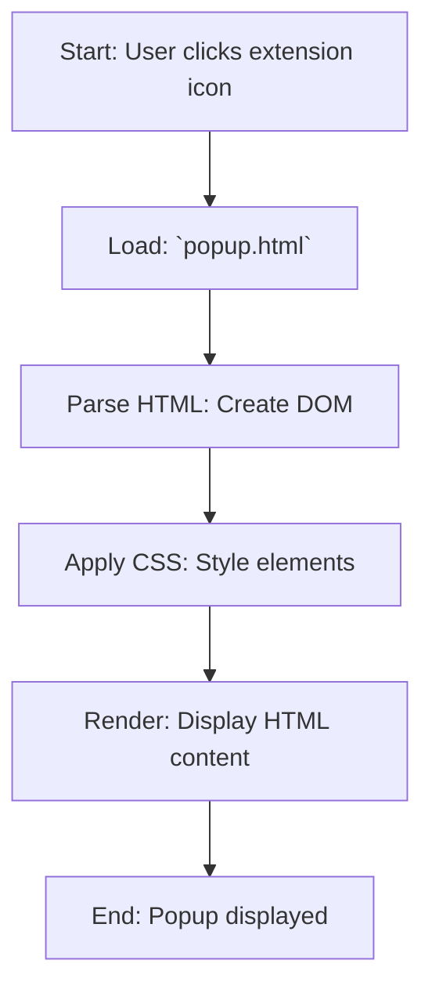

## АНАЛИЗ КОДА: `hypotez/src/webdriver/chrome/extentions/test_extention/html/popup.html`

### 1. <алгоритм>

1. **Загрузка HTML:** Браузер загружает `popup.html` когда пользователь нажимает на иконку расширения.
   *Пример:* Пользователь кликает на иконку расширения в Chrome.
2. **Отрисовка HTML:** Браузер интерпретирует HTML-код, создает DOM и CSSOM.
    *Пример:* Браузер читает `<head>`, `<title>`, `<style>` и `<body>` теги.
3. **Применение стилей:** Браузер применяет стили CSS.
    *Пример:*  Ширина `body` устанавливается в `200px`, добавляется отступ `10px`.
4. **Отображение:** Браузер отображает содержимое `<body>`.
   *Пример:* На экране появляется заголовок `<h1>hypotez</h1>` и текст `
Click the extension icon to collect data from the current webpage.
`.

### 2. <mermaid>

**Объяснение зависимостей:**
*  Нет импортов из других файлов или модулей. Этот файл является автономным HTML-файлом.

### 3. <объяснение>

**Импорты:**
-  В данном коде импортов нет. Файл `popup.html` является самостоятельным и не зависит от других частей проекта, кроме как от общей структуры каталогов расширения.
- `MODE = 'debug'` - это переменная, которая задаёт режим работы расширения. В данном файле она не используется, но может быть важна при отладке.

**Классы:**
- В данном HTML-файле нет классов. Используются только стандартные HTML-элементы.

**Функции:**
- В данном файле нет функций, это статичный HTML-файл.

**Переменные:**
- `MODE` -  глобальная переменная, которая задаёт режим работы расширения. Здесь она установлена в `'debug'`, но в этом файле нигде не используется.
- Эта переменная, вероятно, используется в других файлах расширения, таких как `background.js` или `content.js`, для включения или отключения отладочной информации.

**Пояснение:**
- Данный файл `popup.html` является основой для отображения всплывающего окна расширения.
- Он содержит HTML-структуру с простым текстом и заголовком, а также минимальными CSS-стилями для задания ширины и отступов.
- Этот HTML-файл будет отображаться при нажатии на иконку расширения в браузере.

**Потенциальные ошибки или области для улучшения:**
- HTML-код довольно простой и не содержит никаких интерактивных элементов.
-  Если требуется добавить функционал в всплывающее окно (например, кнопки для сбора данных), необходимо будет добавить JavaScript-код и обновить HTML-структуру.
-  В данном виде, popup просто отображает информацию, но не выполняет никаких действий.

**Цепочка взаимосвязей с другими частями проекта:**
- Этот файл связан с другими файлами расширения, такими как `manifest.json` (где этот файл указан как всплывающее окно) и `background.js` или `content.js`, которые выполняют основную логику расширения.
-  При загрузке страницы в браузере, другие части расширения (если имеются), могут взаимодействовать с этим файлом, например, добавляя динамический контент или обрабатывая действия пользователя.