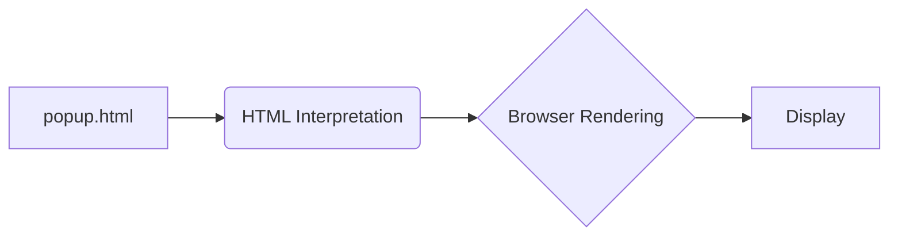

# Анализ кода popup.html

## <input code>

```html
## \file hypotez/src/webdriver/chrome/extentions/test_extention/html/popup.html
# -*- coding: utf-8 -*-\
#! venv/Scripts/python.exe

""" module: src.webdriver.chrome.extentions.test_extention.html """
MODE = 'debug'
<!-- popup.html -->

<!DOCTYPE html>
<html>
<head>
    <title>hypotez</title>
    <style>
        body {
            width: 200px;
            padding: 10px;
        }
    </style>
</head>
<body>
    <h1>hypotez</h1>
    <p>Click the extension icon to collect data from the current webpage.</p>
</body>
</html>
```

## <algorithm>

Поскольку код представляет собой HTML-документ, алгоритм его работы не основан на последовательных вычислениях, а на поведении браузера, который интерпретирует и отображает HTML-разметку.  Блок-схема не подходит для описания этого процесса.


## <mermaid>



## <explanation>

Этот файл представляет собой HTML-страницу, которая будет отображаться в всплывающем окне расширения браузера Chrome.

* **Импорты:** В коде нет импортов Python-модулей.  Этот файл — HTML-шаблон, который будет загружен и обработан браузером.


* **Классы:** Нет классов, так как это просто статический HTML.


* **Функции:** Нет функций, так как это статический HTML.


* **Переменные:**
    * `MODE = 'debug'`:  Эта переменная определяет режим работы (в данном случае `debug`).  По всей вероятности, эта переменная используется в другом модуле (вероятно, Python-скрипте) для управления поведением расширения. Она, однако, не имеет непосредственного воздействия на HTML-вывод.


* **Возможные ошибки/улучшения:**
    * **Не хватает JavaScript:** Для взаимодействия с расширением (которое, видимо, находится за пределами данного файла) необходим JavaScript-код. Данный HTML-файл лишь предоставляет пользователю информацию о том, что расширение существует и что можно взаимодействовать с ним.


* **Взаимосвязи с другими частями проекта:** Этот HTML-файл, вероятно, используется расширением Chrome, которое содержит JavaScript-код (возможно, в другом файле) для обработки взаимодействия с пользователем, получения данных с веб-страницы и выполнения других действий.  Взаимосвязь заключается в том, что JavaScript-код расширения будет использовать `popup.html` для визуализации и отображения информации пользователю.  Вероятно, есть скрипт (например, написанный на Python), который управляет поведением расширения.


**Подробное объяснение:**

Файл `popup.html` — это простая HTML-страничка, предназначенная для отображения всплывающего окна расширения.  Она не выполняет сложных логических операций.  Он содержит заголовок (`<h1>`), параграф (`<p>`), а также CSS-стили для форматирования отображения. Важно, что этот HTML-файл не содержит логику, все действия связаны с обработкой JavaScript кода, который, скорее всего, находится в отдельном файле расширения Chrome (с расширением `.js`).