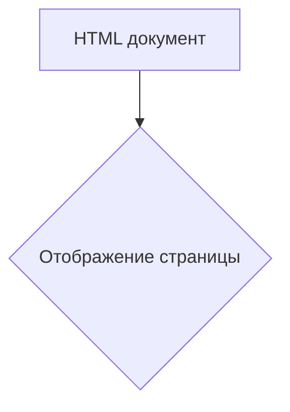
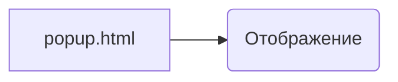

```MD
# Анализ кода popup.html

## <input code>

```html
<!DOCTYPE html>
<html>
<head>
    <title>hypotez</title>
    <style>
        body {
            width: 200px;
            padding: 10px;
        }
    </style>
</head>
<body>
    <h1>hypotez</h1>
    <p>Click the extension icon to collect data from the current webpage.</p>
</body>
</html>
```

## <algorithm>

Этот код представляет собой HTML-документ для всплывающего окна расширения Chrome.  Алгоритм работы заключается в отображении простой страницы.  Не существует никаких пошаговых вычислений, циклов или сложных взаимодействий между элементами.

**Блок-схема (необходима упрощенная, так как алгоритм прост):**



**Пример данных:** Данные не передаются и не обрабатываются.  Страница просто отображает текст и заголовок.


## <mermaid>



**Объяснение диаграммы:**

В диаграмме `popup.html` (A) вызывает функцию `Отображение` (B), которая отображает структуру HTML, без каких-либо дополнительных вычислений или обработки.

## <explanation>

**Импорты:** Нет импортов.  Это чисто HTML-документ, который не зависит от других файлов Python. `# -*- coding: utf-8 -*-` и `#! venv/Scripts/python.exe` – это метаданные, относящиеся к кодировке и интерпретатору, но не к настоящему коду HTML.

**Классы:** Нет классов.  Код представляет собой чистый HTML.

**Функции:** Нет функций.  HTML-код не определяет функций в привычном для языков программирования понимании.

**Переменные:** `MODE = 'debug'` – константа, задающая режим дебага.  В данном контексте она не используется.

**Возможные ошибки/улучшения:**

* **Отсутствие логики:** В коде нет никакой динамической логики или взаимодействия с другими компонентами расширения.  HTML-код просто отображает статическую страницу. Для того, чтобы отображаемая страница была интерактивной, необходимо добавить JavaScript.


**Взаимосвязь с другими частями проекта:**

Этот HTML-файл является частью расширения Chrome, которое, вероятно, содержит JavaScript-код для взаимодействия с пользователем (например, для сбора данных с веб-страницы).  Файлы JavaScript, обрабатывающие события кликов и взаимодействие с расширением Chrome будут связаны с `popup.html` через код JavaScript, который он загружает.  Взаимосвязь заключается в том, что JavaScript-код, расположенный в других файлах расширения, отвечает за функциональность, а этот HTML-файл служит интерфейсом для пользователя.  Без JavaScript-кода этот HTML-файл не будет интерактивным.