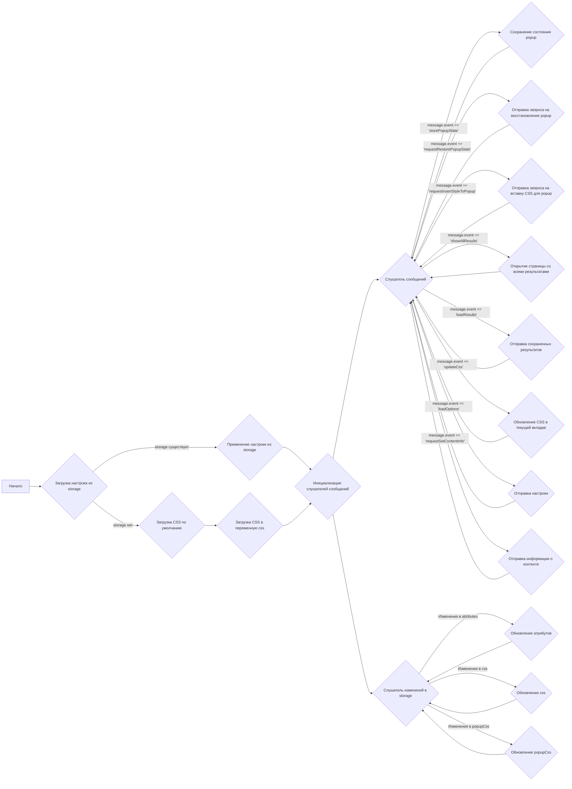
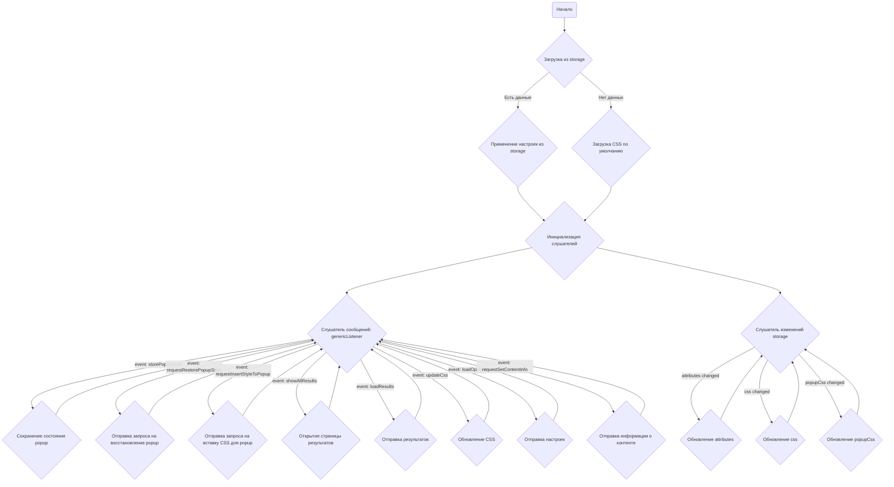

## Анализ кода `try_xpath_background.js`

### 1. <алгоритм>
**Блок-схема:**

**Примеры для каждого блока:**

*   **A (Начало):** Выполнение скрипта `try_xpath_background.js`.
*   **B (Загрузка настроек из storage):** Браузер пытается получить данные из `browser.storage.sync`, включая `attributes`, `css` и `popupCss`.
*   **C (Применение настроек из storage):** Если данные получены из storage, переменные `attributes`, `css` и `popupCss` обновляются этими значениями.
*   **D (Загрузка CSS по умолчанию):** Если в storage нет сохраненного CSS, выполняется загрузка из файла `css/try_xpath_insert.css`.
*   **E (Инициализация слушателей сообщений):**  Создание и установка слушателя `browser.runtime.onMessage` для обработки сообщений от других частей расширения.
*   **F (Загрузка CSS в переменную css):** Загруженный CSS устанавливается как значение переменной `css`.
*  **G (Слушатель сообщений):** Функция `genericListener` обрабатывает сообщения и вызывает соответствующие обработчики.

  *  **H (Сохранение состояния popup):** Сохраняет состояние popup в переменной `popupState`.

    *  `message`: Объект, содержащий состояние popup, например `{"event": "storePopupState", "state": {"isOpen": true}}`.

  * **I (Отправка запроса на восстановление popup):** Отправляет сообщение с сохраненным состоянием popup для его восстановления.

    *  `message`: Объект, инициирующий запрос, например `{"event": "requestRestorePopupState"}`.

  * **J (Отправка запроса на вставку CSS для popup):** Отправляет сообщение на вставку стилей для popup.

    *  `message`: Объект, инициирующий запрос, например `{"event": "requestInsertStyleToPopup"}`.
  
  * **K (Открытие страницы со всеми результатами):** Открывает новую вкладку со страницей `show_all_results.html` для отображения результатов.

    *   `message`: Объект с данными результатов, например, `{"event": "showAllResults", "xpath": "...", "elements": [...]}`.

  * **L (Отправка сохраненных результатов):** Отправляет сохраненные результаты обратно отправителю.
     *   `message`: Объект, инициирующий запрос, например `{"event": "loadResults"}`.

  * **M (Обновление CSS в текущей вкладке):** Обновляет CSS в текущей вкладке, удаляя старые стили и добавляя новые.

     *   `message`: Объект с CSS для обновления, например, `{"event": "updateCss", "expiredCssSet": ["body{color:red;}"], "newCss": "body{color:blue;}"}`.
  
  * **N (Отправка настроек):** Отправляет текущие настройки (атрибуты, css, popupCss) отправителю.

    *   `message`: Объект, инициирующий запрос, например `{"event": "loadOptions"}`.

  * **O (Отправка информации о контенте):** Отправляет информацию о content script.

     *   `message`: Объект, инициирующий запрос, например, `{"event": "requestSetContentInfo"}`.
*   **P (Слушатель изменений в storage):** Функция `browser.storage.onChanged.addListener` следит за изменениями в storage и обновляет переменные `attributes`, `css` и `popupCss`.
*   **Q (Обновление атрибутов):** Обновление переменной `attributes` на основе новых данных из storage.
*   **R (Обновление css):** Обновление переменной `css` на основе новых данных из storage.
*   **S (Обновление popupCss):** Обновление переменной `popupCss` на основе новых данных из storage.

### 2. <mermaid>

**Объяснение диаграммы:**

*   `Start`: Начало выполнения скрипта.
*   `LoadStorage`: Загрузка данных из `browser.storage.sync`.
*   `ApplyStorage`: Применение настроек, полученных из `storage`.
*   `LoadDefaultCss`: Загрузка CSS по умолчанию из файла.
*   `InitListeners`: Инициализация слушателей событий.
*   `GenericListener`: Центральный обработчик сообщений, получаемых от расширения.
*   `StorePopupState`: Функция для сохранения состояния popup.
*   `RestorePopupState`: Функция для отправки сообщения на восстановление состояния popup.
    `InsertStyleToPopup`: Функция для отправки сообщения на вставку стилей для popup.
*   `ShowAllResults`: Функция для открытия страницы со всеми результатами.
*   `LoadResults`: Функция для отправки сохраненных результатов.
*    `UpdateCss`: Функция для обновления CSS на вкладке.
*   `LoadOptions`: Функция для отправки настроек.
*   `SetContentInfo`: Функция для отправки информации о content script.
*   `StorageChangeListener`: Слушатель изменений, происходящих в `browser.storage`.
*   `UpdateAttributes`: Обновляет переменную `attributes` при изменении в storage.
*    `UpdateCssVariable`: Обновляет переменную `css` при изменении в storage.
*    `UpdatePopupCss`: Обновляет переменную `popupCss` при изменении в storage.

**Зависимости:**
*  `browser.storage`: используется для хранения и синхронизации настроек расширения, таких как `attributes`, `css`, и `popupCss`.
*  `browser.runtime`: используется для прослушивания и отправки сообщений между разными частями расширения.
*  `browser.tabs`: используется для взаимодействия с вкладками браузера, включая вставку и удаление CSS.
*   `XMLHttpRequest`: используется для загрузки CSS по умолчанию.
*   `Promise`: используется для асинхронных операций, таких как загрузка CSS и выполнение действий с вкладками браузера.

### 3. <объяснение>

**Импорты:**

*   В данном коде нет явных импортов через `import` или `require`. Он использует глобальные объекты, предоставляемые средой выполнения расширения браузера (`browser`, `window`) и ранее определенные переменные (`tryxpath` и `tryxpath.functions`).  `tryxpath` и `tryxpath.functions` предположительно являются частью самого расширения и доступны в глобальной области видимости.

**Переменные:**

*   `tx` (alias): Псевдоним для объекта `tryxpath`.
*   `fu` (alias): Псевдоним для объекта `tryxpath.functions`.
*   `popupState`: Хранит состояние popup (например, открыт или закрыт),  используется для восстановления popup при перезагрузке расширения.
*   `popupCss`: Строка, содержащая CSS-стили для popup, изначально установлена как `body{width:367px;height:auto;}`.
*   `results`: Объект для хранения результатов, связанных с поиском элементов на странице.
*   `css`: Строка, содержащая CSS-стили для вставки на целевые веб-страницы. Изначально загружается из файла или storage.
*   `attributes`: Объект, содержащий имена атрибутов `data-*`, используемых в расширении для определения контекста и элементов на веб-странице.
*   `genericListener.listeners`: Объект, содержащий функции-обработчики для различных событий сообщений, организован как словарь, ключом которого является название события.

**Функции:**

*   `loadDefaultCss()`: Функция для загрузки CSS по умолчанию из файла `/css/try_xpath_insert.css` с использованием `XMLHttpRequest`. Возвращает `Promise`, который разрешается с текстом CSS.
*   `genericListener(message, sender, sendResponse)`:  Обработчик сообщений. Определяет функцию-обработчик на основе значения `message.event`.
    *   `message`: Объект сообщения, содержащий `event` и другие данные.
    *   `sender`: Объект, содержащий информацию об отправителе сообщения (вкладка, фрейм).
    *   `sendResponse`: Функция для отправки ответа на сообщение.
*   `genericListener.listeners.storePopupState(message)`: Сохраняет состояние popup в переменной `popupState`.
     * `message`: Объект, содержащий состояние popup.
*   `genericListener.listeners.requestRestorePopupState(message)`: Отправляет сообщение с сохраненным состоянием popup для его восстановления.
    * `message`: Объект, инициирующий запрос.
*    `genericListener.listeners.requestInsertStyleToPopup()`: Отправляет сообщение на вставку стилей для popup.
*   `genericListener.listeners.showAllResults(message, sender)`: Создает новую вкладку со страницей `show_all_results.html` и передает туда результаты.
    *   `message`: Объект с данными результатов.
    *   `sender`: Объект с информацией о вкладке и фрейме.
*   `genericListener.listeners.loadResults(message, sender, sendResponse)`: Возвращает сохраненные результаты.
    *   `message`: Объект запроса.
    *   `sender`: Объект с информацией о вкладке и фрейме.
    *   `sendResponse`: Функция обратного вызова для отправки результата.
*   `genericListener.listeners.updateCss(message, sender)`: Обновляет CSS на вкладке.
     *   `message`: Объект с CSS для обновления.
    *   `sender`: Объект с информацией о вкладке и фрейме.
*   `genericListener.listeners.loadOptions(message, sender, sendResponse)`: Отправляет текущие настройки.
    *   `message`: Объект запроса.
    *   `sender`: Объект с информацией о вкладке и фрейме.
    *   `sendResponse`: Функция обратного вызова для отправки результата.
*   `genericListener.listeners.requestSetContentInfo(message, sender)`: Отправляет информацию о content script.
    *   `message`: Объект запроса.
    *   `sender`: Объект с информацией о вкладке и фрейме.

**Объяснение:**

*   Этот код является фоновым скриптом расширения Chrome, который отвечает за управление стилями, настройками и передачей сообщений.
*   Функция `loadDefaultCss` асинхронно загружает CSS-файл через XMLHttpRequest и возвращает Promise.
*   Функция `genericListener` выступает в качестве центрального обработчика сообщений, определяя вызываемую функцию на основе `message.event`.
*   Слушатель `browser.storage.onChanged` отслеживает изменения в хранилище и применяет новые настройки.
*   Фоновый скрипт использует `browser.storage.sync` для сохранения настроек между сеансами браузера.
*   При инициализации скрипт пытается загрузить сохраненные настройки, и в случае отсутствия `css` загружает его из файла по умолчанию.
*   Скрипт использует `browser.tabs` для вставки и удаления CSS в активные вкладки.
*   CSS вставляется с параметром `"cssOrigin": "author"`, что дает ему приоритет перед пользовательскими стилями.

**Потенциальные ошибки и улучшения:**

*   **Обработка ошибок**:  В коде используется `fu.onError` для обработки ошибок, но неясно, что именно делает эта функция. Следует убедиться, что все ошибки обрабатываются корректно, особенно при работе с `storage`, `XMLHttpRequest` и `browser.tabs`.
*  **Код не обрабатывает ситуации, когда сообщение может не иметь обработчика.** В таком случае нужно добавить `else` блок с логгированием для обнаружения таких проблем.
*   **Дублирование кода**: В функциях `genericListener.listeners.updateCss`, `genericListener.listeners.requestInsertStyleToPopup`, `genericListener.listeners.requestRestorePopupState` повторяется код `{"timeout":0,"timeout_for_event":"presence_of_element_located"}`. Стоит вынести этот повторяющийся код в отдельную константу или переменную, чтобы избежать дублирования и сделать код более читаемым.
*   **Асинхронность:**  Работа с браузерными API (такими как `browser.tabs`, `browser.storage`) асинхронна. Важно правильно использовать `Promises` и `async/await` для избежания гонок и неблокирования выполнения скрипта.
*   **Очистка `results`**: Переменная `results` пополняется данными, но нет механизма ее очистки, это может привезти к росту ее размера и потреблению памяти.
*   **Улучшить читаемость кода**: Разделить на более мелкие функции и добавить комментарии для лучшего понимания.

**Цепочка взаимосвязей:**

1.  **`try_xpath_background.js`** (фоновый скрипт) управляет общими настройками, стилями и обрабатывает сообщения от других частей расширения.
2.  **Content scripts** (например, `try_xpath_content.js`) отправляют сообщения фоновому скрипту для запроса настроек или обновления стилей на веб-странице. Они используют атрибуты, определенные в `attributes` для поиска элементов и взаимодействия со страницей.
3.  **Popup script** (например, `try_xpath_popup.js`) может отправлять сообщения фоновому скрипту для сохранения настроек, запроса текущего состояния или для открытия страницы `show_all_results.html`.
4.  **Страница результатов `show_all_results.html`** запрашивает данные из фонового скрипта для отображения всех результатов.
5.  **Хранилище браузера `browser.storage.sync`** используется фоновым скриптом для сохранения и синхронизации настроек, используемых другими частями расширения.

Таким образом, этот скрипт является важным связующим звеном между различными частями расширения, обеспечивая централизованное управление и координацию.