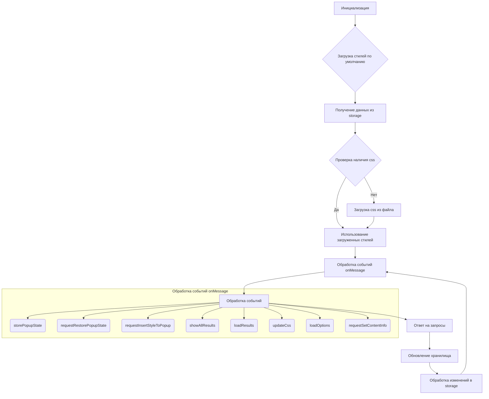
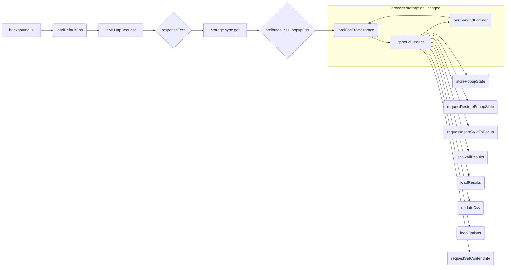

```MD
# Анализ кода try_xpath_background.js

## <input code>

```javascript
/* This Source Code Form is subject to the terms of the Mozilla Public
 * License, v. 2.0. If a copy of the MPL was not distributed with this
 * file, You can obtain one at http://mozilla.org/MPL/2.0/. */

(function (window, undefined) {
    "use strict";

    // alias
    var tx = tryxpath;
    var fu = tryxpath.functions;

    var popupState = null;
    var popupCss = "body{width:367px;height:auto;}";
    var results = {};
    var css = "";
    var attributes = {
        "element": "data-tryxpath-element",
        "context": "data-tryxpath-context",
        "focused": "data-tryxpath-focused",
        "focusedAncestor": "data-tryxpath-focused-ancestor",
        "frame": "data-tryxpath-frame",
        "frameAncestor": "data-tryxpath-frame-ancestor"
    };

    function loadDefaultCss() {
        return new Promise((resolve, reject) => {
            var req = new XMLHttpRequest();
            req.open("GET",
                     browser.runtime.getURL("/css/try_xpath_insert.css"));
            req.responseType = "text";
            req.onreadystatechange = function () {
                if (req.readyState === XMLHttpRequest.DONE) {
                    resolve(req.responseText);
                }
            };
            req.send();
        });
    }

    // ... (остальной код)
```

## <algorithm>


* **A:** Инициализируются переменные `popupState`, `popupCss`, `results`, `css`, `attributes`.
* **B:** Вызывается `loadDefaultCss` для загрузки стилей из файла `try_xpath_insert.css`.
* **C:** Выполняется `browser.storage.sync.get` для получения значений `attributes`, `css`, `popupCss` из хранилища.
* **D:** Проверяется, существует ли загруженный `css`. Если нет, то переходит к загрузке из файла.
* **E:**  Если `css` загружен, он используется.
* **F:** Выполняется загрузка CSS из файла.
* **G:** Обрабатываются события `onMessage`.
* **H:**  Код внутри функции `genericListener` обрабатывает различные типы сообщений (месседжи).
* **I:** Отправляются ответы на запросы (`sendResponse`).
* **J:**  Если есть изменения в хранилище, обновляются соответствующие переменные.
* **K:** Ведется отслеживание изменений в хранилище `browser.storage` и обновление локальных переменных.


## <mermaid>



## <explanation>

**Импорты:**
*  `tx = tryxpath;` и `fu = tryxpath.functions;` - алиасы для сокращения имён, `tryxpath` и `tryxpath.functions` вероятно, содержат другие функции или классы, которые используются в этом файле.  Необходимость этих алиасов лучше прояснит понимание всего кода.


**Классы:**
*  Нет видимых классов в данном коде.  


**Функции:**
* **`loadDefaultCss()`:**  Асинхронно загружает CSS из файла `/css/try_xpath_insert.css`. Использует `XMLHttpRequest` для отправки запроса и `Promise` для обработки ответа. Возвращает Promise, содержащий содержимое файла.
* **`genericListener()`:**  Обработчик сообщений от других частей расширения или страницы,  содержит `genericListener.listeners`, которая содержит множество обработчиков для разных типов сообщений.  Функция перенаправляет сообщения на соответствующие обработчики в зависимости от `message.event`.

* **Функции внутри `genericListener.listeners`**: Каждая функция отвечает на конкретный тип сообщения, например:
    * `storePopupState`: сохраняет состояние `popupState`.
    * `requestRestorePopupState`: восстанавливает состояние `popupState`.
    * `requestInsertStyleToPopup`: вставляет стиль `popupCss` в всплывающее окно.
    * `showAllResults`: создает новую вкладку для отображения результатов.
    * `loadResults`: отправляет данные `results` в ответ.
    * `updateCss`: обновляет стили на вкладках.
    * `loadOptions`: отправляет атрибуты, CSS и popupCss в ответ.
    * `requestSetContentInfo`: отправляет атрибуты в активную вкладку.

**Переменные:**
* `popupState`: Хранит состояние всплывающего окна.
* `popupCss`: Стиль всплывающего окна.
* `results`: Результаты поиска XPath.
* `css`: Стиль, загруженный из файла или хранилища.
* `attributes`: Атрибуты для элементов.
* `id`, `frameId`: Идентификаторы вкладок и фреймов.

**Возможные ошибки/улучшения:**
* **Обработка ошибок:** Обработка ошибок при загрузке файлов и взаимодействии с хранилищем (`.then` and `.catch`). Это улучшает надёжность работы.
* **Достаточно ли подробная логика в listener's?**:  Внутри listener's не хватает деталей о том, что именно делают переменные или в какие функции происходит вызов.
* **Типизация:** Необходимо указать типы переменных.  `results`, `attributes` - объекты.
* **Общее описание/документирование:** Код должен быть более документирован. Комментарии должны описывать не только что делает код, но и *зачем* он это делает.

**Взаимосвязь с другими частями проекта:**
* `tryxpath`: Вероятно, это основной класс или модуль, который содержит функции для работы с XPath.
* `functions`: Вероятно, содержит вспомогательные функции, такие как `fu.onError`.
* `/css/try_xpath_insert.css`: Файл с CSS стилями для вставки.
* `/pages/show_all_results.html`: Страница для отображения результатов.


Этот код представляет собой часть расширения для браузера, которая взаимодействует с DOM и управляет стилями.  Он получает сообщения, обновляет локальные переменные и выполняет различные операции, в том числе загрузку стилей и обновление вкладок браузера.