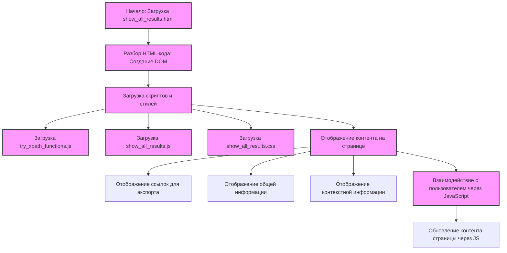

## Анализ HTML-кода `show_all_results.html`

### <алгоритм>

1.  **Загрузка страницы:** Браузер загружает HTML-файл `show_all_results.html`.
2.  **Разбор HTML:** Браузер анализирует структуру HTML-кода, создавая DOM (Document Object Model).
3.  **Подключение скриптов и стилей:**
    *   Браузер загружает и выполняет JavaScript-файлы `try_xpath_functions.js` и `show_all_results.js`.
    *   Браузер загружает и применяет стили из `show_all_results.css`.
4.  **Отображение контента:** Браузер отображает на странице HTML-элементы, стилизованные CSS и функциональность с помощью JavaScript.
    *   Содержимое страницы:
        *   **Ссылки для экспорта**: Две ссылки для экспорта результатов: "Plain text" и "Some values are converted by JSON.stringify".
        *   **Информация**: Таблица с информацией о текущем XPath-запросе: message, title, URL, frameId.
        *   **Контекстная информация**:  Таблица с информацией о контексте XPath-запроса: method, expression, specified resultType, resultType, resolver.
        *   **Детали контекста**: Таблица для детальной информации о контексте.
        *   **Основная информация**: Таблица с основной информацией о запросе: method, expression, specified resultType, resultType, resolver, count.
        *   **Основные детали**: Таблица для детальной информации о результатах запроса.
5.  **Взаимодействие с пользователем (опосредовано через JS):**  При взаимодействии с элементами, такими как ссылки для экспорта, JavaScript может обрабатывать события и обновлять контент страницы.

### <mermaid>

**Объяснение:**

*   `Start`: Начало процесса, представляющее загрузку HTML-страницы.
*   `ParseHTML`: Этап, на котором браузер анализирует HTML-код и создает DOM.
*   `LoadScriptsAndStyles`:  Этап загрузки JavaScript-файлов `try_xpath_functions.js` и `show_all_results.js` и CSS файла `show_all_results.css`.
*   `try_xpath_functions_js`: Загрузка JavaScript-файла `try_xpath_functions.js`.
*   `show_all_results_js`: Загрузка JavaScript-файла `show_all_results.js`.
*   `show_all_results_css`: Загрузка CSS-файла `show_all_results.css`.
*  `DisplayContent`: Отображение контента на странице.
    *   `ExportLinks`:  Отображение ссылок для экспорта.
    *   `MainInfo`: Отображение основной информации.
    *   `ContextInfo`: Отображение контекстной информации.
*   `UserInteraction`: Обработка взаимодействия пользователя с элементами страницы через JavaScript.
*    `UpdateContent`: Обновление контента страницы на основе действий пользователя.

### <объяснение>

**Импорты:**

*   В коде нет явных инструкций `import` в классическом понимании Python. Однако, HTML-файл подключает внешние ресурсы:
    *   ``: Подключает JavaScript-файл, предположительно содержащий функции для работы с XPath. Данный скрипт, скорее всего, содержит общую функциональность, необходимую для расширения, и используется как вспомогательная библиотека.
    *   ``: Подключает JavaScript-файл, специфичный для этой страницы. Он отвечает за управление контентом и интерактивность страницы "show all results". Скорее всего, этот скрипт будет получать данные через API расширения и отображать их на странице.
    *   `<link rel="stylesheet" href="show_all_results.css"/>`:  Подключает файл стилей, который определяет визуальное представление HTML-элементов на странице.

**Структура HTML:**

*   **`<html>`, `<head>`, `<body>`**: Стандартная структура HTML-документа.
*   **`<head>`**:
    *   `<meta charset="utf-8">`: Задает кодировку UTF-8 для поддержки различных символов.
    *   `<title>Tryxpath show all results</title>`: Заголовок страницы, отображаемый во вкладке браузера.
    *   ``, ``: Подключение внешних JS файлов для добавления динамики и функционала.
    *   `<link rel="stylesheet" href="show_all_results.css"/>`: Подключение внешнего файла стилей для оформления.
*   **`<body>`**:
    *   **Раздел "Export links"**: Содержит две ссылки для экспорта результатов:
        *   `<a id="export-text">Plain text</a>`
        *   `<a id="export-partly-converted">Some values are converted by JSON.stringify.</a>`
        *   `id` атрибуты, необходимы для манипуляций с элементами через JS.
    *   **Раздел "Information"**: Содержит таблицу для отображения общей информации об XPath-запросе:
        *   `Message`, `Title`, `URL`, `frameId`.
        *   Каждое поле имеет свой `id`, для манипуляций с элементами через JS.
    *   **Раздел "Context information"**: Содержит таблицу для отображения контекстной информации об XPath-запросе:
        *   `Method`, `Expression`, `Specified resultType`, `resultType`, `Resolver`.
        *   Каждое поле имеет свой `id`, для манипуляций с элементами через JS.
    *   **Раздел "Context detail"**: Содержит таблицу (`<table id="context-detail">`) для отображения детальной контекстной информации, скорее всего заполняется динамически с помощью JS.
    *   **Раздел "Main information"**: Содержит таблицу для отображения основной информации о запросе:
        *   `Method`, `Expression`, `Specified resultType`, `resultType`, `Resolver`, `Count`.
         *   Каждое поле имеет свой `id`, для манипуляций с элементами через JS.
    *  **Раздел "Main details"**: Содержит таблицу (`<table id="main-details">`) для отображения детальной информации о результатах запроса, скорее всего, заполняется динамически с помощью JS.

**Переменные:**

*   `MODE = 'debug'`: Глобальная переменная, вероятно, для управления режимом отладки. Судя по ее определению как `MODE` можно сделать вывод, что  переменная может влиять на поведение скриптов, и используется для  переключения между режимами (например, подробный вывод в режиме отладки).

**Функциональность:**

*   Основная цель страницы - отображение результатов выполнения XPath-запроса, включая детали, контекст и возможность экспорта.
*   Страница активно использует JavaScript (через подключенные скрипты) для динамического обновления содержимого таблиц и обработки событий.  Фактическое заполнение таблиц, логика экспорта и другие операции, скорее всего, выполняются в JavaScript-файлах, подключаемых к HTML-странице.

**Потенциальные ошибки и области для улучшения:**

*   **Зависимость от JS:** Основная функциональность страницы зависит от JavaScript. Если скрипты не загрузятся или произойдет ошибка, страница будет неработоспособной. Стоит добавить проверку для  загрузки и обработки данных через JS.
*   **Отсутствие обработки ошибок:**  В HTML-коде не предусмотрена обработка ошибок, возникающих при получении данных или  выполнении JavaScript-кода. Необходимо добавить обработку ошибок.
*   **Отсутствует описание экспорта:** В HTML-коде нет логики, определяющей как именно экспортируются данные. Вероятно, логика экспорта данных находится в файле `show_all_results.js` и использует `id` атрибуты элементов на странице.
*   **Отсутствие валидации**: HTML код не проверяется на соответствие стандартам.

**Цепочка взаимосвязей:**

1.  **Расширение Chrome (try_path):** Эта HTML-страница является частью расширения Chrome `try_path`. Расширение, вероятно, позволяет пользователю тестировать XPath-выражения.
2.  **JavaScript (`try_xpath_functions.js`, `show_all_results.js`):** Эти скрипты отвечают за динамическое наполнение таблицы данными и обработку пользовательского взаимодействия.
3. **CSS (`show_all_results.css`):** Файл стилей, который определяет внешний вид HTML-страницы.

**Заключение:**

Данный HTML-файл служит шаблоном для отображения результатов XPath-запросов. Он является частью расширения Chrome `try_path` и взаимодействует с JavaScript-файлами для динамического обновления контента и  обработки событий.  Код можно улучшить путем добавления обработки ошибок, валидации HTML,  и более подробного описания экспорта данных.