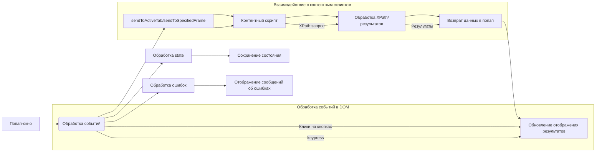

```MD
# Анализ кода popup.js

## <input code>

```javascript
/* ... (Копирование исходного кода) ... */
```

## <algorithm>

Алгоритм работы кода заключается в обработке пользовательских взаимодействий в попап-окне и передаче команд в активную вкладку браузера.  Пошаговая блок-схема:

1. **Инициализация:**
   - Получение ссылок на элементы DOM (HTML-элементы).
   - Инициализация переменных (например, `resultedDetails`, `detailsPageIndex`).
   - Прослушивание событий загрузки страницы (`window.addEventListener("load", ...)`).
2. **Обработка событий кликов:**
   - Обработка кликов на кнопках (`document.getElementById("execute")`, и другие) для отправки сообщений в активную вкладку.
   - Обработка кликов на кнопках в таблицах результатов для отправки сообщений, фокусирующих на соответствующих элементах.
3. **Обработка событий `keypress`:**
   - Обработка нажатий Enter для отправки команд (`mainExpression`, `contextExpression` и т.д.).
   - События `keypress`  для управления отображением различных секций.
4. **`showDetailsPage`:**
   - Выбор страницы результатов.
   - Обновление таблицы результатов (`fu.updateDetailsTable`).
   - Обновление счетчика страницы (`detailsPageCount`).
   - Восстановление положения прокрутки (`window.scrollTo`).
5. **`showError`:**
   - Обновление сообщения об ошибке.
   - Очистка результата.
   - Обновление отображаемой информации.
   - Показ первой страницы результатов.
6. **`sendToActiveTab`, `sendToSpecifiedFrame`:**
   - Отправка сообщений в активную вкладку или заданный фрейм.
   - Выполнения скриптов (`try_xpath_check_frame.js`, `try_xpath_functions.js`, `try_xpath_content.js`) в контексте вкладки.
   - Обработка результатов скриптов и отправки последующих сообщений.
7. **`collectPopupState`:**
   - Собирает текущее состояние попап-окна (состояние чекбоксов, значения текстовых полей).
8. **Обработка сообщений от контентного скрипта:**
    - Обработка сообщений `genericListener` для обновления результатов, ошибок.
   - `genericListener.listeners.showResultsInPopup`: принимает данные об элементах и обновляет отображение результатов.
9. **`makeExecuteMessage`:**
   - Формирование сообщения для выполнения запроса XPath.
   - Сборка данных из различных форм для формирования сообщения.
10. **`getSpecifiedFrameId`:**
    - Получение id фрейма.
11. **`changeVisible`-функции:**
    - Изменяют видимость различных блоков интерфейса.
12. **`genericListener`:**
    - Обработка сообщений от контентного скрипта.

**Пример:** При нажатии кнопки "Execute" выполняется `sendExecute`, которая вызывает `sendToSpecifiedFrame` с `makeExecuteMessage()`.


## <mermaid>




## <explanation>

**Импорты:** Код использует `tryxpath` и `tryxpath.functions` - вероятно, это пользовательские модули или библиотеки, которые содержат функции для работы с XPath и обновления таблиц.

**Классы:** Нет явных определений классов.

**Функции:**

* `sendToActiveTab`: Отправляет сообщение в активную вкладку браузера.
* `sendToSpecifiedFrame`: Отправляет сообщение в указанный фрейм.
* `collectPopupState`: Собирает данные из элементов формы.
* `changeContextVisible`, `changeResolverVisible` и т.д.: Управляют отображением секций.
* `makeExecuteMessage`: Формирует сообщение для выполнения XPath запроса.
* `getSpecifiedFrameId`: Возвращает ID указанного фрейма.
* `execContentScript`: Выполняет скрипты в контентном процессе.
* `showError`: Выводит сообщения об ошибках.
* `genericListener`: Обработчик сообщений от контентного скрипта.
* `showDetailsPage`: Обновляет отображение таблицы результатов.


**Переменные:**

- `relatedTabId`, `relatedFrameId`, `executionId`: Хранят информацию о контексте выполнения запроса.
- `resultedDetails`: Массив с результатами запроса.
- `detailsPageSize`: Размер страницы результатов.
- `detailsPageIndex`: Текущая страница результатов.

**Возможные ошибки/улучшения:**

* **Обработка ошибок:** Хотя есть обработка ошибок в `sendToSpecifiedFrame` и `execContentScript`,  она может быть более тщательной.
* **Оптимизация `sendToSpecifiedFrame`:** Возможно, можно сократить количество `Promise.then` для улучшения производительности.
* **Использование `async/await`:** Использование `async/await` улучшило бы читаемость и управляемость асинхронных операций.
* **Документирование:** Код мог бы быть более читаемым с использованием JSDoc для пояснения назначения функций и переменных.
* **Обработка пустого результата:** Если результат запроса пустой, целесообразно вывести соответствующее сообщение пользователю.

**Цепочка взаимосвязей:**

Попап-окно взаимодействует с контентным скриптом (`try_xpath_check_frame.js`, `try_xpath_functions.js`, `try_xpath_content.js`) для выполнения запросов XPath и получения результатов.  Взаимодействие происходит через `browser.tabs.executeScript` и `browser.tabs.sendMessage`.  Данные о состоянии передаются между ними через сообщения.

**Дополнительные замечания:**
Вероятно, существуют внутренние структуры данных или объекты в модулях, к которым код имеет доступ, но они не представлены в предоставленном фрагменте кода.