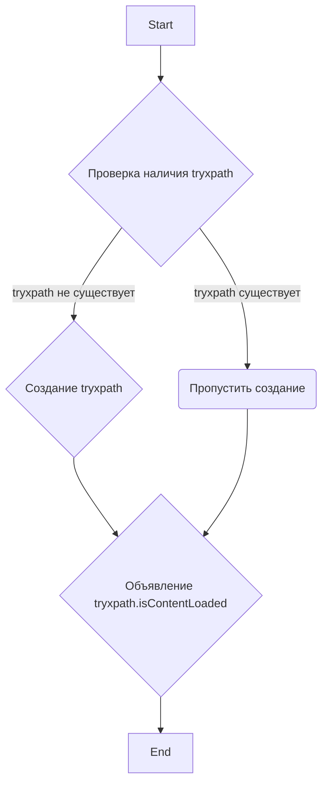

## Анализ кода `try_path_1.3.5/scripts/try_xpath_check_frame.js`

### 1. <алгоритм>
1. **Проверка наличия объекта `tryxpath`:**
   - Проверяется, существует ли уже объект с именем `tryxpath` в глобальной области видимости JavaScript.
   - _Пример_: `if (!tryxpath)` (если `tryxpath` не существует)

2. **Создание объекта `tryxpath` (если необходимо):**
   - Если объект `tryxpath` не существует, он создается как пустой объект.
   - _Пример_: `var tryxpath = {};` (создание пустого объекта)

3. **Объявление переменной `tryxpath.isContentLoaded`:**
    - Объявляется переменная `isContentLoaded` как свойство объекта `tryxpath`. Присвоение значения не происходит, то есть `isContentLoaded` будет иметь значение `undefined`.
    - _Пример_: `tryxpath.isContentLoaded;`

### 2. <mermaid>

### 3. <объяснение>

- **Импорты:**
    - В данном коде нет явных импортов из других файлов. Код предполагает, что это часть более крупного JavaScript проекта и полагается на глобальное пространство имен.

- **Классы:**
    - В данном коде нет определения классов.

- **Функции:**
  - В данном коде нет определения функций.

- **Переменные:**
  - `tryxpath`: Объект, выступающий как пространство имен для кода. Изначально проверяется на существование, и если он не существует, то создается.
     - Тип: `Object`
  - `tryxpath.isContentLoaded`:  Переменная, которая  хранит  состояние  загрузки содержимого. Она объявлена, но не инициализирована, то есть её значение `undefined`.
     - Тип: `undefined`
- **Цепочка взаимосвязей:**
    - Этот файл `try_xpath_check_frame.js` представляет собой часть расширения для браузера Chrome. Он использует концепцию пространства имен `tryxpath` для организации своего кода. Этот код выполняется в контексте браузерного расширения и может взаимодействовать с DOM страницы и API расширений браузера. Файл не зависит от других частей проекта, кроме того, что он полагается на существование глобального пространства имен, что является стандартным для JavaScript.

- **Потенциальные ошибки и области для улучшения:**
    - Код не устанавливает начальное значение для переменной `tryxpath.isContentLoaded`, что может привести к ошибкам, если другие части кода полагаются на определенное начальное состояние этой переменной.
    - Код не документирован, не имеет комментариев, которые помогли бы понимать его предназначение.
    - Нет обработки ошибок или защит от некорректного использования.
    - Нет явной связи с другими файлами.