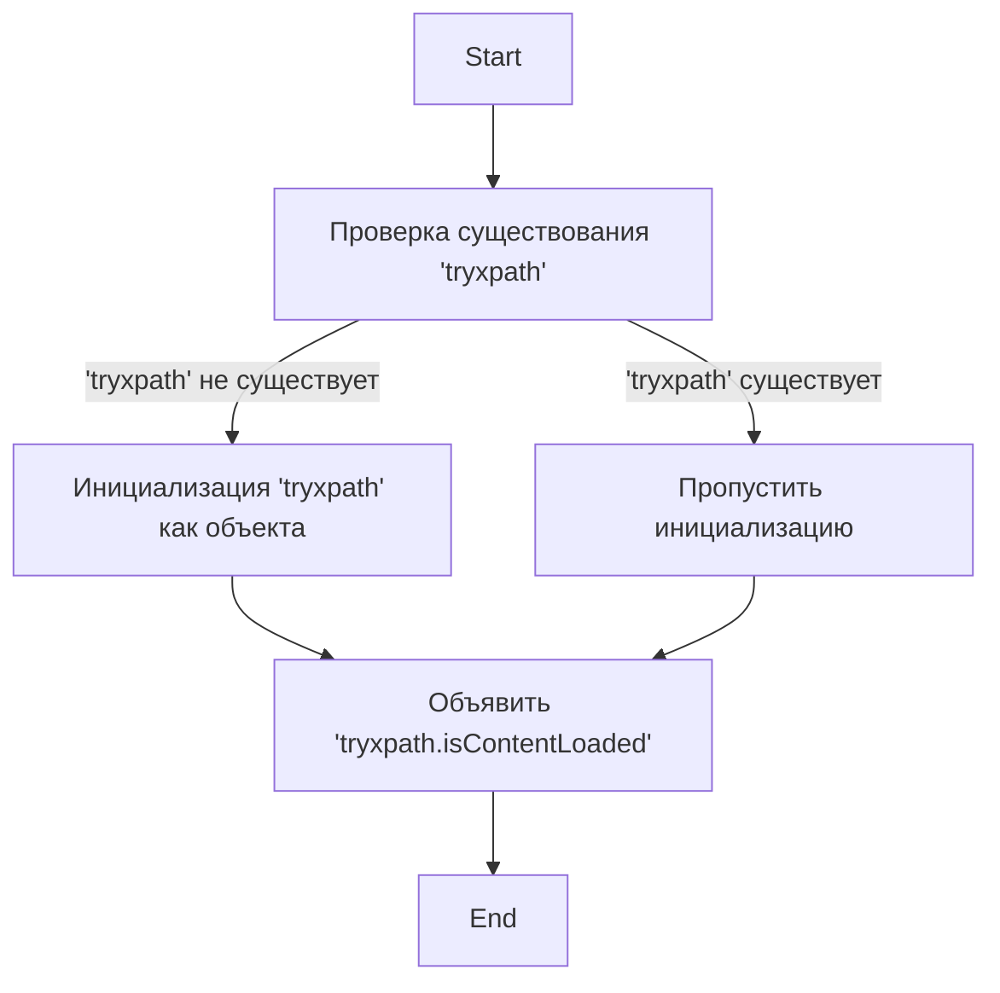

## Анализ кода try_xpath_check_frame.js

### 1. <алгоритм>
1. **Проверка существования `tryxpath`:**
   - Начинается с проверки, существует ли уже переменная `tryxpath` в глобальной области видимости.
   - Пример: `if (!tryxpath) {...}`
   - Если `tryxpath` не существует (т.е. `!tryxpath` истинно), то выполняется блок кода внутри `if`.
2. **Инициализация `tryxpath` (если необходимо):**
   - Если `tryxpath` не существовало, то создается новый объект `tryxpath`, который будет использоваться как пространство имен (namespace) для данного скрипта.
   - Пример: `var tryxpath = {};`
   - Теперь `tryxpath` является объектом, в который можно добавлять свойства и методы.
3. **Объявление переменной `tryxpath.isContentLoaded`:**
   - Объявляется свойство `isContentLoaded` внутри объекта `tryxpath`. В данном коде переменной не присваивается никакого значения.
   - Пример: `tryxpath.isContentLoaded;`
   - Это означает, что переменная `tryxpath.isContentLoaded` существует, но ее значение на данный момент равно `undefined`.

### 2. <mermaid>

**Объяснение зависимостей `mermaid`:**

- **Start**: Начало выполнения скрипта.
- **CheckTryxpath**: Проверка существования переменной `tryxpath`.
- **SkipInitialization**: Если `tryxpath` уже существует, пропускаем блок инициализации.
- **InitializeTryxpath**: Если `tryxpath` не существует, создаем пустой объект.
- **DeclareIsContentLoaded**: Объявление переменной `tryxpath.isContentLoaded`, которая будет использоваться для отслеживания загрузки контента.
- **End**: Конец выполнения скрипта.

### 3. <объяснение>
**Импорты:**
   - В данном коде нет явных импортов других модулей или пакетов. Этот скрипт, похоже, является самодостаточным и полагается на контекст, в котором он выполняется (вероятно, среда расширения браузера).

**Классы:**
   - В этом коде нет классов. Он использует простую структуру JavaScript-объекта для пространства имен.

**Функции:**
   - В этом коде нет функций. Он выполняет только простую проверку и объявление переменной.

**Переменные:**
   - `tryxpath`: Объект (namespace) для хранения переменных и функций, относящихся к функциональности tryxpath.
   - `tryxpath.isContentLoaded`: Булева переменная, которая будет использоваться для отслеживания того, загружен ли контент или нет. На данном этапе, она объявлена но не инициализирована (равна `undefined`).

**Цепочка взаимосвязей:**

  - Этот скрипт, `try_xpath_check_frame.js`, скорее всего, является частью более крупного расширения для браузера, которое помогает разработчикам тестировать и отлаживать XPath-выражения. Он использует `tryxpath` в качестве своего пространства имен, чтобы избежать конфликтов с другими частями расширения или веб-страницы. Переменная `tryxpath.isContentLoaded`, вероятно, будет установлена в `true` после того, как контент фрейма будет загружен, и может быть использована другими частями расширения для контроля за процессами. Этот файл скорее всего используется для отслеживания загрузки iframe.

**Потенциальные ошибки и области для улучшения:**
   - **Отсутствие значения по умолчанию для `tryxpath.isContentLoaded`**:  Переменной `tryxpath.isContentLoaded` не присвоено начальное значение. Это может привести к проблемам, если другие части кода ожидают, что она будет иметь конкретное начальное значение (например, `false`). Рекомендуется добавить инициализацию, например: `tryxpath.isContentLoaded = false;`
   - **Отсутствие документации**: Код не содержит комментариев, объясняющих назначение `tryxpath.isContentLoaded`. Добавление комментариев помогло бы другим разработчикам лучше понять его роль.
   - **Неочевидность назначения:** Судя по имени, переменная `isContentLoaded` может использоваться для отслеживания загрузки контента. Однако, в данном файле переменная просто объявлена. Возможно, в других файлах проекта ей присваивается значение.

**Дополнительные замечания:**

Этот код является простым, но важным для организации пространства имен в расширении. Он предотвращает потенциальные конфликты имен и служит основой для дальнейших операций по проверке загрузки контента.