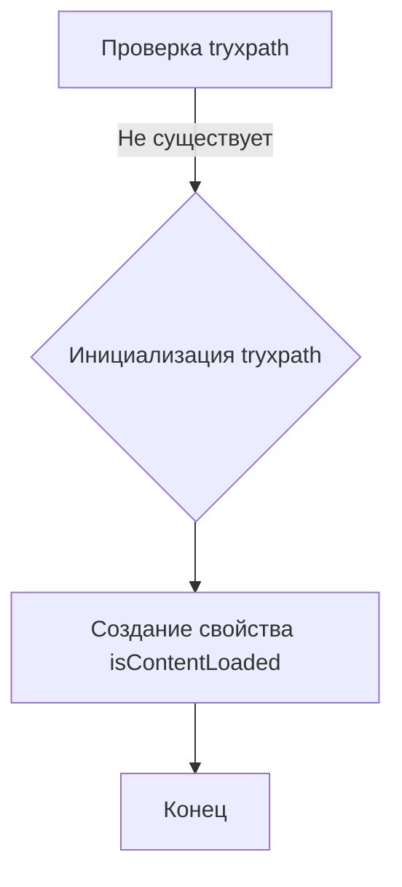

# Анализ кода try_xpath_check_frame.js

## <input code>

```javascript
/* This Source Code Form is subject to the terms of the Mozilla Public
 * License, v. 2.0. If a copy of the MPL was not distributed with this
 * file, You can obtain one at http://mozilla.org/MPL/2.0/. */

// namespace
if (!tryxpath) {
    var tryxpath = {};
}

tryxpath.isContentLoaded;
```

## <algorithm>

Этот код определяет глобальный объект `tryxpath` и создает в нем свойство `isContentLoaded`.  В данном случае, алгоритм сводится к инициализации переменной. Неявно предполагается, что в дальнейшем, в других частях кода, `isContentLoaded` будет использоваться для определения или отслеживания состояния загрузки контента.  

**Пошаговая блок-схема:**

1. **Проверка существования:** Проверяется, существует ли глобальная переменная `tryxpath`.
2. **Инициализация:** Если переменная не существует, создается глобальный объект `tryxpath`.
3. **Создание свойства:** Создается свойство `isContentLoaded` внутри объекта `tryxpath`.  Значение этого свойства не задано явно и будет по умолчанию `undefined`.

**Примеры данных:**

- Начальное состояние: `tryxpath` не определено.
- После выполнения кода: `tryxpath` - объект со свойством `isContentLoaded` со значением `undefined`.

## <mermaid>



## <explanation>

**Импорты:**

Код не содержит импортов из других модулей или файлов. Всё выполняется в глобальной области видимости.

**Классы:**

Нет объявленных классов.

**Функции:**

Нет объявленных функций.

**Переменные:**

- `tryxpath`: Глобальная переменная типа объект. Она инициализируется, если ранее не была определена.
- `tryxpath.isContentLoaded`: Свойство объекта `tryxpath`. Его тип – `undefined` до присвоения значения.

**Возможные ошибки или области для улучшений:**

- **Отсутствие функциональности:**  Код только определяет свойство, но не выполняет никакой функциональной логики.  Важно понимать, для чего предназначено это свойство. Позже `isContentLoaded` должно быть использовано для проверки состояния загрузки.

**Цепочка взаимосвязей:**

Этот код является частью библиотеки или модуля `tryxpath`.  Его дальнейшее использование предполагает взаимодействие с другими частями проекта (например, другими скриптами, выполняющимися в браузере), где `tryxpath.isContentLoaded` будет получать значение, указывающее на готовность контента.  Вероятнее всего, это свойство будет изменяться при успешной загрузке, позволяя другим частям скрипта или приложения реагировать на это событие.  Без понимания контекста, где используется `tryxpath.isContentLoaded`, трудно дать более точную оценку его роли и связей с другими частями проекта.