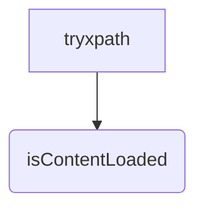

```MD
# Анализ кода try_xpath_check_frame.js

**<input code>**

```javascript
/* This Source Code Form is subject to the terms of the Mozilla Public
 * License, v. 2.0. If a copy of the MPL was not distributed with this
 * file, You can obtain one at http://mozilla.org/MPL/2.0/. */

// namespace
if (!tryxpath) {
    var tryxpath = {};
}

tryxpath.isContentLoaded;
```

**<algorithm>**

Этот код не содержит алгоритма в привычном понимании. Он просто объявляет переменную `tryxpath` и устанавливает ее значение `undefined` (за исключением случая, когда `tryxpath` уже определено), а затем определяет свойство `isContentLoaded` в этом объекте, не присваивая ему никакого значения.


**<mermaid>**



**<explanation>**

* **Импорты:** Нет импортов. Код работает в контексте, где `tryxpath` уже потенциально существует. Это скорее всего часть большего проекта, где `tryxpath` уже определен и используется.

* **Классы:** Нет классов.

* **Функции:** Нет функций.

* **Переменные:**
    * `tryxpath`: Переменная типа `object`.  Её инициализация проверяет, определен ли объект `tryxpath` ранее. Если нет, то создаёт новый пустой объект `tryxpath`.  Этот объект, вероятно, используется для организации и хранения функций и свойств, связанных с проверой содержимого страницы.  Неприсвоение значения `isContentLoaded` может быть намеренным - данная переменная, возможно, будет инициализирована позднее или ее значение будет определено каким-то другим способом.

* **Возможные ошибки или области для улучшений:**

    * **Неиспользуемый код:**  Свойство `isContentLoaded` объявлено, но не используется. Это может быть остатком от предыдущей версии кода или просто временным решением. Нужно разобраться, нужен ли этот объект или нет, и если да, то как он используется.
    * **Неясная цель:** Непонятно, какая конкретная задача решается этим кодом. Необходима дополнительная информация о том, как именно `tryxpath` используется в контексте всего проекта.

* **Взаимосвязи с другими частями проекта:**

    Код, вероятно, используется в другом скрипте или модуле (например, из `webdriver` или `chrome` области), где `tryxpath` и `isContentLoaded` имеют определённое назначение.  Чтобы понять роль этого кода, необходим контекст использования в основном коде. Вероятно, это код, связанный с управлением содержимым веб-страницы и проверкой ее загрузки.  `isContentLoaded` возможно, используется как флаг или в качестве точки проверки для дальнейшего исполнения кода.


**Вывод:**

Код представляет собой небольшой фрагмент, в котором определена глобальная переменная `tryxpath` и объявлено свойство `isContentLoaded` без присвоения значения.  Без дополнительного контекста и информации о том, как `tryxpath` используется в других частях проекта, сложно судить о его точной функции.  Важно понять, как это свойство используется в последующем коде для более глубокого понимания его роли.