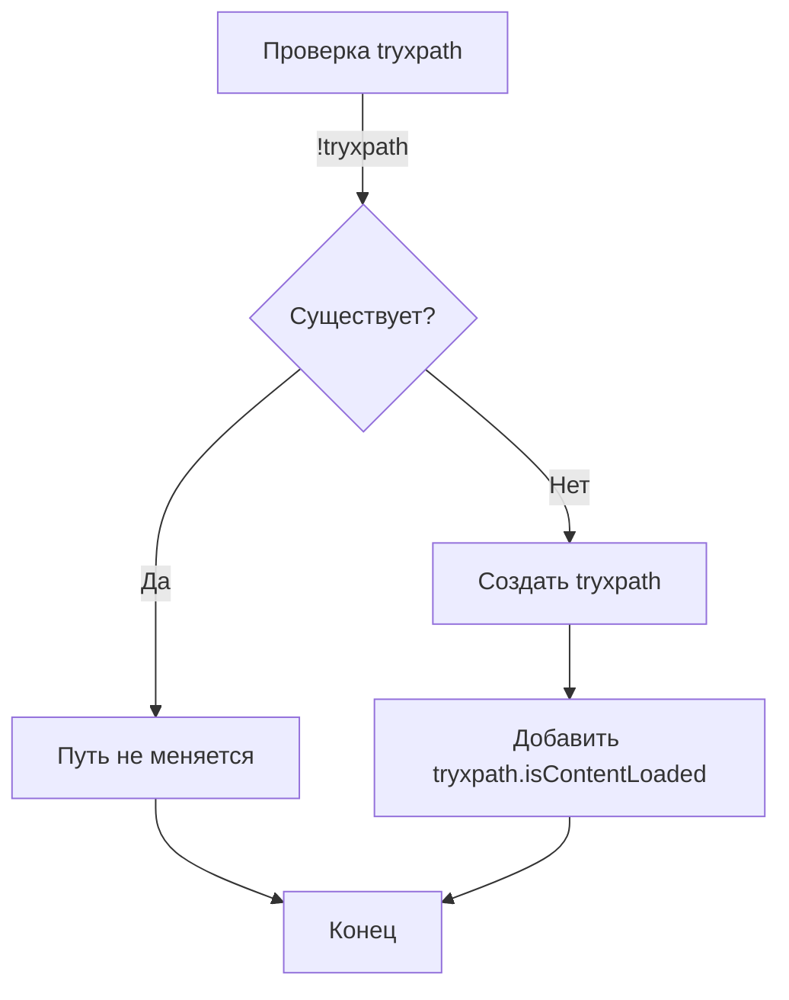

```MD
# Анализ кода try_xpath_check_frame.js

**<input code>**

```javascript
/* This Source Code Form is subject to the terms of the Mozilla Public
 * License, v. 2.0. If a copy of the MPL was not distributed with this
 * file, You can obtain one at http://mozilla.org/MPL/2.0/. */

// namespace
if (!tryxpath) {
    var tryxpath = {};
}

tryxpath.isContentLoaded;
```

**<algorithm>**

Этот код очень прост и не содержит выраженных логических операций или циклов.  Его основная функция -  определение (или создание, если не существует) объекта `tryxpath` в глобальном пространстве имён.

Пошаговая блок-схема:

1. **Проверка существования объекта `tryxpath`:** Проверяется, существует ли переменная `tryxpath` в глобальной области видимости.
2. **Создание объекта `tryxpath` (если необходимо):** Если `tryxpath` не существует, создаётся пустой объект с этим именем.
3. **Инициализация свойства `isContentLoaded`:**  Записывается пустое значение (undefined) для свойства `isContentLoaded` объекта `tryxpath`.  Это, вероятно, подготовка для будущих проверок или действий.


**Пример:**

До выполнения кода в глобальном пространстве имён нет объекта `tryxpath`. После выполнения кода в глобальном пространстве имён будет объект `tryxpath` с свойством `isContentLoaded`, имеющим значение `undefined`.

**<mermaid>**



**<explanation>**

* **Импорты:**  В коде нет импортов.
* **Классы:** Нет классов.
* **Функции:** Нет функций.
* **Переменные:** `tryxpath` - переменная, которая либо существует, либо создаётся как объект.  `tryxpath.isContentLoaded` - свойство объекта, инициализированное значением `undefined`.
* **Возможные ошибки или области для улучшений:**

    * Код слишком прост.  В нём отсутствует какая-либо полезная функциональность. Предположительно это фрагмент кода, подготовленный для будущей реализации проверки состояния загрузки страницы (например, `isContentLoaded = true`, когда страница загружена).
    * Присутствие комментария `// namespace` предполагает, что этот код предназначен для использования в пространстве имён `tryxpath`, что является хорошей практикой.


**Взаимосвязь с другими частями проекта:**

Этот код, скорее всего, является частью более крупного проекта, связанного с автоматизацией веб-тестирования (например, с помощью Selenium WebDriver). Вероятно, в других частях проекта, включая скрипты на JavaScript (используемые в Chrome Extension), будут определяться и использоваться функции и методы из `tryxpath`, связанные с проверкой и управлением состоянием загрузки страницы. Свойство `tryxpath.isContentLoaded` должно использоваться в других функциях для принятия решений о последующих действиях (например, проверка готовности элементов на странице перед выполнением действий).