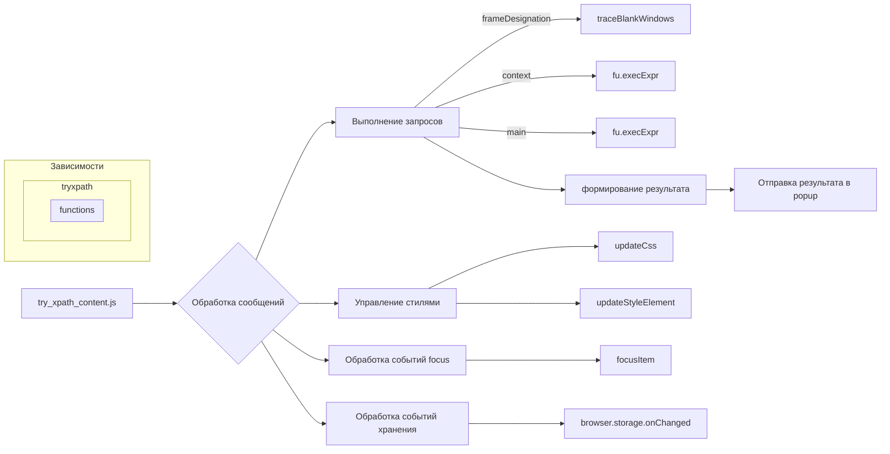

```MD
# Анализ кода try_xpath_content.js

## <input code>

```javascript
/* This Source Code Form is subject to the terms of the Mozilla Public
 * License, v. 2.0. If a copy of the MPL was not distributed with this
 * file, You can obtain one at http://mozilla.org/MPL/2.0/. */

(function (window, undefined) {
    "use strict";

    // alias
    var tx = tryxpath;
    var fu = tryxpath.functions;

    // prevent multiple execution
    if (tx.isContentLoaded) {
        return;
    }
    tx.isContentLoaded = true;

    // ... (остальной код)
```

## <algorithm>

К сожалению, построить полную блок-схему для такого объемного скрипта затруднительно.  Однако, можно выделить ключевые этапы и логические блоки.

**1. Инициализация:**
* Проверяется, загружен ли скрипт уже (tx.isContentLoaded). Если да, выполнение прекращается.
* Инициализируются переменные, хранящие значения по умолчанию (dummyItem, dummyItems, etc.).
* Определяются атрибуты для элементов (attributes).
* Создается пустой объект prevMsg для хранения предыдущих сообщений.

**2. Обработка сообщений:**
* Обработчик сообщений (browser.runtime.onMessage.addListener) обрабатывает различные события (execute, focusItem, etc.).
* В зависимости от типа события вызываются соответствующие функции (например, focusItem, setMainAttrs, execute).

**3. Выполнение запросов (execute):**
* Получает данные запроса (message).
* Обрабатывает указание на фреймы (frameDesignation).  Использует traceBlankWindows для навигации по фреймам.
* Выполняет контекстные запросы (context).
* Выполняет основной запрос (main).
* Собирает результаты (currentItems, contextItem).
* Отправляет результаты в popup (browser.runtime.sendMessage).

**4. Управление стилями:**
* Обрабатывает обновления CSS (updateCss, handleCssChange).
* Вставляет/обновляет стили в DOM (updateStyleElement).
* Удаляет стили (removeStyleElement).

**5. Обработка событий focus:**
* Функции focusItem, focusContextItem, focusFrame реагируют на запросы о фокусировке элемента.
* Отправляет сообщения в фреймы (postMessage).

**6. Обработка событий хранения:**
* Обрабатывает изменения в хранилище (browser.storage.onChanged).
* Обновляет переменные attributes, css в зависимости от изменений.

**Пример перемещения данных:**
* Пользователь отправляет запрос в content script.
* Обработка происходит внутри функции `genericListener.listeners.execute`.
* Данные (expression, context) передаются в функцию `fu.execExpr`.
* Результаты выполнения (items, resultType) возвращаются из `fu.execExpr` и используются для формирования сообщения для отправки в popup.


## <mermaid>



**Объяснение зависимостей:**

Диаграмма показывает, что `try_xpath_content.js` взаимодействует с функциями из `tryxpath.functions` (`fu.execExpr`, `fu.getxpathResultStr`, etc.).  Также есть зависимости от `browser.runtime` для общения с popup и от `browser.storage` для работы с хранилищем.  Существуют неизвестные зависимости от `window` и `document` (браузерные объекты).


## <explanation>

**Импорты:**

* `tx = tryxpath;` и `fu = tryxpath.functions;`: Эти строки импортируют объект `tryxpath` и его подмодуль `functions` для использования функций и переменных из этих модулей, вероятно, определенных в другом файле (или модуле) с именем `tryxpath.js`.

**Классы:**

Нет явных классов.  Код использует функции для обработки данных и взаимодействия с API браузера.

**Функции:**

* `genericListener`:  Обработчик сообщений, принимает сообщение, отправителя и функцию отправки ответа, вызывая специализированный обработчик в зависимости от поля `event` в сообщении.  Это ключевой метод для управления различными событиями.
* `execute`:  Обрабатывает основные запросы (xpath-выражения), включает обработку фреймов и контекстных запросов, выполнение выражений с помощью `fu.execExpr` и отправку результатов обратно в popup.
* `focusItem`:  Фокусирует элемент в DOM.
* `updateStyleElement`: Вставляет или обновляет CSS-стиль в текущем документе.
* `updateCss`: Обновляет CSS-стиль в случае изменений.
* `traceBlankWindows`:  Рекурсивно проверяет фреймы для поиска нужных blank windows.

**Переменные:**

* `attributes`:  Хранит названия атрибутов, которые используются для добавления метаданных к элементам.
* `currentItems`, `contextItem`, `focusedItem`: Хранят результаты запросов, текущий контекст и выделенный элемент.
* `currentCss`: Содержит CSS-стиль, который нужно применить.

**Возможные ошибки и улучшения:**

* **Недостаточная обработка ошибок:**  Хотя код содержит `try...catch` блоки, обработка ошибок могла бы быть более подробной и информативной, особенно при работе с фреймами. Отсутствуют проверки на null или undefined для некоторых переменных.
* **Сложная логика:**  Логика обработки сообщений и фреймов достаточно сложная, и ее трудно проследить без полной документации и более подробных комментариев.
* **Потенциальные утечки памяти:** Неявный импорт через `tryxpath` и `tryxpath.functions` должен быть описан. Указание на корректное освобождение ресурсов `originalAttributes`.


**Взаимосвязи с другими частями проекта:**

* `tryxpath.js` или соответствующий модуль, содержащий функции `fu`, `tx` и другие связанные ресурсы.
* `popup` или расширение браузера -  получатель результатов и место запуска запросов.


Этот анализ предоставляет общее представление о функциональности скрипта, но более глубокий анализ требует доступа к исходному коду связанных модулей (например, `tryxpath.js`).