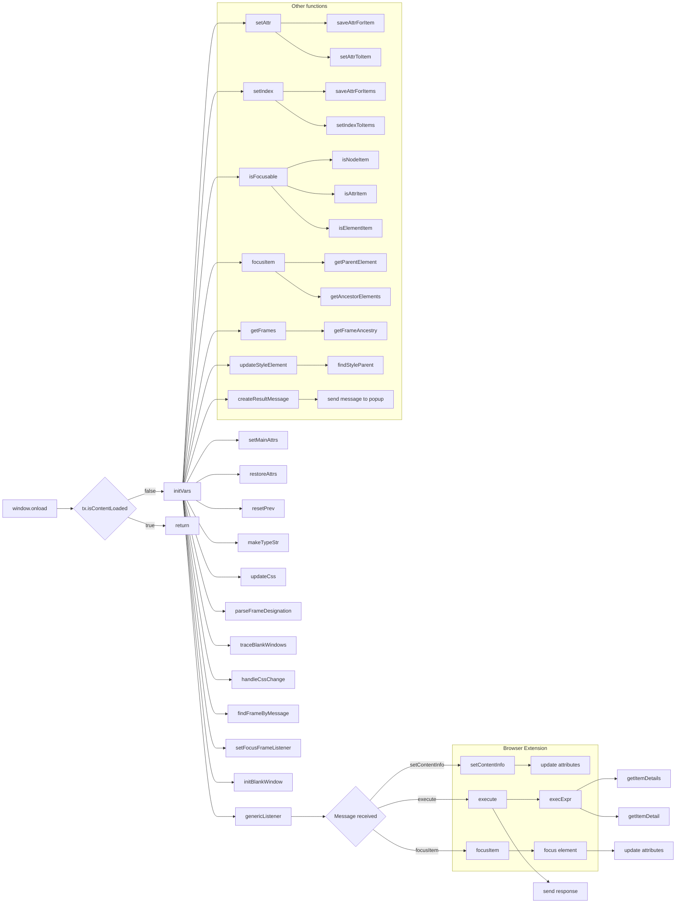

# Анализ кода try_xpath_content.js

```
/* This Source Code Form is subject to the terms of the Mozilla Public
 * License, v. 2.0. If a copy of the MPL was not distributed with this
 * file, You can obtain one at http://mozilla.org/MPL/2.0/. */

(function (window, undefined) {
    "use strict";

    // alias
    var tx = tryxpath;
    var fu = tryxpath.functions;

    // prevent multiple execution
    if (tx.isContentLoaded) {
        return;
    }
    tx.isContentLoaded = true;

    const dummyItem = "";
    const dummyItems = [];
    const invalidExecutionId = NaN;
    const styleElementHeader
          = "/* This style element was inserted by browser add-on, Try xpath."\
          + " If you want to remove this element, please click the reset"\
          + " style button in the popup. */\\n";

    var attributes = { /* ... */ };

    var prevMsg;
    var executionCount = 0;
    var inBlankWindow = false;
    var currentDocument = null;
    var contextItem = dummyItem;
    var currentItems = dummyItems;
    var focusedItem = dummyItem;
    var focusedAncestorItems = dummyItems;
    var currentCss = null;
    var insertedStyleElements = new Map();
    var expiredCssSet = Object.create(null);
    var originalAttributes = new Map();

    // ... (rest of the code)
});
```

## <algorithm>

Код реализует обработку сообщений для расширения браузера, позволяющего выполнять XPath-запросы.  Он слушает события, связанные с XPath-запросами, фокусировкой элементов и обновлением CSS-стилей.

**Шаг 1:** Проверка на повторное выполнение. Если флаг `tx.isContentLoaded` уже установлен, выполнение функции прекращается.
**Шаг 2:** Инициализация переменных.  Создаются пустые массивы, NaN и строка для стиля. Определяются атрибуты.
**Шаг 3:** Функция `setAttr` сохраняет текущие значения атрибутов и устанавливает новые для заданного элемента. Аналогично, `setIndex` для массивов элементов.
**Шаг 4:** `isFocusable` - проверяет, является ли элемент фокусируемым.
**Шаг 5:** `focusItem` - фокусирует элемент:  снимает фокус с предыдущего, устанавливает фокус на текущий, устанавливает атрибуты `focused` и `focusedAncestor`, вызывает методы `blur()`, `focus()` и `scrollIntoView()`.
**Шаг 6:** `setMainAttrs` - устанавливает атрибуты для текущего контекста и элементов.
**Шаг 7:** `restoreAttrs` - восстанавливает исходные значения атрибутов.
**Шаг 8:** `resetPrev` - сбрасывает данные для следующего запроса.
**Шаг 9:** `makeTypeStr` - преобразует тип результата в строку.
**Шаг 10:** `updateCss` - отправляет запрос на обновление CSS в расширение браузера, если требуется.
**Шаг 11:** `getFrames` - парсит JSON-строку, содержащую индексы фреймов. Возвращает массив индексов фреймов.
**Шаг 12:** `parseFrameDesignation` - парсит строку, содержащую индексы фреймов.
**Шаг 13:** `traceBlankWindows` - рекурсивно находит фреймы, возвращает true, если все фреймы находятся в документе, в противном случае false и ссылку на проблемный фрейм.
**Шаг 14:** `handleCssChange` - обрабатывает изменения в CSS.
**Шаг 15:** `findFrameByMessage` - находит элемент фрейма по сообщению.
**Шаг 16:** `setFocusFrameListener` - устанавливает слушатель событий для фреймов, добавляет обработчик событий для сообщений о фокусировке на фреймах.
**Шаг 17:** `initBlankWindow` - инициализирует работу в пустом окне.
**Шаг 18:** `findStyleParent`, `updateStyleElement`, `updateAllStyleElements`, `removeStyleElement`, `removeAllStyleElements` - управляют стилями.
**Шаг 19:** `createResultMessage` - создает сообщение для ответа в расширение браузера.
**Шаг 20:** `genericListener` - обрабатывает различные сообщения от расширения браузера, вызывая соответствующие функции.
**Шаг 21:** Слушатели сообщений: `setContentInfo`, `execute`, `focusItem`, `focusContextItem`, `focusFrame`, `requestShowResultsInPopup`, `requestShowAllResults`, `resetStyle`, `setStyle`, `finishInsertCss`, `finishRemoveCss`.
**Шаг 22:** Слушатель на изменения в хранилище браузера.

Данные передаются между функциями и классами через аргументы функций, глобальные переменные (`contextItem`, `currentItems`, `focusedItem` и т.д.) и события.  Используется `postMessage` для межфреймового общения, и `browser.runtime.sendMessage` для общения с расширением.


## <mermaid>



**Объяснение зависимостей в диаграмме:**

* **`window.onload`**: Инициализирует выполнение кода при загрузке страницы.
* **`tx.isContentLoaded`**:  Проверяет, уже ли выполнялся код для предотвращения повторной инициализации.
* **Функции:** `setAttr`, `setIndex`, `isFocusable`, `focusItem`, `setMainAttrs` и т.д. - обрабатывают внутреннюю логику работы с данными.
* **`genericListener`**:  Обрабатывает сообщения от расширения браузера, вызывая соответствующие функции.
* **Межмодульные зависимости:** Код использует функции из `tryxpath.functions` (функции `fu`).  Взаимодействие с расширением браузера (browser.runtime) для обновления CSS, отправки сообщений и получения данных.

## <explanation>

**Импорты:**

Код использует алиасы `tx` для `tryxpath` и `fu` для `tryxpath.functions`.  Это указывает на то, что `tryxpath` и `tryxpath.functions` - это, вероятно, другие модули или файлы, которые предоставляют функциональность для обработки XPath-запросов и работы с элементами DOM.  Без доступа к этим модулям трудно понять их точное поведение и зависимость от других частей проекта (например, из `src`).


**Классы:**

Нет явных классов. Есть объекты (`attributes`, `originalAttributes`, `insertedStyleElements` и др.), которые представляют структуры данных.


**Функции:**

* **`setAttr(attr, value, item)`:**  Устанавливает атрибут `attr` для элемента `item` с предварительным сохранением.  Аргументы: имя атрибута, значение, элемент.
* **`setIndex(attr, items)`:** Аналогично, но для массива элементов.
* **`focusItem(item)`:** Фокусирует элемент в документе.  Аргумент: элемент.
* **`setMainAttrs()`:** Устанавливает атрибуты для текущих элементов.
* **`restoreAttrs()`:** Восстанавливает исходные значения атрибутов.
* **`resetPrev()`:** Сбрасывает данные.
* **`updateCss()`:** Обновляет CSS-стили.
* **`traceBlankWindows(desi, win)`:**  Проверяет наличие и корректность фреймов.
* **`setFocusFrameListener(win, isBlankWindow)`:**  Устанавливает обработчик сообщений для фреймов.
* **`updateStyleElement(doc)`:** Обновляет стили элемента в документе.
* **`genericListener(message, sender, sendResponse)`**: Обработчик сообщений, принимает данные, отправляет ответы.
* **`findStyleParent(doc)`:**  Находит родителя для стилевого элемента.
* **`removeStyleElement(doc)`**,`removeAllStyleElements` - удаляют стили.

**Переменные:**

* `dummyItem`, `dummyItems`: Пустые значения по умолчанию для элементов.
* `invalidExecutionId`: Значение, обозначающее недействительный идентификатор выполнения.
* `attributes`: Объект, содержащий имена атрибутов.
* `prevMsg`, `executionCount`, `inBlankWindow`, `currentDocument`, `contextItem`, `currentItems`, `focusedItem`, `focusedAncestorItems`, `currentCss`:  Глобальные переменные, хранящие состояние.
* `insertedStyleElements`, `expiredCssSet`, `originalAttributes`:  Сложные структуры данных, используемые для хранения и управления стилями и атрибутами.

**Возможные ошибки и улучшения:**

* **Проверка ввода:** Функции, принимающие JSON, должны проверять корректность вводимых данных, чтобы избежать ошибок при парсинге.
* **Обработка исключений:** Важно обработать возможные исключения (например, при обращении к несуществующим фреймам или элементам), предоставив более информативные сообщения пользователю.
* **Оптимизация:** Для больших наборов данных можно оптимизировать функции `traceBlankWindows` и другие, работающие с массивами.
* **Ясность кода:** Добавление комментариев к более сложным функциям (например, `genericListener`) поможет улучшить читаемость.
* **Тестирование:** Необходимо разработать тесты для проверки работы функций, особенно при работе с фреймами и обновлением CSS.


**Взаимосвязи с другими частями проекта:**

Код тесно связан с расширением браузера (`tryxpath`),  использующим API браузера (например, `browser.storage`, `browser.runtime`). Функции из `tryxpath.functions` отвечают за общую логику работы с DOM и элементами.  Взаимодействие с расширением осуществляется через `browser.runtime.sendMessage` и `postMessage`.

Более подробное понимание проекта требует доступа к исходному коду других файлов, особенно тех, которые определяют `tryxpath` и `tryxpath.functions`.