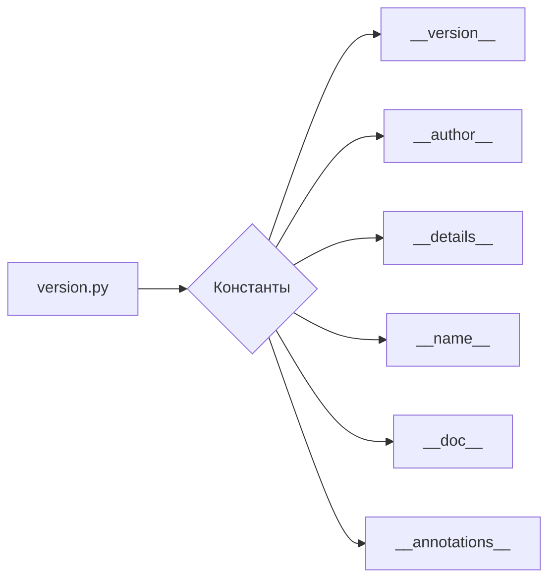

```MD
# Анализ кода файла hypotez/src/webdriver/chrome/extentions/version.py

## <input code>

```python
## \file hypotez/src/webdriver/chrome/extentions/version.py
# -*- coding: utf-8 -*-\
#! venv/Scripts/python.exe
#! venv/bin/python/python3.12

"""
.. module: src.webdriver.chrome.extentions 
	:platform: Windows, Unix
	:synopsis:

"""
MODE = 'dev'

"""
	:platform: Windows, Unix
	:synopsis:

"""


"""
	:platform: Windows, Unix
	:synopsis:

"""


"""
  :platform: Windows, Unix

"""
"""
  :platform: Windows, Unix
  :platform: Windows, Unix
  :synopsis:
"""MODE = 'dev'
  
""" module: src.webdriver.chrome.extentions """


"""
- `__version__`: This variable holds the version of the module or package.
- `__name__`: Contains the name of the module. If the script is being run directly, the value will be `"__main__"`.
- `__doc__`: The module's documentation string.
- `__details__`: This variable likely contains additional details about the module, but the exact purpose depends on the specific module or package.
- `__annotations__`: Contains type annotations for variables and functions in the module.
- `__author__`: The name(s) of the author(s) of the module.
"""
__name__:str
__version__="3.12.0.0.0.4"
__doc__:str
__details__:str="Details about version for module or class"
__annotations__

__author__='hypotez '
```

## <algorithm>

Этот файл представляет собой модуль Python, скорее всего, часть более крупного проекта.  Алгоритм работы  в данном случае - это **определение и хранение метаданных** о модуле, таких как версия, автор, имя и т.д.  Пошаговая блок-схема не применима, так как нет явного вычисления или обработки данных.

## <mermaid>



## <explanation>

**Импорты:**  В данном файле нет импорта других модулей.  Все необходимые данные - это внутренние переменные.

**Классы:**  Нет ни одного класса.

**Функции:**  Нет функций.

**Переменные:**  Все переменные являются константами, хранящими метаданные о модуле:

* `MODE`:  Строковая константа, вероятно, для определения режима работы (например, 'dev', 'prod').  Многократное определение этой переменной - возможная ошибка, так как значение перекрывается.
* `__version__`:  Строковая константа, хранит версию модуля.
* `__author__`:  Строковая константа, хранит имя автора модуля.
* `__details__`: Строковая константа, содержащая дополнительные данные о модуле.
* `__name__`, `__doc__`, `__annotations__`:  Эти переменные обозначены как строки, вероятно, для хранения имени модуля, документации и аннотаций, но их значения не заданы.


**Возможные ошибки и улучшения:**

* **Избыточное объявление `MODE`:**  Второй раз объявленный `MODE`  перезаписывает первое значение. Это лишнее и может привести к непредсказуемому поведению.  Следует использовать только одно определение.
* **Неиспользуемые переменные:**  `__name__`, `__doc__`, `__annotations__` и `__details__`  объявлены, но не имеют присвоенных значений. Если эти переменные используются в других частях проекта, то следует указать их значения.
* **Комментарии:**  Документационные строки (docstrings) могут быть более информативными и структурированными с помощью стандартных конструкций docstrings.


**Взаимосвязи с другими частями проекта:**

Этот файл, скорее всего, используется для хранения информации о версии и других метаданных модуля `webdriver.chrome.extentions`.  Другие части проекта могут использовать эти данные для управления зависимостями, версионирования, или получения дополнительной информации о модуле во время выполнения.  Например, система сборки или тестирования может считывать эти данные для определения версии модуля.