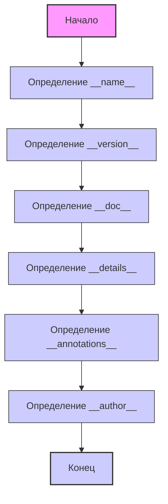

## ИНСТРУКЦИЯ:

Анализируй предоставленный код подробно и объясни его функциональность. Ответ должен включать три раздела:  

1. **<алгоритм>**: Опиши рабочий процесс в виде пошаговой блок-схемы, включая примеры для каждого логического блока, и проиллюстрируй поток данных между функциями, классами или методами.  
2. **<mermaid>**: Напиши код для диаграммы в формате `mermaid`, проанализируй и объясни все зависимости, 
    которые импортируются при создании диаграммы. 
    **ВАЖНО!** Убедитесь, что все имена переменных, используемые в диаграмме `mermaid`, 
    имеют осмысленные и описательные имена. Имена переменных вроде `A`, `B`, `C`, и т.д., не допускаются!  
    
    **Дополнительно**: Если в коде есть импорт `import header`, добавьте блок `mermaid` flowchart, объясняющий `header.py`:\
    ```mermaid
    flowchart TD
        Start --> Header[<code>header.py</code><br> Determine Project Root]
    
        Header --> import[Import Global Settings: <br><code>from src import gs</code>] 
    ```

3. **<объяснение>**: Предоставьте подробные объяснения:  
   - **Импорты**: Их назначение и взаимосвязь с другими пакетами `src.`.  
   - **Классы**: Их роль, атрибуты, методы и взаимодействие с другими компонентами проекта.  
   - **Функции**: Их аргументы, возвращаемые значения, назначение и примеры.  
   - **Переменные**: Их типы и использование.  
   - Выделите потенциальные ошибки или области для улучшения.  

Дополнительно, постройте цепочку взаимосвязей с другими частями проекта (если применимо).  

Это обеспечивает всесторонний и структурированный анализ кода.
## Формат ответа: `.md` (markdown)
**КОНЕЦ ИНСТРУКЦИИ**
## <алгоритм>
1.  **Начало**: Запускается скрипт `version.py`.
2.  **Определение `__name__`**: 
    -   Переменной `__name__` присваивается имя модуля. Если скрипт запущен напрямую,  `__name__` будет равно `"__main__"`. В данном случае, поскольку это файл модуля, `__name__` будет равно `"src.webdriver.chrome.extentions.version"` (если бы файл вызывался как модуль)
    -   Пример: `__name__ = "src.webdriver.chrome.extentions.version"`
3.  **Определение `__version__`**:
    -   Переменной `__version__` присваивается строка, представляющая версию модуля.
    -   Пример: `__version__ = "3.12.0.0.0.4"`
4.  **Определение `__doc__`**:
    -   Переменной `__doc__` присваивается строка документации модуля. В коде это не сделано явно, и, если бы такая строка была в начале модуля, она бы присвоилась. 
    -   Пример (если бы строка документации была): `__doc__ = "Модуль для управления версиями расширений Chrome"`
5.  **Определение `__details__`**:
    -   Переменной `__details__` присваивается строка с подробной информацией о версии.
    -   Пример: `__details__ = "Details about version for module or class"`
6.  **Определение `__annotations__`**:
    -  Переменной `__annotations__` присваивается тип, как словаря, с типами аннотации. 
    -  Пример `__annotations__ = {}` (будет создано пустой словарь).
7.  **Определение `__author__`**:
    -   Переменной `__author__` присваивается строка с именем автора модуля.
    -   Пример: `__author__ = "hypotez"`
8. **Конец**: Завершение выполнения скрипта. Переменные модуля установлены.

## <mermaid>


## <объяснение>

### Импорты
В данном коде импорты отсутствуют. Этот модуль не зависит от других частей проекта напрямую через оператор `import`.
Однако, если бы модуль импортировался в другом месте проекта, он бы предоставил доступ к объявленным в нем переменным, таким как `__version__`, `__details__`, `__author__` и т.д.

### Классы
В этом коде классы не определены. Этот файл предназначен для хранения информации о версии модуля, а не для создания классов.

### Функции
В этом коде функции не определены. Он используется для определения глобальных переменных, а не для реализации функций.

### Переменные

*   `__name__`: (str) Содержит имя текущего модуля. Если скрипт выполняется как основной, то значение будет `"__main__"`, иначе имя модуля.
*   `__version__`: (str) Строка, содержащая версию модуля. В данном случае: `"3.12.0.0.0.4"`.
*   `__doc__`: (str)  Строка документации модуля. В текущей реализации не присвоено, но должна содержать описание модуля.
*   `__details__`: (str) Строка с подробностями о версии модуля. В данном случае: `"Details about version for module or class"`.
*   `__annotations__`:  (dict) Словарь, содержащий аннотации типов. В данном случае инициализируется как пустой.
*   `__author__`: (str) Строка с именем автора модуля. В данном случае: `"hypotez"`.

### Потенциальные ошибки и области для улучшения
*   **Отсутствие `__doc__`**: В коде отсутствует явное присвоение строки документации переменной `__doc__`.  
    **Решение:** Необходимо добавить в начале модуля строку документации, заключенную в тройные кавычки (`"""Docstring"""`). Это улучшит понимание и использование модуля, а также его документирование. 
*   **Магические строки**:  Строка `"3.12.0.0.0.4"` для `__version__` и `"Details about version for module or class"` для `__details__` - являются магическими.
    **Решение:** Лучше вынести такие строки в константы или настроечные файлы, чтобы было легче их менять и  можно было бы создать механизм  автоматического обновления версий.
*   **Странная версия**: Версия `"3.12.0.0.0.4"` не является стандартной нотацией семантического версионирования.
    **Решение:** Стоит пересмотреть нотацию версионирования, чтобы она была более стандартной, например, `"3.12.0.4"`.

### Цепочка взаимосвязей

Хотя в данном файле нет явных импортов, он может быть использован другими модулями внутри проекта `src`. Например, другой модуль может импортировать `version.py` и использовать `__version__` для проверки версии или вывода информации о программе.

```python
# example in some other module
from src.webdriver.chrome.extentions import version

print(f"Current version: {version.__version__}")

```
В этом примере `version.py` действует как источник данных о версии для других модулей.

В целом, этот модуль служит для хранения метаданных о версии модуля, и эти данные могут быть использованы в различных частях проекта.